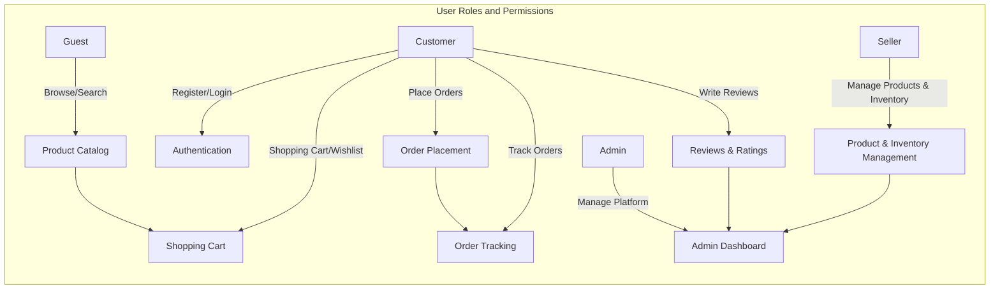

# Functional Requirements Analysis for E-commerce Shopping Mall Platform

This document details precise, testable business requirements and user workflows for the e-commerce shopping mall platform backend. All requirements adhere to the EARS format, focusing on WHAT the system must do from a business perspective.

## 1. User Registration and Login

### 1.1 User Registration
WHEN a guest submits valid registration data including unique email, password meeting complexity requirements, and required personal information, THE system SHALL create a new customer account.
WHEN a user registers, THE system SHALL allow entry and management of multiple shipping addresses associated with their profile.
IF registration data is incomplete or invalid, THEN THE system SHALL reject the request with descriptive error messages specifying missing or invalid fields.

### 1.2 User Login
WHEN a registered customer submits valid login credentials, THE system SHALL authenticate the user and establish a secure session within 2 seconds.
IF the credentials are invalid, THEN THE system SHALL deny access and return an appropriate authentication failure message within 2 seconds.
WHEN a user exceeds 5 consecutive failed login attempts, THEN THE system SHALL temporarily block login attempts from that user for 15 minutes and notify the user.

### 1.3 Address Management
WHEN a logged-in customer manages addresses, THE system SHALL allow adding, editing, setting a default address, and deleting addresses up to a maximum of 5 addresses.
WHEN an address is added or updated, THE system SHALL validate postal codes, phone numbers, and required fields.
WHEN a user selects an address during order placement, THE system SHALL use the selected address for shipping calculations and order processing.

## 2. Product Catalog and Search

### 2.1 Product Catalog
THE system SHALL maintain a hierarchical product category structure.
WHEN a seller adds new products, THE system SHALL allow categorizing products in one or more categories.

### 2.2 Product Variants (SKUs)
THE system SHALL support multiple SKUs per product differentiated by attributes such as color, size, and additional options.

### 2.3 Product Search
WHEN a guest or logged-in user submits a search query, THE system SHALL return relevant products matching the criteria within 3 seconds, sorted by relevance and user preferences.

## 3. Shopping Cart and Wishlist

### 3.1 Shopping Cart
WHEN a customer adds a SKU to the cart, THE system SHALL save the cart state persistently and across devices.
WHEN a customer modifies cart quantities or removes items, THE system SHALL update the cart accordingly.

### 3.2 Wishlist
WHEN a customer adds a product to the wishlist, THE system SHALL save it for future reference.
THE system SHALL allow transferring wishlist items to the shopping cart.

## 4. Order Placement and Payment Processing

### 4.1 Order Placement
WHEN a customer confirms the cart and selected shipping address, THE system SHALL validate the availability of each SKU in inventory.
IF any SKU lacks sufficient inventory, THEN THE system SHALL prevent order submission and notify the customer.
WHEN inventory is sufficient, THE system SHALL create an order record with details of SKUs, pricing, taxes, and discounts.

### 4.2 Payment Processing
WHEN a customer submits payment, THE system SHALL securely process the payment through integrated gateways within 5 seconds.
IF payment is declined or fails, THEN THE system SHALL cancel the order, release reserved inventory, and notify the customer with clear reasons and retry options.
WHEN payment is successful, THE system SHALL update order status and trigger seller fulfillment notifications.

## 5. Order Tracking and Shipping Status Updates

### 5.1 Order Status Tracking
THE system SHALL track order statuses: Pending, Processing, Shipped, Delivered, Cancelled, Refunded.
WHEN order status changes, THE system SHALL notify the customer within 2 minutes through preferred communication channels.

### 5.2 Shipping Updates
THE system SHALL integrate with shipping carriers to receive real-time shipping status updates.
WHEN shipping status changes such as picked up, in transit, out for delivery, or delivered, THE system SHALL update the customer's order tracking page.

## 6. Product Reviews and Ratings

### 6.1 Review Submission
WHEN a customer has purchased and received a product, THE system SHALL allow submission of product reviews and star ratings.
THE system SHALL validate review content against inappropriate language and length constraints.

### 6.2 Review Moderation
THE system SHALL automatically flag reviews for manual moderation if containing suspicious content.
THE system SHALL prevent posting of reviews pending moderation approval.

## 7. Seller Accounts and Product Management

### 7.1 Seller Product Listings
WHEN a seller creates or updates a product listing, THE system SHALL associate the product with that seller.
THE system SHALL enforce validation of SKU attribute uniqueness per product.

### 7.2 Inventory Management
THE system SHALL track inventory quantities per SKU.
WHEN inventory levels drop below configured thresholds, THE system SHALL notify sellers.

### 7.3 Order Fulfillment
WHEN an order contains items from a seller, THE system SHALL notify the seller promptly for fulfillment action.

## 8. Order History and Cancellation/Refund Requests

### 8.1 Order History
WHEN a customer requests order history, THE system SHALL provide detailed past orders including statuses and item details.

### 8.2 Cancellation Requests
WHEN a customer requests order cancellation, THE system SHALL allow it only if the order status is Pending or Processing and request is within 24 hours of order placement.
IF cancellation is not eligible, THEN THE system SHALL notify the customer accordingly.

### 8.3 Refund Requests
WHEN a refund is requested for an eligible order, THE system SHALL process refund approval workflows involving admin review.

## 9. Admin Dashboard for Order and Product Management

### 9.1 Order Management
THE admin SHALL have access to view and update all orders.
THE admin SHALL be able to resolve disputes and override statuses.

### 9.2 Product Management
THE admin SHALL manage product catalog, including approvals, categories, and deactivations.

### 9.3 User Management
THE admin SHALL manage user accounts for customers, sellers, and other admins.

### 9.4 Reporting and Notifications
THE admin SHALL view sales reports and system alerts for inventory and transactions.

## 10. Error Handling

WHEN any operation fails, THE system SHALL provide clear, actionable error messages within 2 seconds.
IF payment processing fails, THE system SHALL rollback orders and notify customers immediately.
WHEN input validation fails, THE system SHALL highlight erroneous fields with descriptive messages.

## 11. Performance Requirements

THE system SHALL respond to search queries within 3 seconds.
THE system SHALL complete user login within 2 seconds.
THE system SHALL process orders including payment within 5 seconds.
THE system SHALL support scalability to 10,000 concurrent users.

---

## Mermaid Diagrams

```mermaid
graph LR
  subgraph "User Roles and Permissions"
    guest["Guest"] -->|"Browse/Search"| productCatalog["Product Catalog"]
    customer["Customer"] -->|"Register/Login"| auth["Authentication"]
    customer -->|"Shopping Cart/Wishlist"| cart["Shopping Cart"]
    customer -->|"Place Orders"| order["Order Placement"]
    customer -->|"Track Orders"| tracking["Order Tracking"]
    customer -->|"Write Reviews"| review["Reviews & Ratings"]
    seller["Seller"] -->|"Manage Products & Inventory"| productMgmt["Product & Inventory Management"]
    admin["Admin"] -->|"Manage Platform"| adminDashboard["Admin Dashboard"]
  end

  productCatalog --> cart
  order --> tracking
  review --> adminDashboard
  productMgmt --> adminDashboard

```

This functional requirements document specifies clear, actionable, measurable business capabilities for backend developers to implement a robust, scalable e-commerce shopping mall platform meeting the specified business needs. All requirements are strictly business-focused with no technical implementation details included.