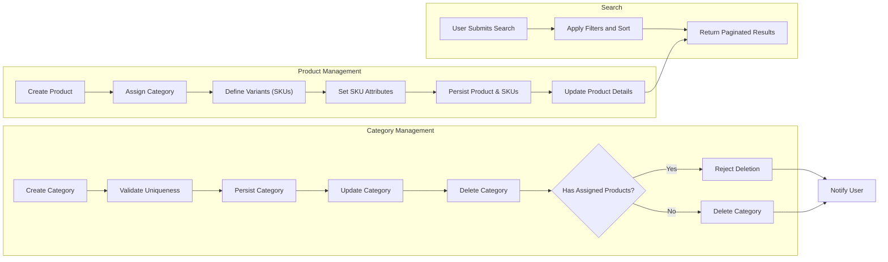

# Functional Requirements for Product Catalog in E-Commerce Shopping Mall Platform

## 1. Introduction and Scope

This document defines the complete functional business requirements for the product catalog module of the shopping mall platform. The product catalog is a critical system component that enables users to browse, search, and view products categorized appropriately. It supports detailed product variants through SKUs, enhancing product diversity and inventory precision. This document excludes technical implementation details, focusing solely on business behaviors and user needs.

## 2. Product Categories

### 2.1 Category Creation, Update, and Deletion

- WHEN an authorized user with appropriate permissions (such as a seller or admin) creates a new category, THE system SHALL persist the category with a unique identifier, a name, a description, and an optional parent category to support nested hierarchy.
- WHEN a category name is submitted, THE system SHALL validate that the name is unique among sibling categories to avoid conflicts.
- WHEN updating a category, THE system SHALL allow modification of the name, description, and parent category, preserving data integrity by ensuring the hierarchy remains consistent.
- IF a category is deleted, THEN THE system SHALL verify whether any products are assigned to it; IF products exist, THEN THE system SHALL reject the deletion and notify the user with an explanatory message.

### 2.2 Category Hierarchy and Relationships

- THE system SHALL support hierarchical category structures with unlimited depth to facilitate flexible product organization.
- WHERE a category has a parent category, THE system SHALL maintain the parent-child relationship for navigation and filtering purposes.
- THE system SHALL provide category listings ordered alphabetically by name within each hierarchy level.
- THE system SHALL allow retrieval of all subcategories recursively for any given category, enabling comprehensive category filtering.

## 3. Product Listing and Details

### 3.1 Product Metadata

- WHEN a seller creates a product, THE system SHALL require the following mandatory attributes:
  - Product name as a non-empty string with a maximum length of 255 characters.
  - Product description as free text providing detailed information.
  - Assignment to at least one existing category for discoverability.
- WHERE optional metadata are provided by the seller, THE system SHALL store attributes such as brand, manufacturer, and general tags.
- THE system SHALL assign a globally unique product identifier to each product for tracking.

### 3.2 Product Detail Specifications

- THE system SHALL allow multiple images per product, supporting various image URLs and captions to enhance product presentation.
- THE system SHALL display product availability status based on SKU inventory levels.
- THE system SHALL track and display prices either at the product-level or at the SKU-level when variants exist.
- THE system SHALL maintain and store historical changes of product details for auditing and versioning purposes.

## 4. Product Variants (SKUs)

### 4.1 Variant Attributes

- THE system SHALL support product variants distinctly defined by attributes such as color, size, and other customizable options.
- THE system SHALL allow sellers to define variant options accurately when creating or updating a product to capture product differences precisely.

### 4.2 SKU Identification and Distinction

- THE system SHALL create unique SKUs for every distinct combination of variant attributes, ensuring unambiguous identification.
- EACH SKU SHALL have the following properties:
  - SKU code that is a unique string identifier.
  - Price expressed as a decimal number.
  - Inventory quantity as an integer representing stock count.
  - Additional SKU-specific metadata such as weight or barcode if applicable.

### 4.3 Inventory Tracking per SKU

- THE system SHALL update inventory quantities at the SKU level in real-time upon sales, returns, or manual adjustments.
- IF inventory for a SKU reaches zero, THEN THE system SHALL mark it as out of stock and prevent ordering unless backordering is enabled by business policy.

## 5. Search Functionality

### 5.1 Search Parameters

- WHEN a user submits a search query, THE system SHALL accept and process the following filters:
  - Keyword matching against product names and descriptions.
  - Filters by category, including parent and child categories.
  - Price range filters allowing customers to specify minimum and maximum prices.
  - Availability status filters to show in stock or out of stock products.
  - Filters for brand or manufacturer to refine results.
- THE system SHALL support sorting of search results by relevance, price (ascending or descending), and newest arrivals.

### 5.2 Search Result Ordering and Pagination

- THE system SHALL paginate search results with a default page size of 20 products to optimize user experience.
- WHEN a specific page number is provided, THE system SHALL return the corresponding page of results.
- THE system SHALL return search results within 2 seconds for datasets up to 10,000 products to ensure responsiveness.

## 6. Business Rules and Validation

- Product names SHALL NOT contain offensive or prohibited content; THE system SHALL validate against a predefined forbidden word list during product creation and update.
- Category names SHALL be unique within the same hierarchy level to avoid ambiguity.
- SKU codes SHALL be unique per product and globally unique within the platform.
- Price values for products and SKUs SHALL be equal to or greater than zero.
- Inventory quantities SHALL never be negative; THE system SHALL enforce this strictly.

## 7. Error Handling and User Feedback

- IF any mandatory attribute is missing during creation or update operations, THEN THE system SHALL reject the operation with clear validation error messages specifying missing or invalid fields.
- IF a search query yields no results, THEN THE system SHALL return an empty result set with a friendly message informing the user.
- IF deletion of a category or product is rejected due to business constraints, THEN THE system SHALL notify the user with the reason for rejection.

## 8. Performance Requirements

- THE system SHALL respond to product catalog retrieval requests within 1 second under typical load conditions.
- THE system SHALL ensure that search queries respond within 2 seconds for datasets up to 10,000 products.
- THE system SHALL support concurrent access by multiple users without degradation in retrieval performance.

## 9. Mermaid Diagram: Product Catalog Main Processes

---

This document provides business requirements only. All technical implementation decisions belong to developers. Developers have full autonomy over architecture, APIs, and database design. This document describes WHAT the system should do, not HOW to build it.