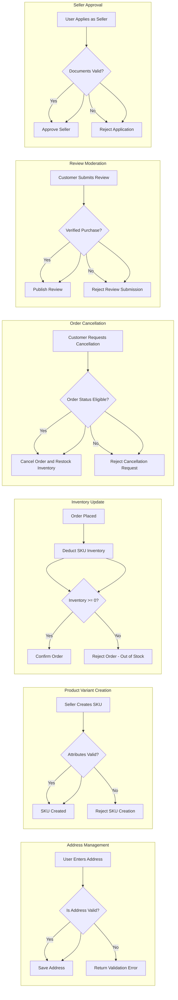

# Business Rules and Operational Constraints for the E-Commerce Shopping Mall Platform

## 1. Introduction

### 1.1 Purpose and Scope
This document specifies comprehensive business rules and operational constraints governing the e-commerce shopping mall platform. It provides backend developers with precise, implementation-ready requirements to enforce correct validation, business logic, and workflow constraints that ensure platform reliability and user satisfaction.

### 1.2 Audience
The intended audience is backend developers and system architects responsible for implementing core functionalities such as address management, product variant handling, inventory control, order processing, review moderation, and seller management.

## 2. Address Validation Rules

### 2.1 Address Data Requirements
WHEN a user enters or updates an address, THE system SHALL require the following fields and validate them strictly:
- Recipient name: non-empty string, maximum 100 characters
- Street address line 1: non-empty string, maximum 200 characters
- Street address line 2: optional string, maximum 200 characters
- City: non-empty string, maximum 100 characters
- State/Province/Region: non-empty string, maximum 100 characters
- Postal/ZIP code: alphanumeric string, maximum 20 characters, validated per country format
- Country: valid country code supported by the platform
- Phone number: numeric string 10-15 digits, may start with '+' sign

### 2.2 Address Format Validation
WHEN an address is submitted, THE system SHALL validate postal codes against country-specific formats and phone numbers to ensure numeric content plus optional leading '+' sign. THE system SHALL enforce maximum length constraints for each field.

### 2.3 User Address Management Rules
THE system SHALL allow users to save up to 5 addresses. WHEN managing addresses, THE system SHALL permit adding, editing, deleting, and marking exactly one default address. Invalid addresses SHALL be rejected with clear, descriptive error messages.

## 3. Product Variant Rules

### 3.1 SKU Definition and Attributes
WHEN a seller creates product variants, THE system SHALL require a unique SKU identifier per variant. Each SKU SHALL define mandatory attributes such as color and size, and MAY include additional optional attributes. Attribute values SHALL conform to allowed enumerations.

### 3.2 Variant Attribute Constraints
THE system SHALL validate variant attributes ensuring mandatory presence and validity of values. THE system SHALL reject SKUs with duplicate attribute combinations for the same product.

### 3.3 Variant Uniqueness and Pricing
THE system SHALL enforce SKU uniqueness within each product and permit independent pricing and inventory control per SKU. Sellers SHALL be able to enable or disable variants.

## 4. Inventory Constraints

### 4.1 Inventory Tracking
THE system SHALL maintain accurate inventory counts at SKU level. WHEN orders are successfully placed and paid, THE system SHALL decrement SKU inventory accordingly.

### 4.2 Inventory Limits and Low Stock Alerts
THE system SHALL prevent inventory counts from becoming negative. WHEN SKU inventory falls below configurable thresholds, THE system SHALL notify sellers to replenish stock.

### 4.3 Stock Replenishment
IF an order is cancelled before shipment, THEN THE system SHALL restore SKU inventory quantities appropriately.

## 5. Order Cancellation and Refund Policies

### 5.1 Cancellation Eligibility
WHEN a customer requests order cancellation, THE system SHALL verify the order status is "confirmed" and not yet shipped or delivered. Cancellation SHALL be allowed only within 24 hours of order placement.

### 5.2 Refund Processing
WHEN refunds are requested, THE system SHALL initiate refund workflow, notify administrators for approval, and execute refunds to original payment methods upon approval.

### 5.3 Rejection and Error Handling
IF cancellation or refund requests violate business rules, THEN THE system SHALL reject the request with clear reasons communicated to the user.

## 6. Review Moderation

### 6.1 Review Submission
WHEN customers submit product reviews, THE system SHALL ensure submissions are from verified purchasers only, limiting to one review per product per order.

### 6.2 Content Moderation
THE system SHALL automatically flag reviews containing inappropriate content through keyword filtering and escalate these for manual administrative review.

### 6.3 User Sanctions
IF users submit repeatedly flagged content, THE system SHALL suspend review privileges for a configurable duration.

## 7. Seller Approval Processes

### 7.1 Seller Registration
WHEN users apply as sellers, THE system SHALL validate submission of all required business documents such as licenses and identification, and verify contact data.

### 7.2 Product Listing Approval
THE system SHALL require all new seller product listings to pass an administrative approval before public availability.

### 7.3 Suspension and Compliance
IF a seller repeatedly violates platform policies, THEN THE system SHALL suspend the seller account and notify them with reasons and suspension duration.

## 8. Business Rules Summary

### 8.1 Performance
THE system SHALL respond to CRUD operations on critical entities within 2 seconds under normal load.

### 8.2 Error Handling
THE system SHALL provide clear, actionable error messages for validation failures and business rule violations.

### 8.3 Security and Access Control
THE system SHALL enforce role-based access control according to defined user actor permissions, ensuring sellers manage only their products and admins have full access.

## 9. Mermaid Diagrams

