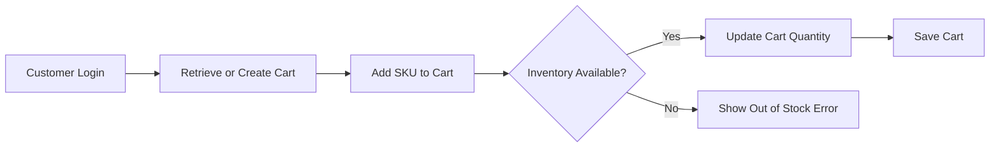
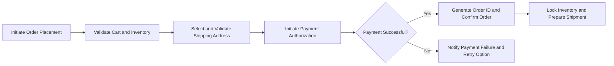

# ShoppingMall Platform - Shopping Cart and Order Management Requirements

## 1. Introduction
The ShoppingMall platform provides e-commerce capabilities allowing customers, sellers, and administrators to interact through a robust backend supporting critical shopping and order workflows. This document details the comprehensive business requirements for shopping cart management, wishlist functionality, order placement, payment processing, and order tracking including shipping updates.

## 2. User Actors and Roles
The primary users interacting with the shopping cart and order system include:
- **Guest**: Unauthenticated user permitted to browse products but unable to manage cart or orders.
- **Customer**: Authenticated user with full cart management, order placement, and tracking capabilities.
- **Seller**: Authenticated user who can view order shipping statuses related to their products.
- **Admin**: System administrator with full oversight and management capabilities over orders.

## 3. Shopping Cart Management

### 3.1 Cart Creation and Persistence
- WHEN a customer logs in, THE system SHALL ensure a persistent shopping cart exists tied uniquely to their account.
- IF no existing cart is found, THEN THE system SHALL automatically create an empty cart for the customer.
- THE shopping cart SHALL retain contents across sessions and devices for continuity.

### 3.2 Adding Items to Cart
- WHEN a customer adds a product variant (SKU) to their cart, THE system SHALL add the SKU entry or increment quantity if it already exists.
- THE system SHALL validate SKU availability in inventory before addition.
- IF the SKU is unavailable or stock is insufficient, THEN THE system SHALL notify the customer and prevent addition.

### 3.3 Managing Cart Item Quantities
- THE customer SHALL be able to update quantities for each SKU in the cart.
- THE system SHALL validate that quantity changes do not exceed available inventory.
- THE system SHALL support removal of SKUs from the cart on customer request.

### 3.4 Cart Validation and Error Handling
- IF at any time an SKU in the cart becomes invalid or discontinued, THEN THE system SHALL notify the customer and remove that SKU automatically.
- THE system SHALL prevent order placement if the cart is empty and notify the customer accordingly.

### 3.5 Performance
- The system SHALL respond to cart operations (add, update, remove) within 2 seconds for the vast majority of requests.

## 4. Wishlist Functionality

### 4.1 Wishlist Persistence
- THE system SHALL provide a persistent wishlist for each authenticated customer, independent of the shopping cart.
- The wishlist SHALL be maintained across customer sessions and devices.

### 4.2 Wishlist Management
- Customers SHALL be able to add and remove product SKUs from their wishlist freely.
- THE wishlist SHALL enforce no duplication of SKUs.

### 4.3 Wishlist Privacy and Sharing
- IF wishlist sharing is enabled by policy, THEN THE system SHALL provide secure shareable links with access controls.
- OTHERWISE, wishlists SHALL remain private and only accessible to their owners.

## 5. Order Placement

### 5.1 Initiating an Order
- WHEN a customer initiates an order, THE system SHALL retrieve the current cart and validate all SKUs have sufficient stock.
- IF any SKU is out of stock, THEN THE system SHALL notify the customer and abort order placement.

### 5.2 Shipping Address Selection
- Customers SHALL select a shipping address from their saved address list.
- THE system SHALL validate the completeness and correctness of the chosen address.

### 5.3 Inventory Reservation
- THE system SHALL reserve the required quantities of SKUs upon successful validation and order confirmation.
- IF inventory reservation fails due to concurrency conflicts, THEN THE system SHALL abort the order and inform the customer.

### 5.4 Payment Processing
- THE system SHALL initiate payment authorization after order validation using supported payment methods (credit card, wallet, bank transfer).
- IF payment authorization fails, THEN THE system SHALL notify the customer with clear failure reason and allow retries.
- Only upon successful payment SHALL the system finalize the order and generate a unique order ID.

### 5.5 Order Cancellation Constraints
- Customers SHALL be able to cancel orders only when status is "Pending" or "Processing".
- Orders that have initiated shipment SHALL NOT be cancellable and instead follow the refund process.

## 6. Order Tracking and Shipping Updates

### 6.1 Tracking
- WHEN an order is shipped, THE system SHALL assign a tracking number linked clearly to the order.
- Customers SHALL be able to view real-time shipping status updates (e.g., "Processing", "Shipped", "In Transit", "Delivered").

### 6.2 Notifications
- THE system SHALL send notifications via email or app alerts on key status changes.
- Sellers SHALL have access to update shipping status for orders containing their products.

### 6.3 Exceptions
- IF shipping updates fail to process, THEN THE system SHALL log the error and notify administrators.

## 7. User Roles and Permissions
| Action                             | Guest | Customer | Seller  | Admin |
|----------------------------------|-------|----------|---------|-------|
| Browse product catalog            | ✅    | ✅       | ✅      | ✅    |
| Manage own shopping cart          | ❌    | ✅       | ❌      | ❌    |
| Manage own wishlist               | ❌    | ✅       | ❌      | ❌    |
| Place orders                     | ❌    | ✅       | ❌      | ❌    |
| View own orders                  | ❌    | ✅       | ❌      | ✅    |
| Cancel own orders                | ❌    | ✅       | ❌      | ✅    |
| Process payments                 | ❌    | ✅       | ❌      | ❌    |
| Track order shipping status     | ❌    | ✅       | ✅*     | ✅    |
| Access all orders and carts data | ❌    | ❌       | ❌      | ✅    |
* Sellers can view shipping status for their own products only.

## 8. Business Rules and Error Handling
- IF an unauthenticated user attempts access to cart or orders, THEN THE system SHALL deny access and prompt login.
- IF order placement fails due to inventory or payment issues, THEN THE system SHALL roll back the transaction and restore cart state.
- THE system SHALL use optimistic locking to prevent race conditions on inventory and order updates.

## 9. Performance and Security
- Cart operations SHALL respond within 2 seconds for 95% of cases.
- The entire order placement transaction SHALL complete within 10 seconds.
- All order and payment data SHALL be stored and transmitted securely using encryption.

## 10. Mermaid Diagrams

### 10.1 Shopping Cart Workflow

### 10.2 Order Placement and Payment Flow

---

This document provides business requirements only. Technical detail decisions, including architecture, API design, and database structures, are left to the development team. This document defines WHAT the system shall do, not HOW to build it.