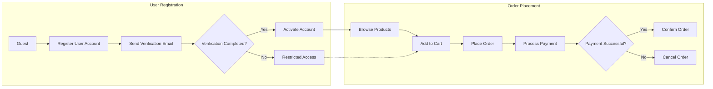
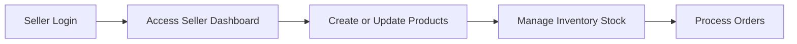
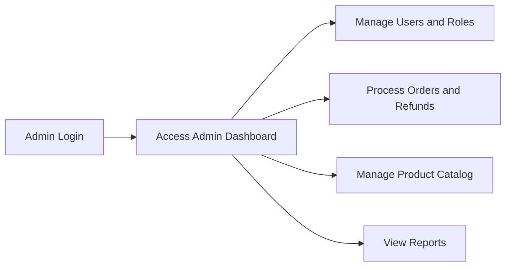

# E-commerce Shopping Mall Platform - Requirements Analysis Report

## 1. Introduction
This report defines the comprehensive business requirements for the e-commerce shopping mall platform named **shoppingMall**. The platform enables multi-vendor product browsing, purchase, seller management, and administrative oversight.

## 2. Business Model

### 2.1 Why This Service Exists
The platform fills a market need by uniting multiple sellers with customers in a single marketplace, simplifying product discovery, transaction processing, and seller support.

### 2.2 Revenue Strategy
- Transaction fees on sales
- Subscription fees for sellers
- Advertising and promotions

### 2.3 Growth Plan
- User acquisition via marketing
- Seller onboarding
- Retention through features like wishlist and reviews

### 2.4 Success Metrics
- Monthly active users
- Transaction volume
- Seller retention
- Order fulfillment rate

## 3. User Actors and Authentication

### 3.1 Actors
- **Guest**: Browses catalog and registers
- **Customer**: Manages account, orders, wishlist
- **Seller**: Manages products, inventory, orders
- **Admin**: Full platform control

### 3.2 Authentication
- Email/password registration
- Email verification mandatory
- JWT session tokens
- Password reset support

### 3.3 Permission Matrix
| Action                  | Guest | Customer | Seller | Admin |
|-------------------------|-------|----------|--------|-------|
| Browse catalog          | ✅    | ✅       | ✅     | ✅    |
| Register account       | ✅    | ❌       | ❌     | ❌    |
| Manage account details | ❌    | ✅       | ❌     | ✅    |
| Place orders           | ❌    | ✅       | ❌     | ✅    |
| Manage own products    | ❌    | ❌       | ✅     | ✅    |
| Admin dashboard access | ❌    | ❌       | ❌     | ✅    |

## 4. Functional Requirements

### 4.1 User Registration and Login
- WHEN a guest registers with valid email and password, THE system SHALL create a user account pending verification.
- WHEN a user verifies email, THE system SHALL activate the account.
- WHEN a user logs in, THE system SHALL authenticate credentials and issue JWT tokens.
- IF login fails, THEN THE system SHALL return an authentication error.

### 4.2 Address Management
- THE customer SHALL be able to add, update, delete multiple addresses.
- WHEN placing orders, THE customer SHALL select one shipping address.

### 4.3 Product Catalog and Search
- THE system SHALL categorize products hierarchically.
- THE system SHALL support keyword search and filtering.

### 4.4 Product Variants (SKUs)
- THE seller SHALL create SKUs with attributes (color, size, options).
- INDEPENDENT inventory and pricing per SKU.

### 4.5 Shopping Cart and Wishlist
- THE customer SHALL add/remove SKUs from cart.
- Cart and wishlist persist across sessions.
- Wishlist items remain private.

### 4.6 Order Placement and Payment
- Validate cart contents and inventory.
- Process payments via gateways (e.g., Stripe, PayPal).
- On payment success, create order and decrement inventory.

### 4.7 Order Tracking and Shipping
- Customers receive real-time order status updates.
- Shipping status updated manually or by integration.

### 4.8 Product Reviews and Ratings
- Purchasers may submit moderated reviews.
- One review per product per order.

### 4.9 Seller Account Features
- Seller registration and profile management.
- Product and inventory management.
- Order viewing and fulfillment.

### 4.10 Inventory Management
- Real-time SKU inventory tracking.
- Stock decremented atomically on orders.

### 4.11 Order History, Cancellation, and Refunds
- Customer order history access.
- Cancellation/refund requests within policy.
- Admin review of refund requests.

### 4.12 Admin Dashboard
- Full management of products, orders, users.
- Monitoring and reporting.

## 5. Business Rules
- Emails unique and verified.
- Inventory must not be negative.
- Orders cannot be cancelled after shipment.
- Refunds require admin approval.

## 6. Error Handling
- Clear messages on authentication failure.
- Prevent ordering out-of-stock items.
- Payment failure triggers user notifications.
- Reject inappropriate reviews.

## 7. Performance Requirements
- Login within 2 seconds.
- Search results within 1 second.
- Support 1000 concurrent users.

## 8. Security and Privacy
- Password hashing and secure sessions.
- HTTPS enforcement.
- Role-based access control.
- GDPR and similar compliance.

## 9. Administrative Management
- Order processing and status updates.
- Product approval and moderation.
- User account and role management.
- System health monitoring and alerting.

## 10. Mermaid Diagrams

### User Registration and Order Process

### Customer Order Workflow

```mermaid
graph LR
  A["User Login"] --> B["Browse Product Catalog"]
  B --> C["Select Product Variant"]
  C --> D["Add to Shopping Cart"]
  D --> E["Proceed to Checkout"]
  E --> F["Select Shipping Address"]
  F --> G["Make Payment"]
  G --> H["Receive Order Confirmation"]
  H --> I["Track Order Status"]
```

### Seller Product Management Workflow

### Admin Management Workflow

---

This document contains business requirements only. Technical implementation details such as database schemas, APIs, or frontend specifications are outside the scope and left to developers. The document focuses entirely on describing WHAT the system must do from a business perspective.