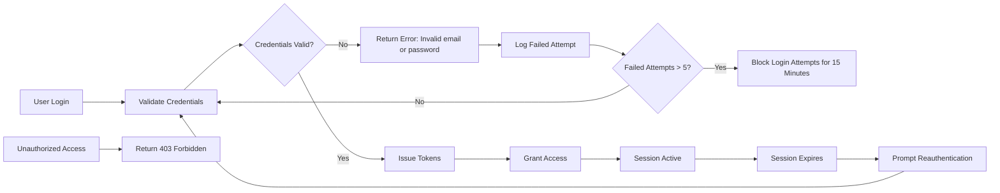
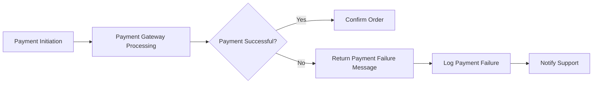
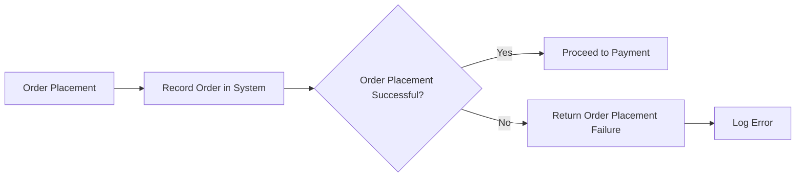
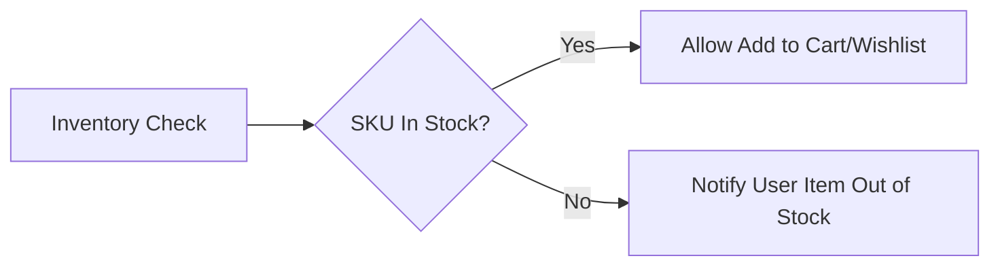
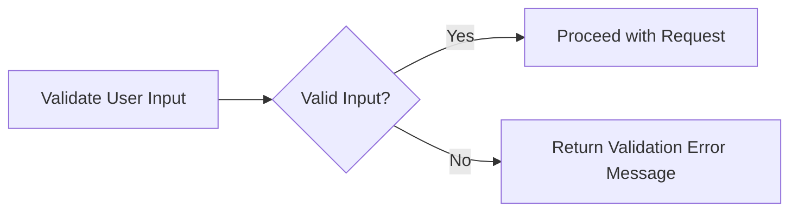

# Error Handling and Recovery Requirements for the E-Commerce Shopping Mall Platform

## 1. Introduction

WHEN errors occur during user interactions or backend processes, THE system SHALL handle them gracefully to maintain reliability and user trust. THE system SHALL provide informative, user-friendly messages and support recovery or retry where applicable.

## 2. Authentication Errors

### 2.1 Login Failures
WHEN a user submits incorrect login credentials, THE system SHALL reject the login attempt with the error message "Invalid email or password" and record the failed attempt in system logs within 1 second.
WHEN a user exceeds 5 consecutive failed login attempts, THE system SHALL temporarily block login attempts for 15 minutes and inform the user with the message "Too many failed attempts. Please try again after 15 minutes."

### 2.2 Session Expiry
WHEN a user session expires due to inactivity, THE system SHALL require reauthentication and display the message "Your session has expired. Please log in again to continue."

### 2.3 Unauthorized Access
WHEN a user attempts to access resources outside their permission scope, THE system SHALL deny access with HTTP status 403 and display the message "You do not have permission to access this resource." within 1 second.

## 3. Payment Failures

### 3.1 Payment Gateway Errors
WHEN the payment gateway returns an error or timeout during payment processing, THEN THE system SHALL inform the user with the message "Payment processing failed. Please try again later." and log the event.

### 3.2 Payment Declines
WHEN a payment is declined by the payment provider, THE system SHALL notify the user with the message "Payment was declined. Please check your payment details or try another payment method."

### 3.3 Refund Processing Failures
WHEN a refund request fails due to payment system errors, THE system SHALL log the failure, notify administrators for manual intervention, and inform the user with the message "Refund processing failed. Please contact support."

## 4. Order Processing Errors

### 4.1 Order Placement Failures
WHEN an order fails to be recorded due to backend errors, THEN THE system SHALL notify the customer with the message "Unable to place your order at this time. Please try again later." and log the error.

### 4.2 Shipment Update Failures
WHEN the system fails to retrieve the latest shipment status, THEN THE system SHALL mark the status as "Unknown", notify the customer with the message "Shipping status is temporarily unavailable. Please check back later.", and log the incident.

## 5. Inventory Shortages

### 5.1 Out-of-Stock Handling
WHEN a product SKU is out of stock, THE system SHALL prevent adding the SKU to carts and wishlists and notify the user with the message "This item is currently out of stock." within 1 second.
WHEN stock replenishment is expected, THE system SHALL allow users to subscribe for availability notifications.

### 5.2 SKU Unavailability
WHEN sellers remove or discontinue SKUs, THE system SHALL update the catalog to remove availability and prevent ordering of such SKUs.

## 6. User Input Validation Errors

### 6.1 Registration and Login Input
WHEN user registration or login inputs are invalid, THE system SHALL reject the request and display contextual error messages explaining the validation failure.

### 6.2 Address Input Validation
WHEN an address submitted is incomplete or invalid, THE system SHALL reject the update with detailed instructions on required corrections.

### 6.3 Search and Filter Input
WHEN search or filter criteria are unsupported or invalid, THE system SHALL ignore unsupported filters, perform the search using valid criteria, and notify the user about any ignored inputs.

## 7. General Error Notification and Recovery

THE system SHALL log all errors with timestamps and relevant context for auditing and troubleshooting.
WHEN recoverable errors occur, THE system SHALL offer the user options to retry the operation without losing progress.
IF notification delivery fails, THE system SHALL retry with exponential backoff up to 3 times and notify support if the issue persists.

## 8. Summary
THE system SHALL ensure robust error handling covering authentication, payments, orders, inventory, and user inputs to enhance user trust and platform reliability. ALL error messages SHALL be clear, timely, and actionable to facilitate user recovery. Implementers have full autonomy regarding technical error handling methods, provided the business requirements are met.

