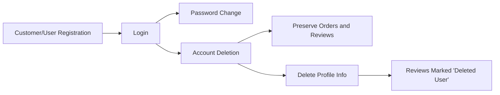
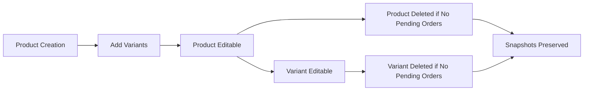
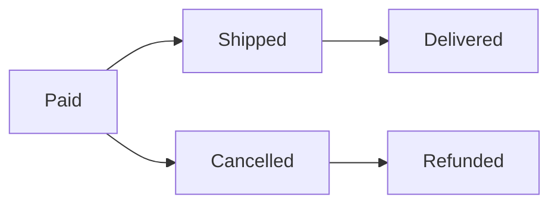
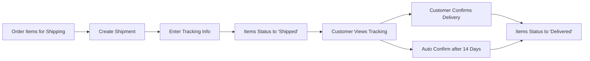

# E-Commerce Shopping Mall Platform Requirements Specification

---

## 1. Introduction

### 1.1 Overview

An e-commerce shopping mall platform enables customers to browse, search, purchase products from multiple sellers in a secure, user-friendly environment. The platform facilitates seller registrations and approvals, product management, and order processing with complete snapshot history and compliance features.

### 1.2 Business Goals

- Provide a secure and reliable online marketplace
- Enable trusted seller onboarding with administrative approval
- Ensure complete traceability through immutable snapshots
- Support detailed product variants and inventory management
- Facilitate efficient order processing with flexible shipping and refund policies


## 2. User Accounts

### 2.1 Customer Account

- WHEN a user provides an email and password during registration, THE system SHALL create a customer account.
- WHEN a customer logs in with valid credentials, THE system SHALL authenticate and initiate a secure session.
- WHEN a customer requests password change, THE system SHALL validate old password and update to new password.
- WHEN a customer requests account deletion, THE system SHALL delete profile information but preserve orders and reviews; reviews shall be displayed as "deleted user".
- Customers MUST be registered and authenticated to use any platform features; no guest browsing is allowed.

### 2.2 Seller Account

- WHEN a user provides an email and password during seller registration, THE system SHALL create a seller account in "pending" status.
- Seller accounts are subject to administrator approval before they can sell.
- WHEN an administrator approves or rejects a seller registration, THE system SHALL update the seller’s approval status.
- Sellers can view their approval status including rejection reasons.
- Rejected sellers MAY submit new registration requests.
- Sellers can update their password and request account deletion with constraints: No pending paid/shipped orders or cancellation/refund requests.
- WHEN a seller deletes their account, THE system SHALL delete their products but preserve order history and shop names in past orders.

### 2.3 Authentication and Authorization

- Authentication uses secure credential verification (email/password).
- Sessions are securely managed with token-based or session-based mechanisms.
- Authorization roles:
  - Customers: Access to shopping, profile, orders, reviews.
  - Sellers: Access to product management, order processing, dashboard.
  - Administrators: Full system control including approvals, user bans, product oversight.


## 3. Profiles and Addresses

### 3.1 Customer Profiles

- Each customer profile contains display name and phone number.
- Customers may update their display name and phone number.

### 3.2 Seller Profiles

- Seller profiles include shop name, description, and logo image.
- Sellers can edit these elements; each change creates an immutable snapshot.
- Customers can view seller profiles.

### 3.3 Address Management

- Customers can add multiple addresses with recipient name, phone, street address, city, state/province, postal code and country.
- Customers can edit, delete addresses and set a default shipping address.
- Address changes impact order shipping selections.


## 4. Categories and Products

### 4.1 Category Management

- Administrators can create, edit, delete categories and one-level subcategories.
- Category names must be unique.
- When a category is deleted, products assigned to it become uncategorized.
- Customers can browse category lists and view products within categories.

### 4.2 Product Catalog and Variants

- Sellers can create products with name, description, category (or subcategory), base price.
- Each product belongs to the creating seller.
- Products require at least one variant (SKU).
- Variants have unique SKU code, option values, optional price override, stock quantity.
- Sellers can add, edit (with snapshots), delete variants with constraints: no pending orders or refund/cancellation requests.
- Variants with zero stock are out of stock and unavailable for cart addition.
- Product deletion rules: no pending orders or refund/cancellation requests; deletion removes variants and inventory.

### 4.3 Product Images

- Multiple images per product allowed.
- Sellers can reorder and delete images; changes trigger snapshots.
- The first image serves as the thumbnail.

### 4.4 Inventory Management

- Stock tracked via inventory history records detailing changes, reasons, timestamps.
- Sellers can add (restock) or subtract inventory (adjustments/loss).
- Order placement and cancellation automatically create inventory records adjusting stock.
- Current stock is the sum of history records.
- Stock cannot be negative.


## 5. Search and Wishlist

### 5.1 Product Search

- Customers can search by product name.
- Results include all sellers’ products.
- Supports pagination, filtering by category, price range, in-stock.
- Sort options: newest, price low to high, price high to low.

### 5.2 Wishlist Management

- Customers can add products to wishlist.
- Wishlist is paginated and shows products.
- Products removed if seller deletes the product.
- Customers can remove products from wishlist.


## 6. Shopping Cart and Checkout

### 6.1 Shopping Cart

- Customers add product variants to cart specifying quantity.
- Quantities combine if same variant added multiple times.
- Cart displays product name, variant options, price, quantity, subtotal.
- Customers can update quantities or remove items.
- Shows total price and warns if quantity exceeds stock.
- Unavailable or out-of-stock variants marked in cart.

### 6.2 Checkout Process

- Checkout requires selecting shipping address (or default).
- Items marked unavailable cannot be checked out.
- Order summary reviewed before placing order.
- Shipping address locked after order placement.


## 7. Orders

### 7.1 Order Creation and Status

- Successful order placement decreases stocked quantities, removes items from cart.
- Records created: order, order items linked to purchased variants/status "paid".
- Snapshots preserve product, variant, seller profile states at purchase.

### 7.2 Shipping and Tracking

- Sellers can ship order items individually or bundled per seller.
- Shipments include tracking info (carrier, tracking number).
- Shipment creation sets item status to "shipped".
- Customers can view tracking and confirm delivery per shipment.
- Unconfirmed delivery auto-updates to "delivered" after 14 days.

### 7.3 Order Cancellation

- Cancellation per order item with status "paid".
- Customers request cancellation with reason.
- Sellers approve/reject cancellation; responses snapshot.
- Approved cancellations update order item status, restore stock.
- Partial cancellations allowed within orders.

### 7.4 Refund Requests

- Refund requested per order item with status "delivered" within 7 days.
- Customers submit reason.
- Sellers respond with approval/rejection; response snapshots saved.
- Approved refunds update item status and restore stock.
- Partial refunds allowed.

### 7.5 Reviews and Ratings

- Customers write one review per product per order after delivery.
- Review includes 1-5 star rating and optional text.
- Reviews can be edited or deleted by customer; edits snapshot.
- Average rating calculated excluding deleted reviews.


## 8. Seller Dashboard

- Sellers view product count, order item count, pending cancellation/refund counts.
- Can filter order items by status.


## 9. Administrator System

### 9.1 Admin Roles and Permissions

- Users may request admin roles with reason.
- Super admins approve/reject and manage admin grades.
- Two grades: regular and super administrator.

### 9.2 Seller Management

- Admins approve/reject seller registrations with reasons.
- Can suspend/unsuspend seller accounts affecting product visibility and sales.

### 9.3 Category Management

- Admins manage categories and subcategories.

### 9.4 Product Oversight

- Admins view all products, snapshots.
- May delete products for policy violations.

### 9.5 Order Oversight

- Admins view all orders.
- May force cancel or refund items/orders.

### 9.6 User Management

- Manage customers and sellers including banning/unbanning.


## 10. Snapshot Principle

- All data modifications create immutable snapshots capturing previous and new states.
- Affected entities: products, variants, sellers, orders, reviews, cancellations, refunds.
- Snapshots enable dispute resolution and data integrity.


## 11. Security and Performance

- Secure authentication and authorization enforced.
- Sensitive data protected according to compliance requirements.
- Performance targets: API responses within 2 seconds, pagination for lists.
- Error handling includes descriptive messages and fallback strategies.


## 12. Glossary and References

- Terms and concepts defined.
- Links to related documents for detailed reference.

---

# Mermaid Diagram: User Account Flow


# Mermaid Diagram: Seller Registration and Approval Flow
```mermaid
graph LR
  A["Seller Registration"] --> B["Pending Approval"]
  B --> C{"Approved?"}
  C --|"Yes"--> D["Seller Can Sell"]
  C --|"No"--> E["Rejected with Reason"]
  E --> F["New Registration Request"]
```

# Mermaid Diagram: Product and Variant Lifecycle


# Mermaid Diagram: Order Item Status Transitions


# Mermaid Diagram: Shipping and Delivery Confirmation

