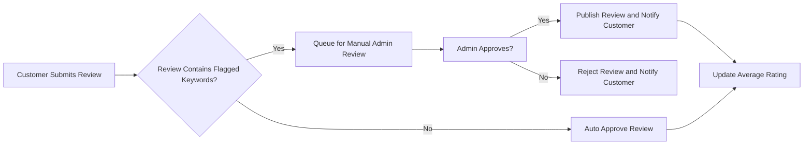
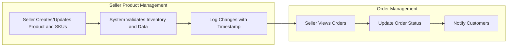

# Product Reviews and Seller Management Requirements

This document defines the complete business requirements for implementing product reviews, ratings, and seller account management functionalities for the shoppingMall e-commerce platform. It describes all user interactions, business processes, rules, and system expectations needed to enable these features.

This document provides business requirements only. All technical implementation decisions belong to developers.

---

## 1. Introduction

The shoppingMall platform allows customers to express their opinions and experiences through product reviews and ratings. Sellers can manage their accounts, products, inventory, and orders associated with their sales. These features enhance the shopping experience by increasing transparency and empowering sellers.

## 2. Product Reviews and Ratings

### 2.1 Review Submission

- WHEN a customer places an order that includes one or more products, THE system SHALL allow the customer to submit a review for each purchased product.
- WHEN a customer submits a product review, THE system SHALL require the review to include at least a rating value between 1 and 5 (inclusive).
- WHERE a review includes text content, THE system SHALL accept comments up to 1000 characters in length.
- WHEN a customer attempts to submit a review for a product they have not purchased, THEN THE system SHALL reject the submission and inform the user appropriately.
- WHEN a customer submits a review, THE system SHALL record the review date and link the review to the customer, product, and specific order.
- WHEN a customer submits multiple reviews for the same product in different orders, THE system SHALL treat each review as a separate entry.

### 2.2 Review Display

- WHEN displaying product details, THE system SHALL show an aggregated average rating calculated from all approved reviews.
- WHEN displaying product reviews, THE system SHALL show only reviews that have been approved by moderation or automatically accepted based on rules.
- THE system SHALL display the review date, reviewer's username (anonymized or displayed as per privacy rules), rating value, and text content for each review.
- THE system SHALL paginate product reviews showing 10 reviews per page, sorted by most recent first.

### 2.3 Rating Aggregation

- THE system SHALL calculate the average product rating as the arithmetic mean of all approved review ratings.
- WHEN new reviews are approved or removed, THE system SHALL immediately update the average rating displayed.

## 3. Review Moderation

### 3.1 Moderation Workflow

- WHEN a review is submitted, THE system SHALL queue it for moderation before public display.
- WHERE a review contains flagged keywords (e.g., offensive words, spam terms), THEN THE system SHALL block the review from display until manually reviewed by an admin.
- THE system SHALL allow admin users to approve, reject, or request changes for reviews.
- WHEN a review is rejected or changes requested, THEN THE system SHALL notify the customer via email or notification.

### 3.2 User Notifications

- WHEN a review is approved, THEN THE system SHALL notify the customer that their review is now publicly visible.
- WHEN a review is rejected, THEN THE system SHALL notify the customer with reasons if available.
- WHEN a review requires changes, THEN THE system SHALL notify the customer with instructions on how to update their review.

### 3.3 Moderation Criteria and Rules

- THE system SHALL automatically approve reviews without flagged content.
- THE system SHALL automatically reject reviews with prohibited content such as hate speech, threats, or spam.
- Admins MAY override any automatic decision manually.

## 4. Seller Account Features

### 4.1 Seller Registration and Profile Management

- WHEN a user registers as a seller, THEN THE system SHALL collect necessary profile information including store name, contact details, and business registration if required.
- THE system SHALL verify the seller's identity via email confirmation or other verification methods.
- THE system SHALL allow sellers to update their profiles at any time.

### 4.2 Seller Permissions

- THE system SHALL allow sellers to manage only their own products, inventory, and sales data.
- THE system SHALL restrict sellers from accessing other sellers' data or admin-only features.

### 4.3 Seller Dashboard Features

- THE seller dashboard SHALL provide views for managing products, viewing orders related to their sales, managing inventory levels per SKU, and viewing sales reports.
- THE system SHALL update data in the seller dashboard in real-time or near real-time.

## 5. Seller Product Management

### 5.1 Product Creation and Update

- THE system SHALL allow sellers to create new products including setting product name, description, price, category, and SKUs with variants (color, size, options).
- THE system SHALL require sellers to provide inventory levels per SKU upon product creation and updates.
- WHEN a seller updates a product or SKU, THEN THE system SHALL log the change with timestamp and seller ID.

### 5.2 Inventory Management per SKU

- THE system SHALL track inventory levels for each SKU separately.
- WHEN inventory reaches a threshold defined by the seller or system defaults, THEN THE system SHALL notify the seller for low stock.
- THE system SHALL prevent orders that exceed available stock per SKU.

### 5.3 Order Management for Sellers

- THE system SHALL allow sellers to view orders containing their products.
- THE system SHALL allow sellers to update the status of orders (e.g., preparing, shipped).
- THE system SHALL notify customers when sellers update shipping status.

## 6. Business Rules

- Customers can only review products they have purchased.
- Reviews must include a valid rating between 1 and 5.
- Sellers cannot access or modify products, inventory, or orders of other sellers.
- Admins have override permissions on moderation and seller management.

## 7. Error Handling

- IF a customer tries to review a product not purchased, THEN THE system SHALL reject with a clear error message.
- IF inventory is insufficient to fulfill an order, THEN THE system SHALL reject order placement and notify the customer.
- IF a seller attempts unauthorized actions on other sellers’ data, THEN THE system SHALL deny access and log the incident.

## 8. Performance Requirements

- Product reviews and ratings shall update instantly after moderation approval.
- Seller dashboard data shall reflect changes within 5 seconds of updates.
- Notifications regarding review moderation and shipping status shall be delivered within 1 minute.

## 9. Mermaid Diagrams

### 9.1 Review Submission and Moderation Flow

### 9.2 Seller Product and Order Management Flow

---

This document fully describes the business requirements for product reviews, ratings, and seller account management for the shoppingMall e-commerce platform. All requirements are expressed to support unambiguous development of backend systems that provide these capabilities according to best practices.

Developers have full autonomy over technical design, APIs, and database structure. This document specifies what the system must do, not how to implement it.