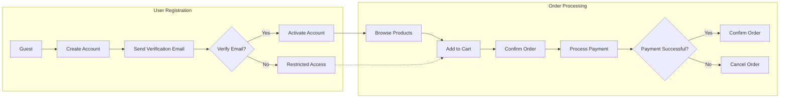

# Functional Requirements Analysis Report for E-Commerce Shopping Mall Platform

## 1. Introduction
The e-commerce shopping mall platform is designed to facilitate seamless online transactions between multiple sellers and customers. This platform enables user registration, product catalog browsing, detailed SKU management, secure order processing, payment integration, and order tracking with seller and admin management features.

## 2. User Actors and Authentication

### 2.1 Actors
- Guest: Unauthenticated user with the ability to browse the product catalog and view product details.
- Customer: Registered user who manages account settings, shipping addresses, shopping cart, wishlist, orders, and product reviews.
- Seller: Registered vendor responsible for managing product listings, SKUs, inventory, and processing orders related to their products.
- Admin: Platform administrators with full access to manage all users, products, orders, reports, and settings.

### 2.2 Authentication Requirements
- WHEN a guest submits a registration request with a valid email and password, THEN the system SHALL create a new customer account pending email verification.
- WHEN the system sends an email verification link, THEN the user SHALL verify their email within 48 hours to activate their account.
- IF email verification is not completed within 48 hours, THEN the system SHALL deactivate or delete the unverified account.
- WHEN a user logs in with valid credentials, THEN the system SHALL issue a JWT access token valid for 15 minutes and a refresh token valid for 30 days.
- IF user credentials are invalid, THEN the system SHALL deny login with an informative error message.
- THE system SHALL support password reset requests via secure email links.
- Unauthorized users SHALL have restricted access only allowing product browsing.
- Role-based access control SHALL be enforced, restricting actions based on user roles.

## 3. Functional Requirements

### 3.1 User Registration and Login
- WHEN a guest registers with a unique email and password, THEN the system SHALL create the customer account with pending status.
- WHEN registration is successful, THEN an email verification SHALL be sent.
- WHEN the customer clicks the verification link, THEN the system SHALL activate the account.
- WHEN a registered user logs in, THEN the system SHALL validate credentials and create an authenticated session.
- IF login fails due to invalid credentials, THEN the system SHALL present a clear error.

### 3.2 Address Management
- Customers SHALL be able to add, edit, delete, and list multiple shipping addresses.
- WHEN ordering, a customer SHALL select from saved addresses.
- THE system SHALL validate all address fields for completeness and format.

### 3.3 Product Catalog and Search
- THE product catalog SHALL support hierarchical categories with unlimited subcategories.
- Products SHALL be searchable by name, category, attributes, and price range.
- THE system SHALL support sorting by price, popularity, and rating.

### 3.4 Product Variants (SKU)
- Sellers SHALL manage product variants via SKUs with attributes such as color, size, and custom options.
- EACH SKU SHALL maintain a unique identifier, price, and inventory count.

### 3.5 Shopping Cart and Wishlist
- Customers SHALL be able to add SKUs to a persistent shopping cart.
- The cart SHALL persist across sessions and devices.
- Customers SHALL have a private wishlist to save items for future purchase.

### 3.6 Order Placement and Payment
- WHEN placing an order, the system SHALL validate SKU availability.
- IF inventory is insufficient, THEN the system SHALL block the order and notify the user.
- The system SHALL integrate with external payment gateways to process payments securely.
- WHEN payment succeeds, THEN the system SHALL create the order record and adjust inventory.
- IF payment fails, THEN the system SHALL notify the customer and cancel the order.

### 3.7 Order Tracking and Shipping
- Customers SHALL track order status including processing, shipped, in-transit, and delivered.
- Sellers and admins SHALL update shipping statuses.
- Notifications SHALL be sent to customers on critical status changes.

### 3.8 Product Reviews and Ratings
- Customers who purchased a product SHALL be able to submit one review with a rating and text.
- The system SHALL moderate reviews for inappropriate content before publishing.
- Sellers SHALL not edit or delete reviews.

### 3.9 Seller Account and Product Management
- Sellers SHALL register and maintain profile information.
- Sellers SHALL create, update, and delete products and their SKUs.
- Sellers SHALL manage inventory quantities per SKU.
- Sellers SHALL view and process orders specific to their products.

### 3.10 Inventory Management
- Inventory levels SHALL be tracked per SKU, with real-time updates.
- WHEN an order is placed successfully, THEN inventory SHALL decrement atomically.
- Sellers SHALL receive alerts for low stock levels based on configurable thresholds.

### 3.11 Order History, Cancellation, and Refunds
- Customers SHALL view their complete order histories.
- Customers SHALL request cancellations or refunds within policy-defined windows.
- Cancellation SHALL be allowed only before orders ship.
- Refund requests SHALL be routed to admins for review and approval.

### 3.12 Admin Dashboard
- Admins SHALL have full access to manage users, products, orders, and reports.
- The dashboard SHALL provide operational insights and system health monitoring.

## 4. Business Rules
- User emails MUST be unique and verified.
- Passwords SHALL meet minimum complexity.
- Orders SHALL NOT be placed if SKU inventory is insufficient.
- Customers SHALL NOT review products they have not purchased.
- Refunds and cancellations SHALL comply with defined timeframes and require admin approval.
- Sellers SHALL ONLY manage their own products and inventory.

## 5. Error Handling
- IF login attempts fail, THEN the system SHALL return clear error messages.
- IF payment processing fails, THEN the system SHALL rollback order creation and notify the customer.
- IF inventory shortages occur during order placement, THEN the system SHALL prevent order confirmation.
- IF review content violates policy, THEN the system SHALL reject the submission with explanation.

## 6. Performance Requirements
- Login requests SHALL respond within 2 seconds.
- Product searches SHALL return results within 1 second.
- Order processing SHALL complete within 5 seconds under normal load.
- The system SHALL support at least 1000 concurrent users without performance degradation.

## 7. Mermaid Diagrams

### User Registration and Order Processing Flow

## 8. Conclusion
This report defines clear, detailed business requirements focusing on user interactions, business rules, error handling, and performance criteria. Authorization is role-based ensuring secure access and management. This document specifies WHAT the system must achieve and leaves implementation details to developers.
