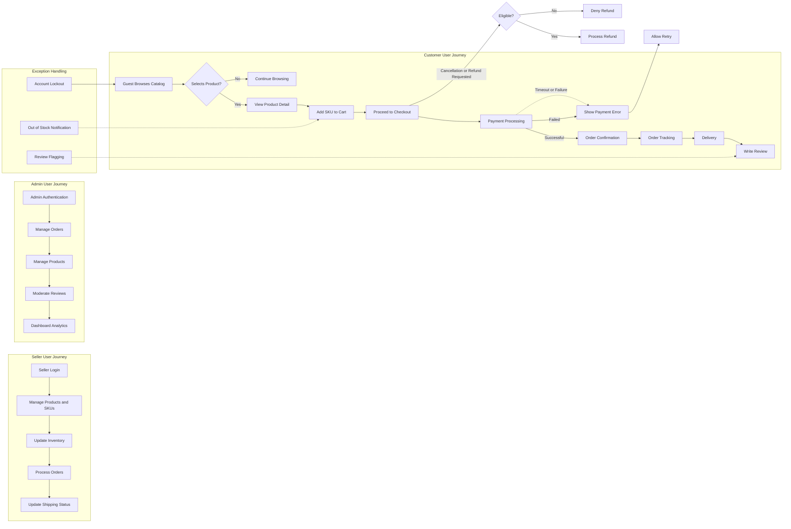

# User Scenarios and Workflows for E-Commerce Shopping Mall Platform

This document describes detailed user scenarios and workflows across all primary user roles for the shopping mall platform, explaining how users interact with the system, what business logic governs these interactions, and how exceptions are handled. This document defines business requirements only. All technical implementation decisions belong to developers, who have full autonomy over architecture, APIs, and database design. The document describes WHAT the system should do, not HOW to build it.

## 1. Introduction

This document covers the user journeys of Customers (buyers), Sellers, and Admins on the shopping mall platform. Each journey is broken down into key interactions, including normal flows and exception handling. The aim is to provide clear, implementable descriptions for backend developers to implement the full business workflow.

## 2. Customer User Journeys

### 2.1 User Registration and Login
- WHEN a guest submits registration details (email, password, name, contact info), THE system SHALL validate input formats (email format, password strength) and create a new Customer account.
- WHEN a Customer logs in with credentials, THE system SHALL authenticate credentials within 2 seconds and establish a secure session using JWT.
- IF authentication fails due to invalid credentials, THEN THE system SHALL reject login with an appropriate error code AUTH_INVALID_CREDENTIALS.
- WHEN a Customer requests password reset, THE system SHALL send a secure reset link to the registered email.

### 2.2 Address Management
- WHEN a Customer adds an address, THE system SHALL validate address fields (postal code, country, mandatory fields) before storing.
- WHEN a Customer updates or deletes an address, THE system SHALL ensure it belongs to the requesting Customer.
- WHEN a Customer places an order, THE system SHALL allow selection of an existing address or creation of a new one.

### 2.3 Browsing Product Catalog
- THE system SHALL display products organized by category and subcategory hierarchy.
- WHEN a Customer browses a category, THE system SHALL return a paginated list of products sorted by popularity or recency.
- THE system SHALL include product base details (name, image, price range, rating) without SKU specifics in listings.

### 2.4 Product Search
- WHEN a Customer submits a search query, THE system SHALL return results filtered by keyword across product name, description, and category.
- THE system SHALL support filtering by product attributes such as color, size, and other SKU options.
- THE system SHALL paginate search results and ensure query response within 1 second for typical queries.

### 2.5 Viewing Product Variants (SKUs)
- WHEN a Customer views a product detail page, THE system SHALL display all available SKUs with variant options (color, size, price, stock status).
- THE system SHALL only display SKUs with positive inventory.

### 2.6 Managing Shopping Cart
- WHEN a Customer adds a SKU to the shopping cart, THE system SHALL verify SKU inventory and update cart quantities accordingly.
- WHEN a Customer updates quantities or removes SKUs from the cart, THE system SHALL persist changes.
- THE system SHALL save the cart for the Customer and allow cart retrieval across devices.
- IF an SKU becomes out of stock, THEN THE system SHALL notify the Customer on cart usage.

### 2.7 Managing Wishlist
- WHEN a Customer adds a product to the wishlist, THE system SHALL store the product ID linked to the Customer.
- THE system SHALL allow removal of products from the wishlist.
- THE system SHALL provide the wishlist view in descending order of addition.

### 2.8 Order Placement and Payment
- WHEN a Customer initiates checkout, THE system SHALL verify Cart contents, prices, and inventory.
- THE system SHALL capture selected shipping address and payment method.
- THE system SHALL process payments using supported payment gateways (credit card, PayPal).
- IF payment is successful, THEN THE system SHALL create an order with initial status "Pending".
- IF payment fails, THEN THE system SHALL return an error code PAYMENT_FAILED and allow retry.

### 2.9 Order Tracking and Shipping Updates
- WHEN a Customer views order details, THE system SHALL display current order status (Pending, Processing, Shipped, Delivered).
- WHEN sellers update shipping status, THE system SHALL notify Customers of status changes.
- THE system SHALL allow Customers to see tracking numbers and estimated delivery.

### 2.10 Product Reviews and Ratings
- WHEN a Customer who purchased a product submits a review, THE system SHALL validate content, associate review with order and user.
- IF review content contains prohibited language, THEN THE system SHALL flag for moderation.
- THE system SHALL aggregate ratings and display average scores.

### 2.11 Order History and Refund Requests
- THE system SHALL provide Customers with a chronological list of past orders.
- WHEN a Customer requests a refund or cancellation, THE system SHALL verify eligibility based on order status and timeframe.
- IF eligible, THEN THE system SHALL initiate refund workflow and notify involved parties.

## 3. Seller User Journeys

### 3.1 Seller Account Registration and Login
- WHEN a seller applies for an account, THE system SHALL validate seller identity documents and profile information.
- Sellers SHALL log in to access their product and order management dashboard.

### 3.2 Product and SKU Management
- Sellers SHALL create and update products with multiple SKUs.
- THE system SHALL enforce SKU uniqueness per product.
- WHEN sellers update prices or options, THE system SHALL validate changes before applying.

### 3.3 Inventory Management
- Sellers SHALL update SKU inventory counts.
- THE system SHALL prevent inventory counts from falling below zero.
- WHEN inventory is low, THE system MAY notify sellers.

### 3.4 Viewing and Managing Orders
- Sellers SHALL view orders containing their products.
- Sellers SHALL update order statuses related to their shipments only.

### 3.5 Shipping Status Updates
- Sellers SHALL record shipping carrier info and tracking numbers.
- WHEN shipping status changes, THE system SHALL notify Customers.

## 4. Admin User Journeys

### 4.1 Admin Login and Access Control
- Admins SHALL authenticate with elevated permissions.
- THE system SHALL log admin access for auditing.

### 4.2 Order Management
- Admins SHALL view and modify all orders' statuses.
- Admins SHALL handle escalations and exceptions.

### 4.3 Product Management
- Admins SHALL manage products across sellers.
- THE system SHALL allow product approval or removal.

### 4.4 User Management
- Admins SHALL manage user accounts including disabling or banning.

### 4.5 Review Moderation
- Admins SHALL moderate flagged reviews.
- THE system SHALL support approval or rejection of reviews.

### 4.6 Dashboard Reporting
- Admins SHALL access analytics on sales, users, inventory, and support tickets.

## 5. Exception and Edge Cases

### 5.1 Authentication Failures
- IF login attempts exceed threshold, THEN THE system SHALL lock the account temporarily and notify the user.

### 5.2 Inventory Shortages
- IF SKU inventory is insufficient during order placement, THEN THE system SHALL notify the user and prevent checkout.

### 5.3 Payment Failures
- IF payment gateway times out, THEN THE system SHALL allow retry with appropriate user guidance.

### 5.4 Invalid Order States
- IF order cancellation is requested after fulfillment, THEN THE system SHALL deny cancellation with explanation.

### 5.5 Review Abuse Handling
- IF reviews contain spam or inappropriate content, THEN THE system SHALL auto-flag and queue for admin review.

---

