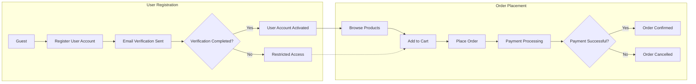

# Requirements Analysis Report for E-Commerce Shopping Mall Platform

## 1. Introduction
The shopping mall platform backend will provide a robust multi-vendor marketplace enabling customers to browse, purchase, and review products while allowing sellers to efficiently manage their catalogs and orders. Admins will oversee all platform operations through an administrative dashboard.

## 2. Business Model
The platform generates revenue through transaction fees, subscription-based seller plans, and advertising. Growth focuses on seller onboarding, customer acquisition, and expanding product categories.

## 3. User Actors and Authentication
- **Guests** can browse product catalogs and register.
- **Customers** manage profiles, addresses, carts, orders, and reviews.
- **Sellers** manage products, SKUs, inventory, and orders.
- **Admins** oversee all entities and platform management.

Authentication uses email/password with mandatory email verification, password resets, and JWT-based sessions. Role-based access controls enforce permissions.

## 4. Functional Requirements

### 4.1 User Registration and Login
- WHEN a guest registers, THE system SHALL create an account and send a verification email.
- IF email unverified, THEN THE system SHALL restrict features.
- WHEN login occurs, THE system SHALL authenticate credentials and create sessions.
- Invalid credentials SHALL prompt errors.

### 4.2 Address Management
- Customers SHALL add, update, delete, and select multiple shipping addresses.

### 4.3 Product Catalog and Search
- Products SHALL be categorized hierarchically.
- THE system SHALL support text search with filters (category, price, rating).

### 4.4 Product Variants (SKUs)
- Sellers SHALL create SKUs with attributes (color, size, options).
- Inventory and pricing tracked per SKU.

### 4.5 Shopping Cart and Wishlist
- Customers SHALL add SKUs to a persistent cart and wishlist.
- Wishlists are private.

### 4.6 Order Placement and Payment Processing
- Orders SHALL validate inventory and pricing.
- Integrate payment gateways (Stripe, PayPal).
- Payment status confirmed before order completion.

### 4.7 Order Tracking and Shipping
- Customers SHALL view order status.
- Sellers update shipping statuses manually or via integrations.

### 4.8 Product Reviews and Ratings
- Customers submit reviews post-purchase.
- Reviews are moderated.

### 4.9 Seller Account Management
- Sellers SHALL register, manage products, SKUs, inventory, and orders.

### 4.10 Inventory Management
- Real-time inventory updates per SKU with low-stock alerts.

### 4.11 Order History, Cancellation, and Refunds
- Customers view order history and request cancellations/refunds within policies.
- Admins review refund requests.

### 4.12 Admin Dashboard
- Admins manage users, products, orders.
- Admins receive notifications and reports.

## 5. Business Rules
- No orders if inventory insufficient.
- Payment confirmation required prior to order.
- Reviews only from delivered purchases.
- Refunds within 14 days of delivery.

## 6. Error Handling
- Clear messages for authentication, inventory, payment, and review errors.

## 7. Performance Requirements
- Login within 2 seconds.
- Search results within 1 second.
- Support 1000 concurrent users.

## Mermaid Diagram: User Registration and Order Flow

This requirements analysis report provides detailed, unambiguous business requirements for backend developers to implement a robust and scalable shopping mall platform.