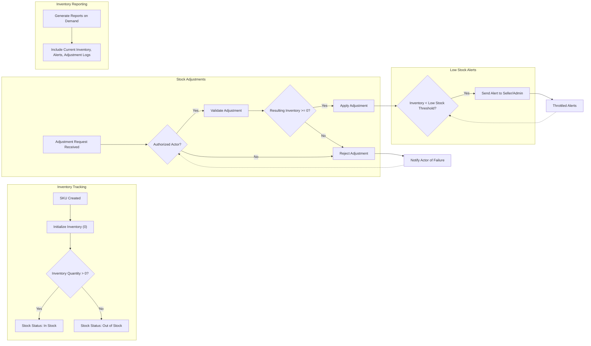

# Inventory Management Requirements Analysis Report

## Introduction

Inventory management is a critical component of the shoppingMall e-commerce platform. It ensures that product availability, order fulfillment, and overall business operations are managed efficiently by tracking inventory at the SKU (Stock Keeping Unit) level. This document defines the detailed business requirements to enable clear backend implementation of inventory tracking, stock adjustments, alerting, and reporting functionalities.

## Inventory Tracking

### SKU Inventory Management
- WHEN a SKU is created by a seller or admin, THE shoppingMall system SHALL initialize its inventory quantity to zero.
- THE system SHALL track inventory quantities distinctly at the SKU level, representing each unique product variant such as color, size, or option.

### Stock Status States
- THE shoppingMall system SHALL maintain stock status for each SKU with the following states:
  - "in stock": Inventory quantity is greater than zero.
  - "out of stock": Inventory quantity is zero.
  - "backordered": Inventory quantity is zero but future stock replenishment is expected (optional state).
- WHEN the quantity of a SKU changes such that the stock status transitions between these states, THE system SHALL update the stock status promptly, ensuring that product availability views and reports accurately reflect current status.

## Stock Adjustment Rules

### Types of Stock Adjustments
- THE system SHALL support the following stock adjustment actions:
  1. Stock addition: increasing SKU inventory, for example, when new stock is delivered.
  2. Stock subtraction: decreasing SKU inventory, such as for damaged goods or loss.
  3. Reservation: temporarily holding inventory for pending orders.
  4. Release: freeing reserved inventory when orders are cancelled or expire.
  5. Automatic deduction: reducing stock upon confirmed order payments.

### Role-Based Authorization
- ONLY sellers owning a SKU or administrators SHALL be authorized to perform stock adjustments.
- THE system SHALL reject any stock adjustment requests from unauthorized users such as customers or guests with a clear error response.

### Stock Adjustment Validation
- WHEN a stock adjustment request is received, THE system SHALL validate:
  - The SKU exists and is owned by the requesting actor when applicable.
  - The adjustment quantity is a positive integer for additions and reservations.
  - Negative adjustments are allowed only for explicit subtractions.
  - The resulting inventory after adjustment SHALL NOT be negative.
- IF validation fails, THE system SHALL reject the adjustment and notify the requester of the specific issue.

### Business Rules
- Inventory quantities SHALL be maintained as integers representing the count of items.
- Stock reservations SHALL lock inventory to prevent overselling.
- Reservations SHALL be released when orders are cancelled or time out.
- Inventory deductions SHALL occur only after payment confirmation to avoid premature stock depletion.

## Low Stock Alerts

### Thresholds and Triggering
- THE shoppingMall system SHALL allow configurable low stock threshold levels for each SKU.
- WHEN SKU inventory falls below the configured threshold, THE system SHALL immediately trigger a low stock alert.

### Notification Mechanisms
- THE system SHALL send low stock alerts to sellers owning the SKU and to administrators responsible for inventory management.
- ALERTS SHALL be delivered as notifications within the system and optionally via email or other configured channels (implementation detail).

### Alert Frequency and Escalation
- THE system SHALL throttle repeated alerts to avoid spamming, sending at most one alert per SKU per configurable time interval.
- IF stock remains low for a prolonged period, THE system MAY escalate alerts to additional roles per business rules.

## Inventory Reporting

### Report Types
- THE shoppingMall system SHALL provide the following inventory reports:
  1. Current inventory levels per SKU, including stock status.
  2. Summary of SKUs with low stock levels.
  3. Detailed stock adjustment history logs with timestamps, adjustment types, quantities, and actor information.

### Accessibility
- Reports SHALL be accessible on-demand through seller and admin dashboards.
- Scheduled reporting (e.g., daily or weekly) MAY be supported for operational planning.

## Business Rules and Constraints

- Inventory data SHALL remain accurate and consistent with orders and returns.
- THE system SHALL prevent orders from being placed for SKUs with insufficient inventory unless backordering is explicitly supported.
- Returns, cancellations, and refunds SHALL result in corresponding positive stock adjustments.
- Negative inventory SHALL never be allowed.

## Error Handling and Recovery

- IF inconsistencies or conflicts are detected between inventory and orders, THE system SHALL log incidents and notify administrators.
- FAILED stock adjustments SHALL trigger rollback of any partial changes.
- THE system SHALL notify actors of any failures and provide clear error explanations.

## Performance Requirements

- Inventory updates SHALL be reflected in the system within one second of adjustment.
- Low stock alert detection SHALL occur in near real-time following inventory changes.

## Glossary

- SKU (Stock Keeping Unit): Unique identifier for each distinct product variant.
- Inventory Quantity: Current count of available items for a SKU.
- Reservation: Temporary locking of stock for pending orders.
- Stock Adjustment: Any change to inventory quantity (additions, subtractions, reservations).
- Low Stock Threshold: Configurable level indicating when inventory is considered low.

## Mermaid Diagrams

This concludes the completed business requirements for inventory management in the shoppingMall platform, providing detailed natural language descriptions to support backend developers in unambiguous implementation.

All technical decisions, database schema design, and API implementation are within the development team's autonomy.
