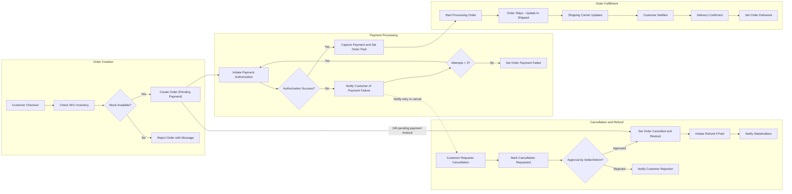

# Order Processing, Payment Handling, and Shipping Status Updates Requirements

This document provides the detailed business requirements for managing orders, processing payments, tracking shipments, and handling cancellations and refunds within the shoppingMall e-commerce platform. It defines workflows, business rules, user permissions, error handling, and performance expectations essential for backend developers.

> This document provides business requirements only. All technical implementation decisions belong to developers. Developers have full autonomy over architecture, APIs, and database design. This document describes WHAT the system should do, not HOW to build it.

## 1. Introduction

shoppingMall offers users a full-featured e-commerce experience, including product browsing, order placement, payments, shipping tracking, and order management. This document specifies the requirements to ensure orders are managed accurately and efficiently throughout their lifecycle, payments are processed securely, shipments are tracked with updates, and cancellation/refund processes provide customer satisfaction while maintaining business integrity.

## 2. Order Workflow

### 2.1 Order Creation

- WHEN a customer finalizes checkout, THE shoppingMall system SHALL create a new order record associating customer info, delivery address, payment method, and ordered SKU quantities.
- THE system SHALL decrement inventory stock for each SKU atomically upon successful order creation.
- IF any SKU stock is insufficient at order time, THEN THE system SHALL reject the order creation and notify the customer immediately with details on unavailable products.
- WHEN an order is created, THE system SHALL set order status to "Pending Payment".

### 2.2 Order Status Lifecycle

- THE system SHALL track the following order statuses in this exact sequence:
  - "Pending Payment"
  - "Paid"
  - "Processing"
  - "Shipped"
  - "Delivered"
  - "Cancelled"
- THE system SHALL allow status transition only to the next logical state in the sequence.
- WHEN payment is confirmed, THE system SHALL change order status from "Pending Payment" to "Paid".
- WHEN order fulfillment begins, THE system SHALL change order status from "Paid" to "Processing".
- WHEN order ships, THE system SHALL change order status from "Processing" to "Shipped".
- WHEN the customer receives the shipment, THE system SHALL change order status from "Shipped" to "Delivered".
- WHEN an order is cancelled, THE system SHALL set status to "Cancelled" and trigger inventory restock for involved SKUs.

### 2.3 Order Cancellation

- WHERE the order status is "Pending Payment" or "Paid", THE customer SHALL be able to request order cancellation.
- WHEN a cancellation request is submitted, THE system SHALL mark the order status as "Cancellation Requested".
- THE seller or admin SHALL review cancellation requests and approve or reject them.
- WHEN approved, THE system SHALL update order status to "Cancelled" and restock SKUs.
- WHEN rejected, THE system SHALL notify the customer with the reason.

## 3. Payment Processing Methods

### 3.1 Payment Options Supported

- THE system SHALL support payment methods including credit card, PayPal, and bank transfer.
- WHERE credit card payment is selected, THE system SHALL integrate with third-party payment gateways for authorization.
- WHERE bank transfer is selected, THE system SHALL allow manual payment confirmation by admins.

### 3.2 Payment Authorization and Capture

- WHEN a customer submits payment details, THE system SHALL initiate authorization through the payment gateway.
- IF authorization succeeds, THE system SHALL capture the payment immediately and update order status to "Paid".
- IF authorization fails, THEN THE system SHALL reject the payment and notify the customer with failure reason.

### 3.3 Payment Failure Handling

- IF payment fails repeatedly (3 times), THEN THE system SHALL mark order as "Payment Failed" and notify the customer to retry or cancel the order.
- IF payment remains "Pending Payment" for more than 24 hours from order creation, THEN THE system SHALL cancel the order automatically.

## 4. Shipping and Delivery Tracking

### 4.1 Shipping Status Updates

- THE seller SHALL update shipping status with tracking number and carrier details once order ships.
- THE system SHALL change order status to "Shipped" and record shipping information.
- THE system SHALL provide real-time shipping status to customers if integrated with carrier APIs.

### 4.2 Integration with Shipping Carriers

- THE system SHALL support integration with major shipping carriers to retrieve tracking updates.
- WHEN tracking status changes (e.g., In Transit, Out for Delivery), THE system SHALL update order shipment status accordingly.

### 4.3 User Notifications for Shipping

- WHEN order status changes to "Shipped", THE system SHALL notify the customer by email or app notification.
- WHEN delivery is confirmed by carrier update or user confirmation, THE system SHALL update order status to "Delivered".

## 5. Cancellation and Refund Requests

### 5.1 Cancellation Request Process

- THE customer SHALL be able to request cancellation via their order history for orders in "Pending Payment", "Paid", or "Processing" status.
- THE system SHALL log cancellation requests and notify sellers and admins for review.

### 5.2 Refund Eligibility and Processing

- THE system SHALL allow refund requests only for orders in "Paid", "Processing", or "Shipped" status, before delivery.
- THE system SHALL validate refund eligibility based on payment method and order status.
- WHEN refund request is approved, THE system SHALL initiate refund process through payment gateway or manual process.
- THE system SHALL update order status to "Cancelled" if refund is fully processed.

### 5.3 User Notifications and Status Updates

- THE system SHALL notify customers and sellers throughout the cancellation and refund lifecycle.
- THE system SHALL allow customers to check status of cancellation and refund requests at any time.

## 6. Business Rules and Validation

- THE inventory stock must never drop below zero.
- ORDER status transitions must follow the prescribed sequence exactly.
- PAYMENT attempts have a retry limit of 3.
- SHIPPING updates require valid tracking numbers and carrier codes.
- CANCELLATION and refund approvals require admin or seller authorization.

## 7. Error Handling and Performance Expectations

- IF order creation fails due to stock issues, THEN the customer SHALL be informed within 2 seconds.
- PAYMENT authorization responses SHALL be processed and reflected within 3 seconds.
- SHIPPING status updates SHALL propagate to users within 5 minutes of carrier update.
- CANCELLATION requests SHALL be acknowledged immediately with confirmation.

---

## Mermaid Diagram: Order and Payment Processing Flow

---

This document specifies the business requirements for order, payment, and shipping processes essential for the shoppingMall platform operation and user satisfaction. Backend developers shall implement these requirements to ensure robust, reliable, and user-friendly order lifecycle management.