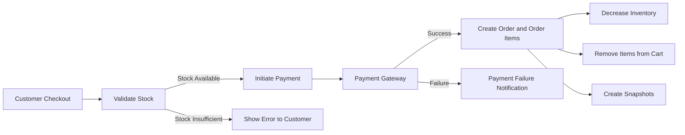
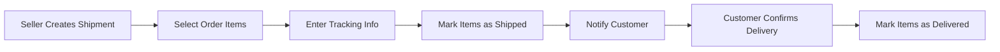

# E-Commerce Shopping Mall Platform Functional Requirements

## 1. Customer Account Management

### Registration and Authentication
- WHEN a user wants to use the platform, THE system SHALL require registration with an email and password.
- WHEN a customer registers, THE system SHALL verify uniqueness of the email and store credentials securely.
- WHEN a customer logs in with email and password, THE system SHALL authenticate and create a session.
- WHEN a customer wants to change their password, THE system SHALL allow password updates after authentication.
- WHEN a customer requests account deletion, THE system SHALL delete their profile information but preserve related orders and order history for seller and legal records.
- WHEN a customer requests account deletion, THE system SHALL preserve their reviews but display as "deleted user".

### Profile Management
- EACH customer SHALL have a profile containing display name and phone number.
- WHEN a customer edits their profile, THE system SHALL update the display name and phone number and create a snapshot of the previous profile state.

## 2. Address Management

- EACH customer SHALL be able to create, edit, and delete multiple shipping addresses.
- EACH shipping address SHALL include recipient name, phone number, street address, city, state/province, postal code, and country.
- WHEN a customer sets a default shipping address, THE system SHALL mark it accordingly and use it as the default during checkout.
- WHEN a shipping address is edited, THE system SHALL create a snapshot recording previous and new values.

## 3. Seller Account Management

### Registration and Approval
- WHEN a seller registers with email and password, THE system SHALL save the registration request with status "pending".
- WHEN an administrator approves the seller registration, THE system SHALL update the status to "approved" enabling selling capabilities.
- WHEN an administrator rejects the seller registration, THE system SHALL update the status to "rejected" and store the rejection reason.
- WHEN a rejected seller submits a new registration, THE system SHALL create a new pending request.

### Authentication and Deletion
- WHEN a seller logs in with email and password, THE system SHALL authenticate and verify they have an approved status.
- WHEN a seller wants to change their password, THE system SHALL allow password updates after authentication.
- WHEN a seller requests account deletion, THE system SHALL only allow if there are no pending orders or cancellation/refund requests.
- WHEN a seller deletes their account, THE system SHALL delete their products from listings but preserve order histories and snapshots.

### Profile Management
- EACH seller SHALL have a profile containing shop name, description, and logo image.
- WHEN a seller updates their profile, THE system SHALL save a snapshot of the previous state.
- CUSTOMERS SHALL be able to view seller profiles.

## 4. Categories and Product Management

- PRODUCTS SHALL be organized in categories and subcategories (one level only).
- CATEGORIES are managed exclusively by administrators.
- CUSTOMERS SHALL be able to browse categories and view products within.
- SELLERS can create products with required fields: name, description, category, and base price.
- SELLERS can edit products and each edit SHALL create a product snapshot including variants and images.
- PRODUCTS can have multiple variants each with SKU, option values, price override, and stock quantity.
- VARIANTS edits SHALL create corresponding snapshots.
- SELLERS can upload multiple images per product, reorder, and delete images; all changes are snapshotted.
- PRODUCTS or VARIANTS can be deleted only if no pending orders or requests exist.

## 5. Snapshot Principle and Data Integrity

- WHEN editable data changes, THE system SHALL create immutable snapshots recording change time, old and new values.
- SNAPSHOTS SHALL cover products, variants, seller profiles, order items, reviews, cancellation and refund requests.
- SNAPSHOTS SHALL be viewable by owners and administrators for dispute resolution.
- PRODUCT SNAPSHOTS include variant snapshots preserving full product state at edit time.

## 6. Inventory and Variant Management

- EACH variant SHALL have its own stock quantity managed through immutable inventory history records.
- INVENTORY adjustments INCLUDE restocking and reductions due to orders or losses.
- STOCK quantity computation SHALL be the sum of all inventory records.
- STOCK zero or below SHALL mark variant as "out of stock" and prevent addition to carts.
- SELLERS can view inventory history and manage stock with reasons and timestamps.

## 7. Product Search, Wishlist, and Shopping Cart

### Search
- CUSTOMERS can search products by name with pagination.
- FILTERS include category, price range, and stock availability.
- SORT options include newest first and price ascending/descending.

### Wishlist
- CUSTOMERS can add and remove products from their wishlist.
- WISHLIST is paginated and shows products, not variants.
- DELETED products are automatically removed from all wishlists.

### Shopping Cart
- CUSTOMERS add product variants to the cart specifying quantities.
- IF a variant is already in cart, quantities combine.
- CART displays product name, variant options, price, quantity, subtotal, and total price.
- WARNINGS are shown if cart quantity exceeds stock.
- UNAVAILABLE variants are marked and cannot be purchased.

## 8. Checkout, Payment, and Order Lifecycle

### Checkout
- CUSTOMERS proceed to checkout from cart, selecting shipping address or default.
- THE system prevents checkout with unavailable items.
- ORDER summary includes items, shipping, and totals.
- SHIPPING address locks after order placement.

### Payment Processing
- THE system interfaces with external payment gateways.
- PAYMENT success triggers order creation; failure prompts retry.

### Order Creation
- ORDER records created with order items representing purchased variants.
- STOCK decremented for purchased quantities.
- CART items removed on successful order.
- SNAPSHOTS of products, variants, and seller profiles saved with order items.

### Order and Item Status
- EACH order item maintains independent status: paid, shipped, delivered, cancelled, refunded.
- ORDER status derives from items' statuses with defined logic for mixed states.

## 9. Shipping, Tracking, and Delivery Confirmation

### Shipment Management
- SELLERS group order items by shipment.
- TRACKING info includes carrier name and tracking number.
- STATUS updates to "shipped" on shipment.

### Delivery Confirmation
- CUSTOMERS confirm delivery per shipment.
- SYSTEM auto-confirms after 14 days.
- STATUS update to "delivered" on confirmation.

## 10. Order Cancellation and Refund Processes

### Cancellation
- CUSTOMERS request cancellation per order item with status "paid".
- REQUEST includes reason text.
- SELLERS approve or reject; snapshots created upon response.
- APPROVED cancellations mark item as cancelled and restore stock.
- ORDER updates status if all items cancelled.

### Refund
- CUSTOMERS request refund per delivered item within 7 days.
- REQUEST includes reason text.
- SELLERS approve or reject; snapshots created.
- APPROVED refunds mark item as refunded and restore stock.
- ORDER status updates accordingly.

## 11. Reviews and Ratings

- CUSTOMERS write reviews after item delivery; one review per product per order.
- REVIEWS include rating and optional text.
- REVIEWS editable; edits create snapshots.
- REVIEWS deletable; text replaced with "deleted user".
- PRODUCT average rating computed from non-deleted reviews.

## 12. Seller Dashboard

- SELLERS view summary: product count, order items, pending requests.
- SELLERS manage order items with filtering by status.

## 13. Administrator System and Permissions

### Becoming Administrator
- USERS submit requests with reason.
- SUPER ADMIN approves or rejects.
- APPROVED users get regular admin status.

### Administrator Grades
- REGULAR and SUPER ADMIN roles.
- SUPER ADMIN manage promotion and demotion except self-demotion.

### Seller Management
- ADMIN approve/reject seller registrations.
- SUSPENSION hides products, blocks new product management but allows existing order processing.

### Category Management
- ADMIN manage categories creation, editing, deletion.

### Product Oversight
- ADMIN view all products and snapshots.
- ADMIN delete products for policy violations.

### Order Oversight
- ADMIN view all orders.
- ADMIN force-cancel/refund items or entire orders.

### User Management
- ADMIN view customers and sellers.
- ADMIN ban/unban users to block login.

## Mermaid Diagrams

## Summary

All functional requirements specify detailed business logic, authorization rules, data immutability via snapshots, and error handling for robust software implementation. This document serves as the definitive guide for backend developers to build the e-commerce shopping mall platform according to enterprise standards and legal compliance.
