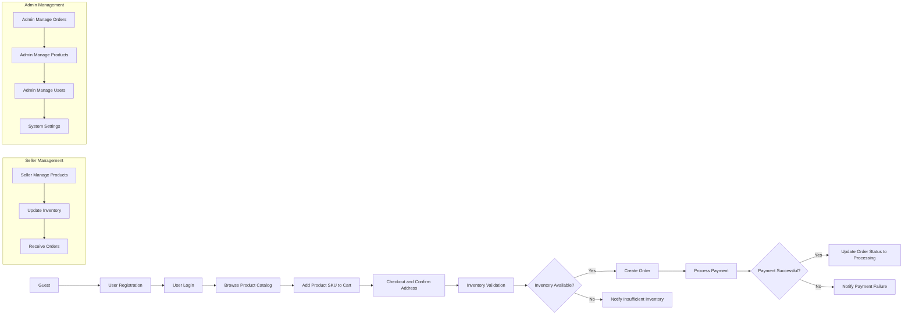

# Functional Requirements Analysis for E-commerce Shopping Mall Platform

This document provides detailed business requirements and user workflows for the e-commerce shopping mall platform backend. It describes WHAT the system must do from a business perspective, leaving HOW to implement to developers. This document focuses on the essential features and processes for robust and scalable platform operation.

## 1. User Registration and Login

### 1.1 User Registration
WHEN a guest submits registration data including valid email, password, and required personal information, THE system SHALL create a new customer account.
WHEN a user registers, THE system SHALL allow entry and management of multiple shipping addresses associated with their profile.
IF the registration data is incomplete or invalid, THEN THE system SHALL reject the request with descriptive error messages.

### 1.2 User Login
WHEN a registered customer provides valid login credentials, THE system SHALL authenticate the user and establish a secure session.
IF login credentials are invalid, THEN THE system SHALL deny access and return an appropriate authentication failure message.

### 1.3 Address Management
WHEN a logged-in customer manages addresses, THE system SHALL allow adding, editing, setting default, and deleting addresses.
WHERE a customer selects an address during order placement, THE system SHALL use the selected address for shipping calculation and order processing.

## 2. Product Catalog and Search

### 2.1 Product Catalog
THE system SHALL provide a product catalog organized into hierarchical categories.
THE system SHALL support multiple product variants represented as SKUs with attributes such as color, size, and additional options.

### 2.2 Product Search
WHEN a guest or authenticated user submits a search query or applies filters (category, price range, attributes), THE system SHALL return relevant products matching the criteria.
THE system SHALL rank search results primarily by relevance and secondarily by popularity or rating.

## 3. Shopping Cart and Wishlist

### 3.1 Shopping Cart
WHEN a customer adds a product SKU to their cart, THE system SHALL record it and maintain the cart across sessions.
WHEN a customer updates quantities or removes items, THE system SHALL update the cart contents accordingly.

### 3.2 Wishlist
WHEN a customer adds a product to the wishlist, THE system SHALL save it for later consideration.
THE system SHALL allow transferring items from the wishlist to the shopping cart.

## 4. Order Placement and Payment

### 4.1 Order Placement
WHEN a customer confirms their cart contents and shipping address, THE system SHALL validate inventory availability for each SKU.
IF inventory is insufficient for any SKU, THEN THE system SHALL notify the customer and prevent order placement until resolved.
WHEN inventory is confirmed, THE system SHALL create an order record with all order details.

### 4.2 Payment Processing
WHEN the customer submits payment information, THE system SHALL integrate with configured payment gateways to process payment securely.
IF payment fails, THEN THE system SHALL inform the customer with clear failure reasons and allow retry or cancellation.
WHEN payment succeeds, THE system SHALL update the order status and trigger subsequent fulfillment workflows.

## 5. Order Tracking and Shipping

### 5.1 Order Status Tracking
WHEN a customer views their order, THE system SHALL display the current order status (e.g., Pending, Processing, Shipped, Delivered).

### 5.2 Shipping Updates
WHEN shipping providers update delivery status, THE system SHALL reflect updated shipping status accessible by customers.

### 5.3 Notifications
WHEN order status changes or shipping milestones are reached, THE system SHALL send notifications to customers via preferred communication channels.

## 6. Product Reviews and Ratings

### 6.1 Review Submission
WHEN a customer completes an order, THE system SHALL allow submission of product reviews and ratings for purchased items.
IF the review text or rating is invalid or abusive, THEN THE system SHALL reject submission and request correction.

### 6.2 Review Moderation
WHERE applicable, THE system SHALL support moderation workflows to approve or reject reviews before public display.

## 7. Seller Product Management

### 7.1 Product Listing
WHEN a seller adds or updates product listings, THE system SHALL associate those products with the seller account.
WHEN a seller edits a product variant or SKU, THE system SHALL update variant details including attributes and pricing.

### 7.2 Inventory Management
THE system SHALL maintain accurate inventory counts per SKU and track stock changes.
WHEN sellers update inventory, THE system SHALL validate inputs and adjust available stock accordingly.

### 7.3 Order Fulfillment
WHEN orders contain products from a seller, THE system SHALL notify the seller for fulfillment processing.

## 8. Inventory Control

THE system SHALL enforce inventory constraints to prevent overselling.
WHEN inventory for a SKU drops below a configurable threshold, THE system SHALL notify the seller.

## 9. Order History and Management

### 9.1 Order History
WHEN a customer requests their order history, THE system SHALL return a list of past orders with statuses and summary details.

### 9.2 Cancellation and Refund Request
WHEN a customer submits a cancellation or refund request, THE system SHALL validate eligibility according to business rules.
IF eligible, THEN THE system SHALL process the request and update order statuses accordingly.

## 10. Admin Functionalities

### 10.1 Order Management
THE system SHALL provide admins with capabilities to view, update, and manage all orders across the platform.

### 10.2 Product Management
THE system SHALL allow admins to manage product catalogs, categories, and review seller product listings.

### 10.3 User Management
THE system SHALL enable admins to manage customer and seller accounts, including status changes and permissions.

### 10.4 System Settings
THE system SHALL provide access to configure platform-wide settings such as payment gateway configurations, shipping options, and notification templates.

---

This document focuses strictly on business functionalities and user actions. Technical implementation details such as API endpoints, database schemas, and UI designs are outside the scope of this document. Backend developers are responsible for translating these business requirements into a robust technical solution tailored to the platform's needs.