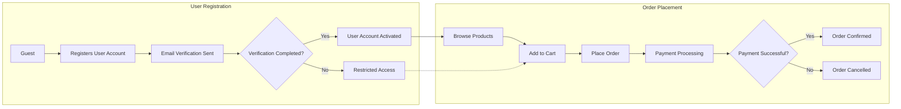

# Requirements Analysis Report for E-Commerce Shopping Mall Platform

## 1. Introduction
This report specifies detailed business requirements for the e-commerce shopping mall platform backend. The goal is to provide precise, actionable requirements that guide backend development for a multi-vendor marketplace supporting product browsing, order processing, payments, reviews, and administrative functions.

## 2. Business Model
### 2.1 Purpose
The platform exists to provide a comprehensive online marketplace where multiple sellers can offer products with rich variants. It addresses the need for centralized inventory and order management, enabling a seamless shopping experience for customers.

### 2.2 Revenue
Revenue streams include transaction fees per sale, subscription fees for premium seller accounts, and possible advertisements.

### 2.3 Growth and Success Metrics
The platform aims to scale via seller onboarding and user acquisition, measuring success by monthly active users, transaction volume, average order value, and fulfillment rates.

## 3. User Actors and Authentication
### 3.1 Actors
- Guest: Unauthenticated user who can browse catalogs and register
- Customer: Registered users managing profiles, addresses, carts, orders, and reviews
- Seller: Vendors managing their products, SKUs, inventory, and orders
- Admin: Oversees the entire platform including users, products, and orders

### 3.2 Authentication
- Email/password registration with verification
- JWT-based sessions with access and refresh tokens
- Password reset capability
- Role-based access control restricting data and operations per actor

## 4. Functional Requirements
### 4.1 User Registration and Login
- WHEN a guest registers, THE system SHALL create a user account and send verification email.
- IF the email is unverified, THE system SHALL limit account access.
- WHEN a user logs in with valid credentials, THE system SHALL generate authentication tokens.

### 4.2 Address Management
- Customers can add, edit, delete multiple shipping addresses
- Customers can designate a primary address

### 4.3 Product Catalog and Search
- Products are categorized hierarchically
- Search supports filters by category, price, rating

### 4.4 Product Variants (SKU) and Inventory
- Sellers can create multiple SKUs per product with distinct attributes
- Inventory is tracked at SKU level with concurrency controls

### 4.5 Shopping Cart and Wishlist
- Customers can add SKUs persistently to cart and wishlist
- Wishlists are private

### 4.6 Order and Payment Processing
- Validate inventory and price before order placement
- Integrate with payment gateways with success/failure handling

### 4.7 Order Tracking and Shipping
- Customers can view order status
- Sellers or admins update shipping status manually or by integration

### 4.8 Product Reviews and Ratings
- Customers may submit moderated reviews for purchased products
- Sellers cannot interfere with reviews

### 4.9 Seller Features
- Seller accounts handle product and inventory management
- Sellers view and process orders relevant only to their products

### 4.10 Order History, Cancellation, and Refunds
- Customers can view order history
- Cancellation and refunds allowed within policies, routed for admin approval

### 4.11 Admin Dashboard
- Admins manage all users, products, orders
- Admin dashboard includes analytics and dispute resolution capabilities

## 5. Business Rules
- Unique emails per user
- No orders if inventory insufficient
- Payment confirmation required
- Reviews only from verified buyers
- Refund requests within 14 days
- Admin overrides allowed

## 6. Error Handling
- Clear error messages on authentication failure
- Inventory shortages block order placement with notification
- Payment failure rollbacks order creation
- Review content moderation with rejection messages

## 7. Performance Requirements
- Login response within 2 seconds
- Search results within 1 second
- Support 1000 concurrent users

## 8. Mermaid Diagrams
### User Registration and Order Process

## 9. Conclusion
This report captures comprehensive, testable business requirements for the shoppingMall platform backend. It enables developers to implement a robust, secure, and scalable e-commerce system supporting multi-vendor functionality, rich product variants, order processing, and administration.

All implementation decisions such as architecture, APIs, and database design are to be determined by the development team based on these requirements.