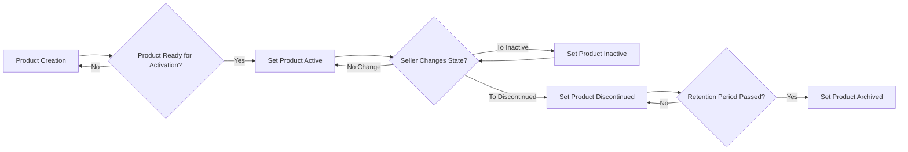
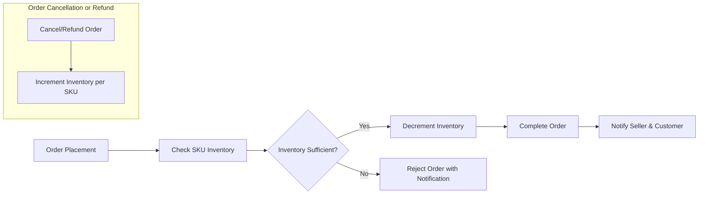

# Inventory Management and Product Lifecycle Requirements for Shopping Mall Platform

This document defines the business and functional requirements for managing product inventory, SKUs, and product lifecycle within the shopping mall e-commerce platform.

This document provides business requirements only. All technical implementation decisions belong to developers.

---

## 1. Introduction

The purpose of this document is to establish the comprehensive backend requirements that enable precise inventory tracking per SKU, product lifecycle management, seller product management capabilities, and auditing/reporting for inventory accuracy.

The system supports multiple user roles: guests, customers, sellers, and admins. This document focuses on inventory and product management relevant mainly to sellers and admins.

## 2. SKU Inventory Tracking

### 2.1 Inventory Record Keeping
- WHEN the system creates or updates a SKU inventory record, THE system SHALL maintain a non-negative integer inventory count reflecting available stock.
- THE system SHALL associate each SKU with variant attributes such as color, size, and options.
- WHEN an order is placed and payment confirmed, THE system SHALL decrement the inventory count of each SKU ordered atomically.
- WHEN an order is cancelled or refunded, THE system SHALL increment the inventory count of the affected SKUs accordingly.
- WHEN a seller or admin manually updates inventory levels for a SKU, THE system SHALL validate the updated count is zero or positive and reject any negative adjustments.

### 2.2 Inventory Update Workflow
- WHEN a customer adds a product SKU to the shopping cart, THE system SHALL NOT reserve inventory at this stage.
- WHEN an order is successfully placed, THE system SHALL reserve inventory by decrementing the SKU counts to prevent overselling.
- IF an order request includes SKUs with insufficient inventory, THEN THE system SHALL reject the order and notify the customer specifying which SKUs are out of stock.

### 2.3 Inventory Validation and Limits
- THE system SHALL support inventory counts up to 1,000,000 units per SKU.
- THE system SHALL synchronize inventory updates in real-time to prevent overselling under concurrent access.

## 3. Product Lifecycle Management

### 3.1 Product States
- THE system SHALL define product lifecycle states: Draft, Active, Inactive, Discontinued, and Archived.
- WHEN a seller creates a new product, THE system SHALL place it in the Draft state.
- WHEN a product has complete required information and seller publishes it, THE system SHALL transition it to Active state to appear in product catalogs.
- WHEN a seller temporarily suspends product sales, THE system SHALL transition the product to Inactive state, making it unavailable to customers.
- WHEN a product is permanently removed from sale, THE system SHALL transition it to Discontinued state.
- WHEN a product has been in Discontinued state for a configurable retention period, THE system SHALL archive the product, removing accessibility for sellers and customers.

### 3.2 SKU Management
- THE system SHALL allow sellers to define multiple SKUs per product, each with distinct variant attributes such as color, size, and options.
- THE system SHALL track inventory and pricing at SKU level.
- WHEN the product is in Draft or Inactive state, THE system SHALL permit sellers to add, edit, or remove SKUs.
- WHEN the product is Active, Discontinued, or Archived, THE system SHALL prohibit SKU modifications to maintain catalog consistency.

## 4. Seller Product Management

### 4.1 Product Creation and Editing
- WHEN a seller logs in, THE system SHALL allow creation of new products including metadata (title, description, category, images) and SKU variants.
- THE system SHALL validate required fields are complete before allowing a product to be published.

### 4.2 Inventory Adjustments
- WHEN a seller manually adjusts inventory levels for any SKU, THE system SHALL log the adjustment with a timestamp, user ID, and reason.
- IF a manual adjustment results in a negative inventory count, THEN THE system SHALL reject the change and notify the seller with an error.

### 4.3 Order-Related Updates
- WHEN a seller views orders containing their products, THE system SHALL provide SKU-level order details including quantities, statuses, and shipping information.
- WHEN a seller updates shipping status for an order item, THE system SHALL promptly notify the customer of the status change.

## 5. Inventory Auditing and Reporting

### 5.1 Scheduled Audits
- THE system SHALL support scheduled inventory audits comparing system inventory counts against physical stock for sellers and admins.
- THE system SHALL generate discrepancy reports highlighting mismatches for review and correction.

### 5.2 Reporting
- THE system SHALL provide detailed inventory reports to sellers and admins including stock levels, movement history, and low stock alerts.

### 5.3 Error Handling
- IF inventory inconsistencies are detected (e.g., negative counts), THEN THE system SHALL suspend sales of affected SKUs and notify admins for investigation.

## 6. Summary

This document provides detailed, clear business requirements for SKU inventory tracking, product lifecycle states and transitions, seller product management functions, and auditing/reporting capabilities. Adherence to these requirements ensures accurate inventory control and consistent product availability for the shopping mall platform.

## Mermaid Diagram: Product Lifecycle Flow

## Mermaid Diagram: Inventory Update Workflow

