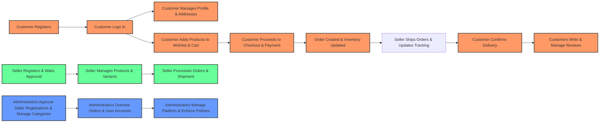

# E-Commerce Shopping Mall Platform

## Customer Account

- The shopping mall platform requires mandatory registration for any feature use; guest browsing is not allowed.
- Customers shall register with an email and password.
- Customers shall log in using their email and password.
- Customers shall be able to change their passwords.
- Customers shall be able to delete their account.

### Account Deletion

- WHEN a customer deletes their account, THEN their profile information SHALL be deleted immediately.
- Orders and order history shall be preserved after account deletion for seller record retention and legal compliance.
- Reviews authored by the deleted customer shall remain but displayed as "deleted user" to maintain review integrity.

## Customer Profile

- Each registered customer shall have a profile consisting of a display name and phone number.
- Customers shall be able to edit their display name and phone number at any time.

## Address Management

- Customers can register multiple shipping addresses.
- Each address record comprises recipient name, phone number, street address, city, state or province, postal code, and country.
- Customers shall be allowed to edit or delete any of their shipping addresses.
- Customers shall be able to designate one address as the default shipping address.

## Seller Account

- Registration for seller accounts requires email and password.
- Sellers shall log in with their email and password.
- Sellers shall be able to change their passwords.
- Seller accounts require explicit administrator approval prior to selling any products.
- Sellers shall be able to view their approval status: pending, approved, or rejected.
- Rejection reasons must be visible to the seller if their registration is rejected.
- Rejected sellers can submit new registration requests for reconsideration.

### Seller Account Deletion

- Sellers can delete their account only if no pending orders (paid or shipped status) or pending cancellation/refund requests exist.
- When deleting an account, all their products are removed from listings.
- Seller order history and snapshots are preserved for record keeping.
- The seller shop name on past orders shall be preserved after account deletion.

## Seller Profile

- Every seller profile contains: shop name, shop description, and logo image.
- Sellers can edit the shop name, description, and logo.
- Every edit creates an immutable snapshot for audit and dispute resolution.
- Customers can view seller profiles to gain shop insights.

## Categories

- Products are organized hierarchically in categories with a single nesting level of subcategories.
- Categories are administered exclusively by platform administrators.
- Each category stores its name and description.
- Customers can browse all categories and view products by category.

## Snapshot Principle

- Every editable data modification triggers a snapshot creation to preserve previous states.
- Snapshots include timestamp, data changed, previous values, and new values.
- Snapshots are immutable and cannot be deleted.
- Snapshots are accessible by owners and administrators for dispute resolution.

### Snapshot Scope

- Products and their images
- Product variants including SKU, options, and prices
- Seller profiles
- Order items capturing product, variant, and seller profile at purchase
- Reviews including ratings and texts
- Cancellation and refund requests with reasoning and status changes

### Product Snapshot Structure

- Product snapshots capture the entire product state, including associated variant snapshots.

## Products

- Sellers can create products each with required name, description, category (including subcategory), and base price.
- Products belong to the seller who created them.
- Product edits trigger snapshot creation.
- Products can be deleted only if no pending order items (paid or shipped) or pending cancellation/refund requests exist.
- Deletion removes the product and all variants and inventory records.
- Deleted products are not visible in search or category listings.
- Sellers and administrators can view product snapshots at any time.

## Product Images

- Sellers can upload and reorder multiple images per product.
- The first image serves as the main thumbnail.
- Deleting or updating images triggers product snapshot creation.

## Product Variants (SKU)

- Products can have multiple variants denoting option combinations.
- Each variant has a unique SKU code, option values, optional overridden price, and required stock quantity.
- Sellers can add, edit, and delete variants with conditions similar to product deletion.
- At least one variant is required for a product to be purchasable.
- Products with no variants remain visible but are marked as "unavailable".

## Inventory Management

- Variant stock quantities are managed through inventory history records capturing quantity changes, reasons, and timestamps.
- Positive quantity changes indicate restock; negative indicate sales or adjustments.
- Sellers can perform manual stock adjustments with reason annotations.
- Orders and cancellations/refunds automatically adjust inventory.
- When stock is zero, variants show as "out of stock" and cannot be added to carts.

## Product Search

- Customers can search products by name with case-insensitive partial matching.
- Search results are paginated and support filtering by category, price range, and in-stock status.
- Sorting options include newest first, price low to high, and price high to low.
- Search results for each product show main image, name, price or range, seller name, and average rating.
- Deleted or hidden products do not appear in the search results.

## Product Listing

- Listings display thumbnail, product name, pricing info, seller shop name, and average rating.

## Product Detail Page

- Detailed pages show all images, product info, category, seller profile link, variants with price and stock, average rating, total review count, and all reviews.

## Wishlist

- Customers can add products (not variants) to their wishlist.
- Wishlist is paginated and customers can remove items.
- Products deleted by sellers are automatically removed from all wishlists.

## Shopping Cart

- Cart items are product variants with specified quantities.
- Adding a variant combines quantities if the item already exists.
- Cart details include product name, variant options, price, quantity, and subtotal.
- Quantity changes and removal by customers are supported.
- Total price calculation and availability checks are performed.
- Out-of-stock or deleted variants are marked unavailable in the cart.

## Checkout

- Customers may select shipping addresses (default or others) for checkout.
- Unavailable items cannot be checked out.
- Order summary including items, shipping address, and total price is reviewed before order placement.
- Shipping address is locked at order placement.

## Payment

- After order review, customers confirm and initiate payment processing via external gateway.
- Successful payment leads to order creation; failures allow retry.

## Order Creation

- Successful orders decrement variant stocks and remove items from carts.
- Orders consist of multiple order items with individual statuses.
- Snapshots of products, variants, and sellers at purchase time are saved.

## Order Structure

- Orders contain one or more order items representing purchased variants.
- Quantities aggregate multiple units of the same variant.
- Items may be from different sellers.
- Item statuses include paid, shipped, delivered, cancelled, and refunded.
- Overall order status derives from item statuses.

## Order History

- Customers can view paginated, sorted by date, orders with summaries.
- Full order details show item lists, shipping addresses, and shipments with tracking info.

## Order Status

- Item status governs processing; overall order status is computed from item states including partial completion scenarios.

## Shipping and Tracking

- Shipments group order items for shipping from each seller.
- Sellers handle shipments and enter tracking details.
- Customers can view tracking and confirm deliveries per shipment.
- Automatic delivery confirmation occurs after 14 days if the customer does not confirm.

## Order Cancellation

- Cancellation requests managed per order item in paid status not yet shipped.
- Requests include reasons and require seller approval.
- Snapshots are kept for cancellation request states.
- Approved cancellations change item status and restock.
- Partial cancellations update overall order status accordingly.

## Refund Requests

- Refunds requested per delivered order item within 7 days.
- Seller approval required for processing.
- Snapshots capture refund requests state.
- Approved refunds change item status and adjust inventory.
- Overall order status updates based on partial or complete refunds.

## Reviews and Ratings

- Reviews allowed only for delivered purchased items.
- One review per product per order.
- Rating mandatory, text optional.
- Reviews sorted newest first, editable with snapshot on edit.
- Deletion preserves review snapshots and adjusts average rating calculations.

## Seller Dashboard

- Dashboard summarizes total products, order items, and pending requests counts.
- Sellers can view and filter all order items for their products.

## Administrator System

### Becoming an Administrator

- Any user can submit a request to become an administrator with a reason.
- Super administrators can approve or reject requests.
- Approved users become regular administrators.

### Administrator Grades

- Two grades exist: regular and super administrators.
- Super administrators can promote or demote other administrators, but cannot demote themselves.

### Seller Management

- Administrators view pending seller approvals and can approve, reject, or suspend sellers, providing reasons up on rejection.
- Suspended sellers have their products hidden and cannot create or edit products but can fulfill existing orders.
- Unsuspending restores product visibility.

### Category Management

- Administrators can create, edit, and delete categories; deleting categories results in products becoming uncategorized.

### Product Oversight

- Administrators can view and delete any product and view any product snapshots.

### Order Oversight

- Administrators can view all orders and force-cancel or force-refund items or entire orders, updating stocks and customer refunds accordingly.

### User Management

- Administrators manage customer and seller accounts, with abilities to ban or unban to restrict login capabilities.

---

