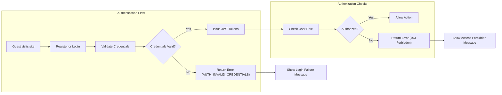

# Security and Compliance Requirements Analysis Report for the ShoppingMall Platform

This document defines the security requirements, authorization controls, data privacy policies, and regulatory compliance mandates for the ShoppingMall e-commerce platform. It is intended to guide backend developers in the implementation of secure, compliant, and privacy-respecting backend functionalities.

## 1. Authentication Security

### 1.1 Authentication Flow

WHEN a guest attempts to register, THE ShoppingMall SHALL validate the registration data, ensuring required fields such as email and password are provided and meet format and complexity requirements, and SHALL securely store the user credentials with password hashing.

WHEN a user attempts to log in, THE ShoppingMall SHALL validate the provided email and password against stored credentials.

WHEN a customer's authentication credentials are verified, THE ShoppingMall SHALL issue a JWT access token with a 15-minute expiry and a refresh token with a 30-day expiry.

THE ShoppingMall SHALL require email verification BEFORE fully activating customer or seller accounts.

WHEN a user requests password reset, THE ShoppingMall SHALL generate a secure token for password reset and SHALL send a one-time-use, time-limited password reset link to the user's registered email.

WHEN a user logs out, THE ShoppingMall SHALL revoke the active refresh token to prevent reuse.

THE system SHALL expire and invalidate refresh tokens after 30 days or when the user changes their password.

### 1.2 Password and Credentials Security

THE ShoppingMall SHALL store passwords using secure, salted, one-way cryptographic hashing algorithms (e.g., bcrypt, Argon2).

THE ShoppingMall SHALL enforce password complexity requiring a minimum length of 8 characters, including uppercase and lowercase letters, numbers, and special symbols at registration and password change.

IF a user submits invalid login credentials, THEN THE ShoppingMall SHALL respond with HTTP 401 Unauthorized and an error code AUTH_INVALID_CREDENTIALS.

IF a user attempts login before email verification, THEN THE ShoppingMall SHALL respond with HTTP 403 Forbidden and an error code AUTH_ACCOUNT_NOT_VERIFIED.

### 1.3 Session and Token Management

THE ShoppingMall SHALL issue JWT access tokens with an expiration time of 15 minutes.

THE ShoppingMall SHALL issue refresh tokens with an expiration time of 30 days.

THE ShoppingMall SHALL support token revocation upon password change or manual logout actions.

THE ShoppingMall SHALL store tokens securely to prevent common vulnerabilities such as token theft or replay attacks.

### 1.4 Error Handling for Authentication

IF authentication fails due to invalid credentials, THEN THE ShoppingMall SHALL return a standardized error response with the error code AUTH_INVALID_CREDENTIALS and message indicating incorrect username or password.

IF authentication fails due to unverified account, THEN THE ShoppingMall SHALL return a standardized error response with the error code AUTH_ACCOUNT_NOT_VERIFIED and instructions for email verification.

## 2. Authorization Controls

### 2.1 User Roles and Permission Levels

THE ShoppingMall SHALL implement distinct roles: guest, customer, seller, and admin, each with defined permissions and scopes of access.

THE admin role SHALL have unrestricted access to all platform resources and administrative functionalities.

THE seller role SHALL have permission to create, update, and manage only their own product listings, SKU inventories, and order fulfillment processes.

THE customer role SHALL be able to browse products, manage their shopping cart and wishlist, place orders, track orders, and create product reviews.

THE guest role SHALL only have read-only access to browse products and perform searches without access to sensitive or personalized data.

### 2.2 Access Control Enforcement

WHEN a user attempts any action, THE ShoppingMall SHALL verify that the user's role and associated permissions allow the action.

IF unauthorized access is detected, THEN THE ShoppingMall SHALL respond with HTTP 403 Forbidden status and an access denied message.

### 2.3 Permission Matrix and Role Restrictions

| Action                          | Guest | Customer | Seller | Admin |
|--------------------------------|-------|----------|--------|-------|
| Browse product catalog          | ✅    | ✅       | ✅     | ✅    |
| Register an account             | ✅    | N/A      | N/A    | N/A   |
| Manage own addresses            | ❌    | ✅       | ✅     | ✅    |
| Add to cart and wishlist       | ❌    | ✅       | ❌     | ✅    |
| Place orders                   | ❌    | ✅       | ❌     | ✅    |
| Manage own products            | ❌    | ❌       | ✅     | ✅    |
| Manage inventory per SKU       | ❌    | ❌       | ✅     | ✅    |
| Process order cancellations/refunds | ❌    | ✅       | ❌     | ✅    |
| Access admin dashboard          | ❌    | ❌       | ❌     | ✅    |

## 3. Data Privacy

### 3.1 Personal Data Handling

THE ShoppingMall SHALL collect and process personal data only as necessary to provide and improve the service.

THE ShoppingMall SHALL anonymize or mask personal data in logs, monitoring data, and error reports to prevent data leaks.

### 3.2 Data Encryption

THE ShoppingMall SHALL encrypt sensitive personal data in persistent storage using strong encryption standards.

THE ShoppingMall SHALL transmit all personal data over encrypted communication channels using HTTPS/TLS.

### 3.3 Data Retention and Deletion Policies

WHEN a user requests account deletion, THE ShoppingMall SHALL irreversibly delete all personally identifiable data within 30 days.

THE ShoppingMall SHALL retain financial transaction data and order records required for compliance and auditing for a minimum of 7 years.

### 3.4 User Consent and Privacy Controls

THE ShoppingMall SHALL obtain explicit consent from users during registration regarding data collection, usage, and sharing.

THE ShoppingMall SHALL provide users the ability to access, download, or delete their personal data as part of privacy rights compliance.

## 4. Regulatory Compliance

### 4.1 Applicable Regulations

THE ShoppingMall SHALL comply with GDPR, CCPA, and PCI DSS standards relevant to e-commerce platforms processing personal and payment data.

### 4.2 Compliance Requirements

THE ShoppingMall SHALL notify affected users and authorities within 72 hours upon confirming a data breach.

THE ShoppingMall SHALL maintain detailed records of user consents, data processing activities, and security audits.

### 4.3 Audit and Logging Requirements

THE ShoppingMall SHALL log all security-relevant events including but not limited to authentication attempts, password changes, permission changes, and administrative operations.

THE logs SHALL be stored securely with tamper-evident mechanisms and be retained for a minimum period of one year.

---

---

> This document provides business requirements only. All technical implementation decisions belong to developers. Developers have full autonomy over architecture, APIs, and database design. This document describes WHAT the system should do, not HOW to build it.