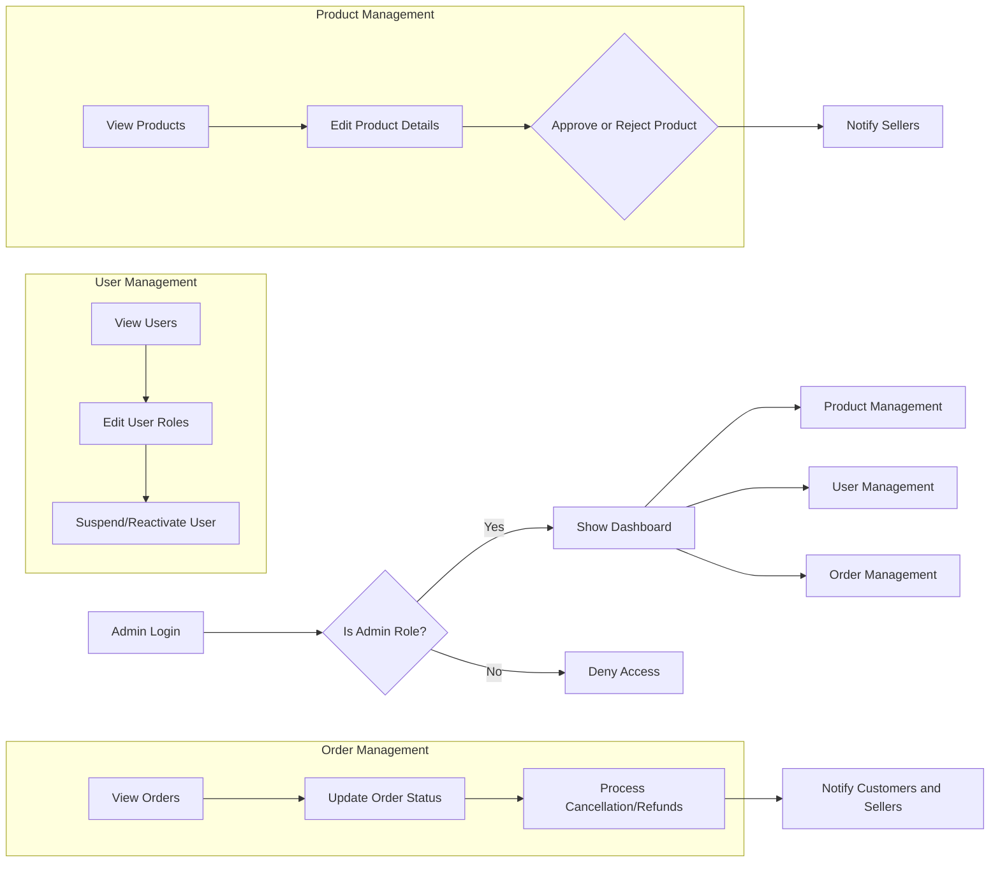
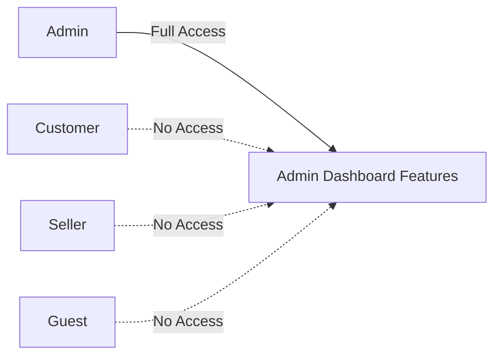

# Admin Dashboard Requirements Analysis Report

This document outlines comprehensive business requirements for the admin dashboard capabilities of the shoppingMall backend application. It provides detailed descriptions of expected functionalities related to product, user, and order management to guide backend developers.

> This document provides business requirements only. All technical implementation decisions belong to developers. Developers have full autonomy over architecture, APIs, and database design. This document describes WHAT the system should do, not HOW to build it.

## 1. Introduction and Overview

The admin dashboard serves as a centralized interface for system administrators to monitor and manage key aspects of the e-commerce platform. It facilitates effective operational control over product listings, user accounts, and orders to maintain platform integrity and ensure smooth business processes.

### 1.1 Goals
- Provide system administrators with complete visibility and control over platform products, user accounts, and order management.
- Streamline workflows for managing product approvals, user role changes, and order processing.
- Ensure administrative actions follow security policies and business compliance.
- Facilitate timely resolution of order disputes, user infractions, and data corrections.

### 1.2 Scope
- Covers all backend admin functionalities related to managing products, users, and orders.
- Includes audit logging, notifications, role-based access control, and error handling.
- Excludes frontend design and implementation details.

## 2. Admin Dashboard Role and Permissions

### 2.1 Role Definition
- Admins SHALL have exclusive access to the admin dashboard.
- Admins SHALL be authenticated and authorized to perform all admin functions.

### 2.2 Permissions
- Admins SHALL manage all aspects of product listings including creation, update, approval, and deletion.
- Admins SHALL manage all user accounts including role assignments, suspensions, and reactivations.
- Admins SHALL oversee order processing, including manual status updates and cancellation/refund approvals.
- All admin actions SHALL be audited with timestamps and admin user identification.

## 3. Product Management Features

### 3.1 Product Viewing and Editing
- WHEN accessing the admin dashboard, THE system SHALL display a paginated list of all products with key details: product name, SKU, categories, price, stock status, seller info, and approval status.
- THE system SHALL enable admins to view detailed product information.
- THE system SHALL allow editing of product data such as name, description, categories, variants, prices, and images.
- ALL product edits SHALL trigger audit logs including admin user ID and timestamp.

### 3.2 Product Approval and Publishing
- New or updated products submitted by sellers SHALL be marked "pending approval".
- Admins SHALL be able to approve or reject products from the dashboard.
- WHEN approved, THE product SHALL be published and visible in the product catalog.
- WHEN rejected, THE system SHALL record rejection reasons and notify the seller.

### 3.3 Category and Variant Management
- Admins SHALL create, update, and delete product categories.
- Admins SHALL manage product variants (SKUs), including corrections or removals.

## 4. User Management Features

### 4.1 User Account Overview
- THE system SHALL provide a paginated list of all users filterable by role, status, and registration date.
- Admin SHALL view detailed user profiles including personal information, account status, and order history summary.

### 4.2 Role and Permission Management
- Admin SHALL assign and modify user roles with audit logging.
- THE system SHALL support promoting customers to sellers and demoting sellers to customers.

### 4.3 Account Suspension and Reactivation
- Admin SHALL suspend user accounts preventing login and usage of authenticated features.
- Suspended accounts SHALL be reactivatable restoring previous permissions.

## 5. Order Management Features

### 5.1 Order Viewing and Filtering
- Admins SHALL view all orders across the platform with filters for status, date, customer, and seller.
- Selecting an order SHALL display detailed order information including items, payment, shipping, and customer contacts.

### 5.2 Order Status Updates
- Admins SHALL manually update order statuses in exceptional cases.

### 5.3 Cancellation and Refund Processing
- Admins SHALL approve or reject cancellation and refund requests.
- The system SHALL update order and payment statuses accordingly and notify appropriate parties.

## 6. Business Rules and Constraints

- Only authenticated admins SHALL access the admin dashboard.
- Deletion of orders or users SHALL NOT be permitted to preserve audit integrity.
- Admin actions SHALL be fully auditable with timestamps and identifiers.
- Notifications SHALL be sent for critical events such as fraudulent activity or high refund rates.

## 7. Error Handling and Security

- Unauthorized admin actions SHALL be denied with logging.
- Data update failures SHALL return clear descriptive errors.
- The system SHALL respond to all admin actions within 2 seconds under normal load.

## 8. Performance Requirements

- Admin dashboard pages SHALL load and respond within 2 seconds for 95% of requests.
- Audit logs SHALL be stored reliably and retrievable for compliance audits.

## 9. Mermaid Diagrams

### 9.1 Admin Dashboard High-Level Functional Flow

### 9.2 User Role Permission Matrix

This completes the requirements analysis for the shoppingMall admin dashboard. The document provides detailed, specific, and measurable business requirements ready for backend implementation.