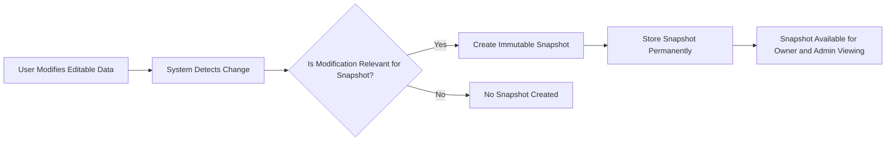

# E-Commerce Shopping Mall Platform

## 1. Customer Account

- THE system SHALL require customers to register before using any platform features; guest browsing SHALL NOT be allowed.
- WHEN a customer registers, THE system SHALL require an email address and password.
- WHEN a customer logs in, THE system SHALL authenticate using email and password.
- WHEN a customer requests to change their password, THE system SHALL allow password update.
- WHEN a customer requests account deletion, THE system SHALL allow deletion under these conditions:
  - Delete the customer's profile information.
  - Preserve the customer's orders and order history for seller records and legal purposes.
  - Preserve customer's reviews but show the author as "deleted user".

## 2. Customer Profile

- Each customer SHALL have a profile containing display name and phone number.
- WHEN a customer updates their profile, THE system SHALL allow editing of display name and phone number.

## 3. Address Management

- Customers SHALL be able to add multiple shipping addresses.
- Each address SHALL contain recipient name, phone number, street address, city, state/province, postal code, and country.
- Customers SHALL be able to edit, delete, and set one address as the default shipping address.

## 4. Seller Account

- Sellers SHALL register with email and password.
- Sellers SHALL log in using email and password.
- Sellers SHALL be allowed to change their password.
- Seller accounts SHALL require administrator approval before enabling selling capabilities.
- Sellers SHALL be able to view their approval status as pending, approved, or rejected.
- Rejected sellers SHALL receive a rejection reason and SHALL be able to submit new registration requests.
- Sellers MAY delete their account only if:
  - No pending orders exist with paid or shipped status.
  - No pending cancellation or refund requests exist.
- WHEN a seller deletes their account, THE system SHALL:
  - Delete their products from listings.
  - Preserve order history and snapshots.
  - Preserve shop name in past orders.

## 5. Seller Profile

- Each seller SHALL have a profile including shop name, description, and logo image.
- Sellers SHALL be able to edit the shop name, description, and logo.
- THE system SHALL create a snapshot for every edit made to seller profiles.
- Customers SHALL be able to view seller profiles.

## 6. Categories

- Products SHALL be organized into categories.
- Categories MAY have one level of subcategory nesting.
- Each category SHALL have a name and description.
- Only administrators MAY create, edit, or delete categories.
- Customers SHALL be able to browse all categories and view products in each category.

## 7. Snapshot Principle and Rules

- THE system SHALL create immutable snapshots whenever editable data related to critical entities is modified.
- Snapshots SHALL include timestamp, fields changed, values before and after.
- Snapshots SHALL be preserved permanently and accessible only to owners and administrators.
- Snapshots SHALL apply to products, product variants, seller profiles, order items, reviews, cancellation requests, and refund requests.
- Snapshots SHALL preserve full product and variant state, including images and SKU details.
- Snapshots SHALL be preserved even if original data entities are deleted.
- Snapshots SHALL support dispute resolution and legal compliance.

## 8. Products

- Sellers SHALL be able to create products with name, description, category, and base price as required fields.
- Products SHALL belong to the seller who created them.
- Sellers SHALL be able to edit their products; every edit SHALL trigger a snapshot creation.
- Sellers MAY delete products only if no pending orders or cancellation/refund requests exist for any variants.
- Deletion SHALL remove all variants and inventory records.
- Deleted products SHALL not appear in search or category listings.
- Sellers and administrators SHALL be able to view product snapshots.

## 9. Product Images

- Sellers SHALL be able to upload multiple images per product.
- Images MAY be reordered; the first image SHALL be the main thumbnail.
- Sellers MAY delete images.
- Image changes SHALL be included in product snapshots.

## 10. Product Variants (SKU)

- Products MAY have multiple variants.
- Each variant SHALL contain SKU code (unique and required), option values, optional price override, and required stock quantity.
- Sellers SHALL be able to add, edit, and delete variants following rules:
  - Deletion only if no pending orders or cancellation/refund requests exist.
- Products MUST have at least one variant to be purchasable.
- Products without variants shall be shown as unavailable in search.
- Every variant edit SHALL create a snapshot.

## 11. Inventory Management

- Stock quantities SHALL be managed per variant through inventory history records.
- Each record SHALL contain quantity change, reason, and timestamp.
- Current stock SHALL be calculated as the sum of all inventory records.
- Sellers MAY restock or adjust stock with quantity and reason.
- Order placement automatically creates negative quantity inventory records.
- Order cancellation or refund automatically restores stock through positive records.
- Stock reaching zero means out of stock status; out of stock variants cannot be added to cart.
- Sellers SHALL have access to full inventory history per variant.

## 12. Product Search

- Customers SHALL be able to search products by name.
- Search results SHALL be paginated.
- Filters SHALL include category, price range, and in-stock only.
- Sorting options SHALL include newest first, price low to high, and price high to low.

## 13. Product Listing

- Product lists SHALL show main image, name, base price or price range, seller shop name, and average rating.

## 14. Product Detail Page

- Customers SHALL view full product details including all images, name, description, category, seller shop name (linked to profile), variants with prices and stock status, average rating, total review count, and all reviews.

## 15. Wishlist

- Customers MAY add products to wishlist.
- Wishlist SHALL be product-based, paginated, and allow product removal.
- Deleted products SHALL be automatically removed from all wishlists.

## 16. Shopping Cart

- Customers SHALL add specific variants to cart with quantity.
- Same variant additions SHALL combine quantities.
- Cart SHALL show product name, variant options, price, quantity, subtotal, and total price.
- Customers SHALL modify quantities or remove items.
- Cart SHALL warn when variant stock is less than requested quantity.
- Unavailable or deleted variants SHALL be marked unavailable in the cart.

## 17. Checkout

- Customers SHALL proceed to checkout only with available items.
- Customers MUST select a shipping address or use default.
- Customers SHALL review order summary (items, shipping address, total price) before placing order.
- Shipping address SHALL be immutable post order placement.

## 18. Payment

- Customers confirm payment after review.
- The system SHALL integrate with external payment gateways.
- Payment failures SHALL prevent order creation and allow retries.
- Payment success SHALL lead to order creation.

## 19. Order Creation

- When orders are placed:
  - Stock quantities decrease per variant.
  - Cart items removed.
  - Order record created with order items per variant.
  - Order items initialized with "paid" status.
  - Snapshots of purchased products, variants, and seller profiles SHALL be saved to preserve state at purchase time.

## 20. Order Structure and Status

- Orders SHALL contain one or more order items, each with quantity and status.
- Item statuses include paid, shipped, delivered, cancelled, and refunded.
- Overall order status SHALL be derived based on item statuses as rules specify.

## 21. Shipping and Tracking

- Seller shipments MAY bundle multiple order items.
- Sellers SHALL select items for shipment, enter carrier and tracking info.
- Shipment creation SHALL update item statuses to shipped.
- Customers SHALL view tracking info and confirm delivery per shipment.
- Delivery confirmation updates items to delivered; automatic delivery confirmation after 14 days if customer does not act.

## 22. Order Cancellation

- Customers MAY request cancellation per order item with status "paid".
- Cancellation requests SHALL include reasons.
- Sellers SHALL approve or reject cancellations.
- Snapshot SHALL be created upon seller response.
- Approved cancellations SHALL mark items as cancelled and restore stock.
- If all items cancelled, order status SHALL become cancelled.

## 23. Refund Requests

- Refund requests SHALL apply per delivered order item within 7 days.
- Requests SHALL include reason.
- Sellers SHALL approve or reject refund requests.
- Snapshot SHALL be created upon seller response.
- Approved refunds SHALL refund the customer and restore stock.
- All item refunds SHALL update order status accordingly.

## 24. Reviews and Ratings

- Customers SHALL write one review per product per order after delivery.
- Reviews SHALL include rating (1 to 5 stars) and optional text.
- Reviews SHALL be editable and deletable by authors, with snapshots for edits and preserved after deletion.
- Product average ratings SHALL be calculated from non-deleted reviews.

## 25. Seller Dashboard

- Sellers SHALL view summaries: total products, order items, pending cancellations and refunds.
- Sellers SHALL view and filter order items by status.

## 26. Administrator System

- Users MAY request administrator roles with reasons.
- Super administrators SHALL manage admin approvals and grade promotions/demotions.
- Administrators SHALL manage seller account approvals, suspensions, and unsuspensions.
- Suspended sellers SHALL have products hidden and purchasing disabled but can process existing orders.
- Administrators SHALL manage categories, products, orders (including force cancellations/refunds), and user bans.

---