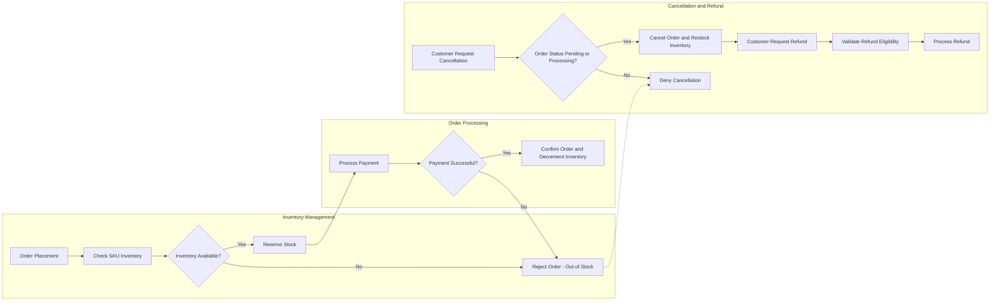

# Business Rules and Operational Constraints for Shopping Mall Platform

## 1. Introduction

This document defines the essential business rules, data validation requirements, inventory management policies, order cancellation and refund processes, product review moderation mechanisms, and security and compliance mandates for the e-commerce shopping mall platform backend. It serves as the authoritative resource for backend developers to implement robust, consistent, and secure business logic aligned with the platform’s goals.

## 2. Data Validation Rules

### 2.1 User Registration and Address Management
- WHEN a user registers or updates their profile, THE system SHALL validate the email address format strictly according to RFC 5322 standards.
- WHEN a user adds or updates an address, THE system SHALL validate that mandatory fields—street, city, state/province, postal code, and country—are present, non-empty, and in correct formats (e.g., postal code matches country norms).
- IF any required user field is missing or incorrectly formatted, THEN THE system SHALL reject the request and return a detailed validation error explaining the issue.

### 2.2 Product Data Validation
- WHEN a seller creates or updates a product, THE system SHALL ensure that the product name length is at least 3 characters and no more than 100 characters.
- THE system SHALL enforce that assigned product categories correspond to existing, active categories in the system.
- THE system SHALL validate SKU variant attributes such as color, size, and other option types to be valid choices compliant with the product’s category and business rules.
- THE system SHALL ensure inventory counts per SKU are integers equal to or greater than zero.

### 2.3 Order and Payment Validation
- WHEN a customer attempts to place an order, THE system SHALL verify that each product SKU in the order has sufficient inventory available.
- THE system SHALL validate payment data presence, integrity, and format before proceeding with order confirmation.
- IF payment data validation fails, THEN THE system SHALL abort the order placement and communicate the failure reason to the customer clearly.

## 3. Inventory Management

### 3.1 SKU Level Inventory Controls
- THE system SHALL maintain precise, real-time inventory quantities for every individual SKU variant.
- WHEN an order is confirmed after successful payment, THE system SHALL atomically decrement the inventory count of each SKU included in the order to prevent overselling.
- IF concurrent attempts to update inventory cause conflicts, THEN THE system SHALL attempt controlled retries and, if inventory runs out, SHALL reject the order with an "out of stock" notification.

### 3.2 Inventory Restocking
- Sellers and admins SHALL be able to increase SKU inventory counts through backend operations securely.
- All inventory adjustments SHALL be recorded with timestamps, actor identification, and quantity changed, supporting audit trails and accountability.

## 4. Order Cancellation and Refund Policies

### 4.1 Order Cancellation
- WHEN a customer requests cancellation, THE system SHALL verify that the order is in a cancellable state: specifically, status "Pending" or "Processing" only.
- IF the order status is "Shipped", "Delivered", or beyond, THEN THE system SHALL deny cancellation requests and suggest contacting customer service.

### 4.2 Refund Processing
- Refund requests SHALL be accepted within 30 calendar days following the order's delivery confirmation date.
- THE system SHALL evaluate requests against product-specific return policies and payment method constraints for refund eligibility.
- The progress and status of refund requests SHALL be tracked diligently and communicated to the customer.

## 5. Review Moderation

### 5.1 Submission Rules
- Customers SHALL only be allowed to submit product reviews for products they have actually purchased.
- Review text SHALL have a minimum length of 20 characters and a maximum of 1000 characters to ensure content quality.

### 5.2 Moderation Process
- All submitted reviews SHALL undergo automated checks for profanity, spam, and other banned content.
- Reviews flagged as suspicious by automated systems SHALL be routed for manual moderation by administrative staff.
- Admins SHALL have interfaces to approve, reject, or request revisions for reviews before publication.

### 5.3 Abuse Handling
- THE system SHALL monitor user behavior for abusive review patterns, such as repeated submission of inappropriate content.
- Users determined to be abusing the review system SHALL have their review privileges suspended and be notified.

## 6. Security and Compliance

### 6.1 Authentication and Authorization
- THE system SHALL enforce role-based access control consistent with defined roles: guest, customer, seller, and admin.
- Passwords SHALL be stored securely using salted hashing mechanisms adhering to industry best practices.

### 6.2 Data Privacy
- The platform SHALL comply with applicable data protection regulations such as GDPR by safeguarding personal information and restricting unauthorized data access.
- Sensitive data including passwords and payment details SHALL never be logged or sent in unsecured formats.

### 6.3 Audit Logging
- THE system SHALL keep detailed logs of important user actions, including authentication events, order status changes, inventory modifications, and administrative operations.
- Logs SHALL record timestamp, actor identity, and operation result to facilitate auditing and issue resolution.

### 6.4 Error and Incident Handling
- IF a security breach or unauthorized access attempt is detected, THEN THE system SHALL immediately reject the attempt, block affected sessions, and log the event comprehensively.

## 7. Summary

This document presents mandatory business rules and operational constraints that the shopping mall backend must implement to ensure proper data integrity, inventory control, customer service workflows, review credibility, and security compliance. Adherence to these rules is critical for reliable platform operation and regulatory adherence.

## Mermaid Diagram - Inventory and Order Processing Flow

This diagram illustrates the critical flow of inventory verification, order placement, payment processing, cancellation checks, and refund handling aligned with the business rules.

> This document provides business requirements only.
> All technical implementation decisions belong to developers.
> Developers have full autonomy over architecture, APIs, and database design.
> The document describes WHAT the system should do, not HOW to build it.