# Product Reviews and Ratings Management

## 1. Introduction
This document details the business requirements for managing product reviews and ratings on the shopping mall platform. It focuses on enabling customers to submit reviews, ensuring content is moderated appropriately, aggregating ratings accurately, and governing participation through clearly defined rules.

> This document provides business requirements only.
> All technical implementation decisions, including system architecture, APIs, and database design, are the responsibility of the development team.
> Developers have full autonomy over implementation details.

## 2. Review Submission

### 2.1 User Permissions
- WHEN a user is authenticated as a customer, THE system SHALL allow the user to submit a review for a product they have purchased.
- IF a user is not authenticated or is not a customer, THEN THE system SHALL deny review submission and return an appropriate error message.

### 2.2 Submission Process
- WHEN a customer submits a product review, THE system SHALL validate the review content and metadata before acceptance.
- THE review SHALL include a rating value (integer) between 1 and 5 inclusive.
- THE review SHALL include a text comment with a minimum length of 10 characters and a maximum length of 1000 characters.
- WHERE the review content passes validation, THE system SHALL save the review in a pending state pending moderation.

### 2.3 Content Requirements
- IF the review text contains prohibited words or violates platform policies, THEN THE system SHALL reject the submission.
- THE system SHALL store the date and time of submission in ISO 8601 format.

## 3. Moderation and Approval

### 3.1 Moderation Workflow
- THE system SHALL provide a queue of pending reviews for admin users to review.
- WHEN an admin reviews a pending product review, THE system SHALL allow the admin to approve or reject the review.
- IF the review is approved, THEN THE system SHALL change its status to "approved" and make it visible on the product page.
- IF the review is rejected, THEN THE system SHALL change its status to "rejected" and notify the submitting customer.

### 3.2 Approval Criteria
- Moderators SHALL evaluate reviews for relevance, appropriateness, and compliance with policies.
- Reviews that appear fraudulent or spam SHALL be rejected.

### 3.3 Rejection and Appeals
- WHEN a review is rejected, THE system SHALL provide a mechanism for customers to appeal the decision.
- THE system SHALL log moderation decisions for audit purposes.

## 4. Rating Aggregation

### 4.1 Calculation Methods
- THE system SHALL calculate the average product rating as the arithmetic mean of all approved review ratings.
- Ratings SHALL be updated immediately upon review approval, rejection, or deletion.

### 4.2 Display Rules
- THE system SHALL display the average rating with one decimal place precision.
- THE system SHALL display the total count of approved reviews for each product.

### 4.3 Update Frequency
- Rating aggregation SHALL occur in real-time or within 5 seconds after review state changes.

## 5. User Participation Rules

### 5.1 Eligibility for Review
- WHEN a customer has completed an order containing the product, THE system SHALL allow them to submit exactly one review per product.
- IF a customer attempts to submit multiple reviews for the same product, THEN THE system SHALL deny the additional submissions.

### 5.2 Review Updating and Deletion
- THE system SHALL allow customers to update their review within 30 days of submission.
- WHEN a review is updated, THE system SHALL reset its moderation status to pending.
- THE system SHALL allow customers to delete their reviews.

### 5.3 Abuse Prevention and Penalties
- THE system SHALL monitor reviews for abusive or fraudulent behavior.
- IF abuse is detected (e.g., fake reviews, spam), THEN THE system SHALL suspend review privileges for the offending user.
- THE system SHALL notify users of suspension with reasons.

## 6. Business Rules

### 6.1 Review Validation
- THE system SHALL validate that the review rating is an integer between 1 and 5.
- THE system SHALL validate that the review text is free from prohibited content.

### 6.2 Handling of Fraudulent or Inappropriate Content
- THE system SHALL flag suspicious reviews for manual review.
- THE system SHALL provide admins with interfaces to manage flagged content.

### 6.3 Performance Requirements
- THE system SHALL respond to review submission requests within 2 seconds under normal load.
- THE system SHALL update aggregated ratings and counts within 5 seconds after moderation changes.

## 7. Error Handling

- IF a user attempts to submit a review without being logged in, THEN THE system SHALL return an authentication error with appropriate error code.
- IF the review content fails validation rules, THEN THE system SHALL return a detailed error message specifying the reason.
- IF the user exceeds the one-review-per-product limit, THEN THE system SHALL return a conflict error indicating duplicate reviews are not allowed.
- IF moderation approval fails due to system errors, THEN THE system SHALL retry or queue the action for later processing.

## 8. References and Related Documents

- For product information integration, see the [Functional Requirements Document](./03-functional-requirements.md).
- Review content validation and moderation policies are further detailed in the [Business Rules Document](./04-business-rules.md).
- User roles and authentication details are covered in the [User Roles and Authentication Document](./02-user-roles.md).

---

## Mermaid Diagram: Review Submission and Moderation Workflow

```mermaid
graph LR
  A["Customer Completes Purchase"] --> B["Eligible to Submit Review"]
  B --> C["Customer Submits Review"]
  C --> D["Validate Review Content"]
  D --> E{"Content Valid?"}
  E -->|"Yes"| F["Store Review as Pending"]
  E -->|"No"| G["Reject Submission with Error"]
  F --> H["Admin Reviews Pending Submission"]
  H --> I{"Approve or Reject?"}
  I -->|"Approve"| J["Set Review to Approved and Publish"]
  I -->|"Reject"| K["Set Review to Rejected and Notify User"]
  J --> L["Update Product Rating and Counts"]

  style A fill:#f9f,stroke:#333,stroke-width:1px
  style B fill:#bbf,stroke:#333,stroke-width:1px
  style C fill:#ddf,stroke:#333,stroke-width:1px
  style D fill:#f96,stroke:#333,stroke-width:1px
  style E fill:#f66,stroke:#333,stroke-width:1px,stroke-dasharray: 5 5
  style F fill:#afa,stroke:#333,stroke-width:1px
  style G fill:#f99,stroke:#333,stroke-width:1px
  style H fill:#ffc,stroke:#333,stroke-width:1px
  style I fill:#fc6,stroke:#333,stroke-width:1px,stroke-dasharray: 5 5
  style J fill:#afa,stroke:#333,stroke-width:1px
  style K fill:#f99,stroke:#333,stroke-width:1px
  style L fill:#afa,stroke:#333,stroke-width:1px
```

---

This completes the requirements analysis for the product reviews and ratings management feature of the shopping mall platform.