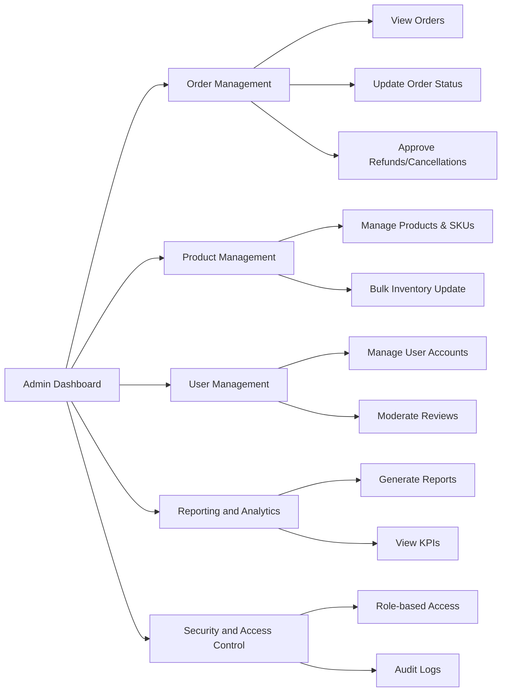

# Admin Dashboard Requirements Analysis Report

## 1. Introduction

This document specifies the complete business requirements for the admin dashboard of the shoppingMall platform. The platform connects customers, sellers, and administrators for a seamless e-commerce experience. The admin dashboard empowers system administrators with tools to oversee, manage, and control all significant platform operations.

## 2. Dashboard Features Overview

THE shoppingMall platform SHALL provide an admin dashboard that enables administrators to manage orders, products, users, and reports. This dashboard SHALL present an integrated interface with convenient access to key data, operational controls, and analytics.

## 3. Order and Product Controls

### 3.1 Order Management

- WHEN an administrator accesses the dashboard, THE system SHALL display an overview of recent orders, including order IDs, buyer names, order dates, and current statuses.
- THE system SHALL allow filtering orders by status (e.g., "pending", "processing", "shipped", "delivered", "canceled", "refunded"), date ranges, buyer, and seller.
- THE system SHALL provide access to detailed order information including products ordered, SKUs, quantities, prices, payment method and status, shipping information, and shipment tracking updates.
- THE system SHALL allow administrators to update order statuses following approved business rules, such as marking orders as shipped or canceling orders.
- THE system SHALL enable administrators to approve or reject cancellation and refund requests.
- THE system SHALL enforce validation of status transitions according to the business rules document.

### 3.2 Product Management

- THE system SHALL allow administrators to view, add, edit, or delete products, including their SKUs (variants), categories, prices, and inventory levels.
- THE system SHALL support bulk editing capabilities, particularly for SKU inventory adjustments.
- THE system SHALL display product status indicators showing active, inactive, or out-of-stock.
- THE system SHALL allow approval or rejection of seller-submitted products before they become publicly visible.
- THE system SHALL provide search and filtering capabilities for products by name, category, seller, and status.

## 4. User Management Tools

- THE system SHALL permit administrators to search and filter users by role (customer, seller, admin), registration date, account status, and activity.
- THE system SHALL provide details for individual users, including profile information, order history, and activity logs.
- THE system SHALL allow administrators to suspend, reactivate, or delete user accounts.
- THE system SHALL provide mechanisms to reset passwords or resend account verification emails.
- THE system SHALL enable administrators to moderate and remove inappropriate reviews or ratings submitted by users.

## 5. Reporting and Analytics

- THE system SHALL provide dashboards for administrators to view key performance indicators such as total sales, number of orders, active users, and top-selling products.
- THE system SHALL allow generation of detailed reports based on selectable criteria like date ranges, product categories, and user segments.
- THE system SHALL offer visualization of data through charts, graphs, and tables to support business analysis and decision-making.

## 6. Security and Access Control

- THE system SHALL restrict access to the admin dashboard exclusively to users with the admin role authenticated through secure login and token validation.
- THE system SHALL implement role-based access control ensuring only authorized administrators can perform sensitive operations.
- THE system SHALL record audit logs of administrative actions on orders, products, and user accounts for accountability and troubleshooting.
- THE system SHALL enforce session management policies including automatic session expiration and multi-factor authentication support as per security guidelines.

## 7. Error Handling and Performance Expectations

- IF any data retrieval or update fails in the admin dashboard, THEN THE system SHALL display a clear error message indicating the failure reason and suggested next steps.
- THE system SHALL ensure all admin dashboard requests respond within 3 seconds under normal operating conditions even during peak loads.

## 8. Summary

This document provides backend developers with detailed, actionable requirements to build a robust admin dashboard for the shoppingMall platform. The feature set enables comprehensive management covering orders, products, users, and analytics with a focus on security, usability, and performance.

---

### Mermaid Diagram: Admin Dashboard Features Overview

> This document defines business requirements only. All technical implementation decisions for architecture, APIs, and database design shall be determined by the development team. The focus is on WHAT the system must do to satisfy business goals and user needs for the administrative dashboard.