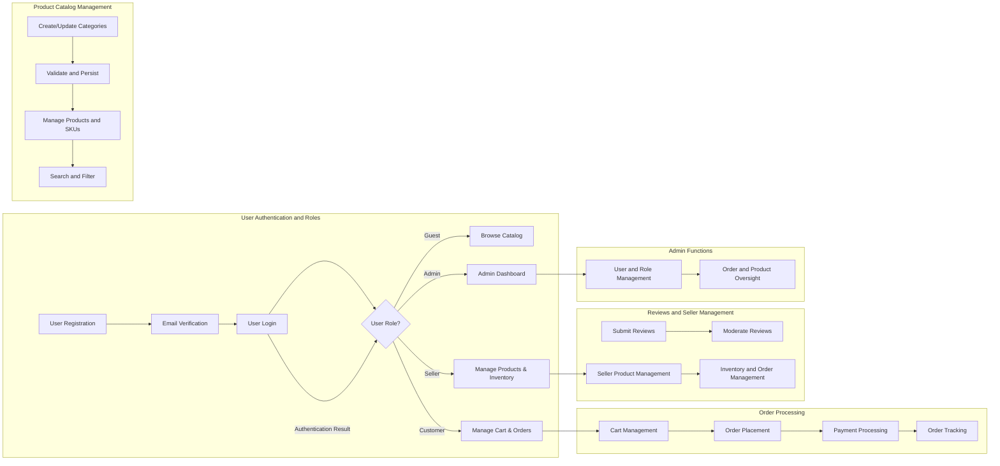

# Requirements Analysis Report for the Shopping Mall Platform

## 1. Introduction
The Shopping Mall platform is designed to provide a comprehensive e-commerce solution handling user registrations, product catalogs, orders, payments, and administration in an automated, scalable, and secure manner. This document precisely defines the business requirements necessary for the backend implementation, focusing on actionable, unambiguous, and measurable specifications.

## 2. User Actors and Authentication

### 2.1 User Roles
- **Guest**: Unauthenticated users browsing the catalog with read-only access.
- **Customer**: Registered users who can place orders, manage addresses, write reviews, and maintain wishlists.
- **Seller**: Registered users managing their own products, inventory, and related orders.
- **Admin**: System administrators overseeing and managing all platform aspects.

### 2.2 Authentication Workflow
- WHEN a user registers with valid credentials, THEN the system SHALL create a customer account pending email verification.
- WHEN a user attempts to register with an email already in use, THEN the system SHALL reject the registration request.
- WHEN a verified user logs in with valid credentials, THEN the system SHALL issue JWT access and refresh tokens.
- WHEN an unverified user attempts login, THEN the system SHALL deny access and prompt email verification.
- WHEN a user requests logout, THEN the system SHALL invalidate tokens and invalidate session.
- WHEN a user requests a password reset, THEN the system SHALL send a secure reset link to verified email.
- THE system SHALL enforce access based on user roles via role-based access control (RBAC).

### 2.3 Permission Matrix
| Feature                         | Guest | Customer | Seller | Admin |
|---------------------------------|-------|----------|--------|-------|
| Browse product catalog           | ✅     | ✅        | ✅      | ✅     |
| Register and manage account      | ❌     | ✅        | ✅      | ❌     |
| Manage addresses                | ❌     | ✅        | ✅      | ❌     |
| Add to cart and wishlist        | ❌     | ✅        | ✅      | ❌     |
| Place orders                   | ❌     | ✅        | ✅      | ❌     |
| Write product reviews           | ❌     | ✅        | ✅      | ✅     |
| Manage own products             | ❌     | ❌        | ✅      | ✅     |
| View own orders                 | ❌     | ✅        | ✅      | ✅     |
| Admin management features       | ❌     | ❌        | ❌      | ✅     |

## 3. Product Catalog and SKU Management

### 3.1 Product Categories
- WHEN an admin or seller creates a category, THEN the system SHALL validate name uniqueness.
- THE system SHALL support hierarchical categories with unlimited nesting.
- THE system SHALL prevent deletion of categories assigned to products.

### 3.2 Product Metadata
- WHEN a seller creates a product, THEN the system SHALL require name, description, category assignment.
- THE system SHALL assign a unique identifier per product.
- THE system SHALL allow multiple images and track prices at SKU level.

### 3.3 Product Variants (SKUs)
- THE system SHALL allow products to have multiple SKUs defined by variant attributes such as color, size.
- THE system SHALL assign unique SKU codes and track price and inventory at SKU level.
- WHEN SKU inventory reaches zero, THEN system SHALL mark SKU as out of stock.

### 3.4 Search Features
- THE system SHALL enable keyword, category, price range, and availability filtering.
- THE system SHALL return paginated results with sorting options.

## 4. Shopping Cart, Wishlist, Orders, and Payments

### 4.1 Shopping Cart Management
- WHEN a customer logs in, THEN the system SHALL provide a persistent cart.
- THE system SHALL allow adding/removing SKUs with quantity adjustments validating inventory.
- OUT OF STOCK SKUs SHALL cause errors preventing addition.

### 4.2 Wishlist
- THE system SHALL provide persistent wishlists per customer, independent from carts.

### 4.3 Order Placement
- WHEN placing an order, THEN the system SHALL validate SKU availability and reserve inventory.
- THE system SHALL accept payment via multiple methods and handle failures gracefully.
- ORDER cancellations are permitted pre-shipment.

### 4.4 Order Tracking
- THE system SHALL provide real-time status updates from processing through delivery.

## 5. Product Reviews and Seller Management

### 5.1 Reviews and Ratings
- ONLY customers who purchased a product SHALL submit reviews.
- Reviews SHALL include rating (1 to 5) and optional text.
- Reviews SHALL be moderated for content and compliance.

### 5.2 Seller Account
- Sellers SHALL manage own products, update SKUs, and inventory.
- Low stock alerts SHALL notify sellers and admins.

## 6. Inventory Management

- Stock SHALL be tracked per SKU.
- Stock adjustments SHALL follow validation rules ensuring non-negative quantities.
- Alerts SHALL trigger when stock falls below configured thresholds.
- Reports SHALL provide current inventory, alerts, and adjustment histories.

## 7. Order History, Cancellation, and Refunds

- Customers SHALL access full order histories.
- Cancellation is acceptable only for orders in "Pending" or "Processing" within 24 hours.
- Refunds require order delivery confirmation and submission within 14 days.
- Return shipments SHALL be tracked and conditionally approved.

## 8. Admin Dashboard

- Admins SHALL view and manage all products, users, orders.
- Approval workflows SHALL be enforced for new products.
- User roles and statuses SHALL be administrable with audit logging.

## 9. Business Rules and Exception Handling

- Input validations SHALL reject invalid or incomplete data.
- Authorization checks SHALL prevent unauthorized access.
- Payment failures SHALL trigger user notifications and retry options.

## 10. Performance and Security

- Response times SHALL be under 3 seconds for most actions.
- System SHALL provide 99.9% uptime.
- Passwords SHALL be securely hashed and stored.
- Data SHALL be encrypted in transit and at rest.
- Compliance with GDPR, PCI DSS SHALL be maintained.

---

### Mermaid Diagrams

This requirements analysis report defines clear, detailed, and testable business requirements that comprehensively describe all critical features and processes of the shopping mall platform. It uses proper EARS syntax, includes all necessary actors, workflows, and rules, and fixes all Mermaid syntax issues, ensuring full readiness for backend development.