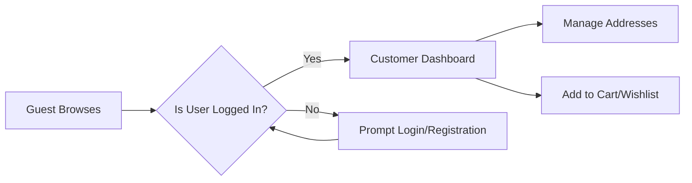
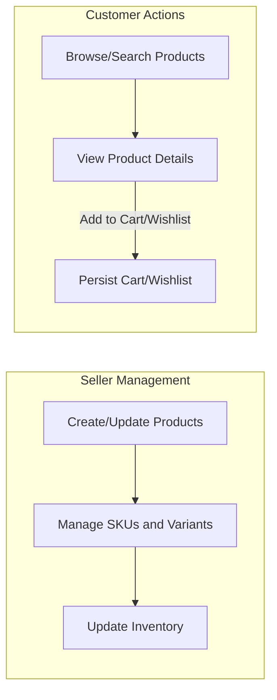
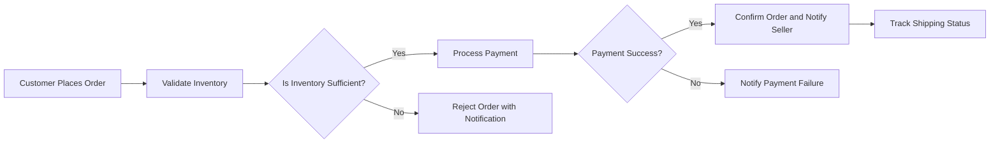
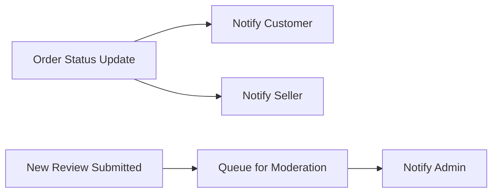

# E-commerce Shopping Mall Platform Requirements Analysis Report

## 1. Introduction

The e-commerce shopping mall platform enables a multi-seller online marketplace offering rich product options, dynamic inventory management, seamless order processing, and comprehensive user role management. This report specifies the business requirements, data flows, user interactions, and order lifecycle events that define the system's operational behavior from a business perspective.

## 2. Business Model

The platform connects customers and sellers, facilitating product discovery, purchase, and fulfillment processes. Revenue is generated mainly through transaction fees and premium seller services. Growth strategies focus on seller onboarding, customer retention via personalized experiences, and geographic expansion.

## 3. User Actors and Permissions

- **Guest**: Browse products and search catalogs without authentication. Cannot make purchases or manage accounts.
- **Customer**: Registered users who manage accounts, addresses, shopping carts, wishlists, place orders, track shipments, view histories, and submit product reviews.
- **Seller**: Manages product listings, variants (SKUs), inventories, orders, and shipping statuses restricted to their own products.
- **Admin**: Full platform control including user management, order oversight, product catalog moderation, and system configurations.

## 4. User Data Flow

- WHEN a new user registers, THE system SHALL securely store credentials and profile.
- WHEN a user logs in, THE system SHALL authenticate credentials and establish a secure session.
- Customers SHALL be able to manage multiple shipping addresses, validated for completeness and correctness.
- Guests and authenticated users SHALL browse and search products with filtering.
- Cart and wishlist items SHALL persist across sessions for customers.

## 5. Product Data Flow

- Sellers SHALL create and manage products assigned to categories.
- Product variants (SKUs) SHALL reflect options such as color, size, and configurable attributes.
- Inventory tracking SHALL be at SKU granularity with automatic stock decrement on confirmed orders.
- When SKUs are out of stock, THE system SHALL prevent ordering.

## 6. Order Lifecycle

- WHEN a customer places an order, THE system SHALL validate stock, calculate totals, and reserve inventory.
- Payment processing SHALL be integrated, notifying success or failure.
- Order statuses SHALL update through lifecycle stages: Pending Payment, Payment Confirmed, Processing, Shipped, Delivered, Cancelled, Refunded.
- Customers SHALL view order history and request cancellations or refunds within policy constraints.

## 7. Notification Flow

- Notifications SHALL be sent for order confirmations, shipping status changes, cancellations, refunds, and reviews.
- Sellers SHALL receive alerts for new orders, shipping updates, and product reviews needing moderation.
- Admins SHALL receive system alerts for important platform events.

## 8. Functional Requirements

- User registration, login, and address management SHALL comply with validation and security rules.
- Product catalog SHALL support hierarchical categories and variant attributes.
- Shopping cart and wishlist SHALL be persistent and allow item transfers.
- Order placement SHALL verify inventory and integrate with secure payment gateways.
- Order tracking SHALL provide real-time updates.
- Review submissions SHALL be limited to verified purchasers.
- Sellers SHALL manage their product listings, inventories, and fulfill orders.
- Admins SHALL have full management capabilities through dashboards.

## 9. Business Rules and Validation

- User emails MUST be unique, and passwords meet complexity requirements.
- Addresses MUST include validated fields regarding format and length.
- Inventory MUST not drop below zero; sales allowed only if sufficient stock.
- Orders cancellable only within defined timeframes and statuses.
- Reviews undergo content moderation.
- Roles SHALL enforce strict access controls.

## 10. Error Handling and Performance Expectations

- Authentication failures SHALL return clear messages.
- Payments failures SHALL prompt informative user notifications.
- Insufficient inventory SHALL block order placement with explanation.
- Validation errors SHALL provide specific feedback.
- The system SHALL serve product searches in under 3 seconds.
- Login validation SHALL complete within 2 seconds.
- Order and payment processing SHALL complete within 5 seconds.
- The platform SHALL support scaling up to 10,000 concurrent authenticated users.

## 11. Diagrams

### 11.1 User Data Flow

### 11.2 Product Data Flow

### 11.3 Order Lifecycle

### 11.4 Notification Flow

## 12. Conclusion

The platform functionalities and data flows described fulfill the comprehensive business requirements for an e-commerce shopping mall. These natural language specifications empower backend developers to design and implement a robust, scalable, and user-friendly system.

> *This document defines business requirements only. All technical implementations (architecture, APIs, database design, etc.) are responsibility of the development team.*