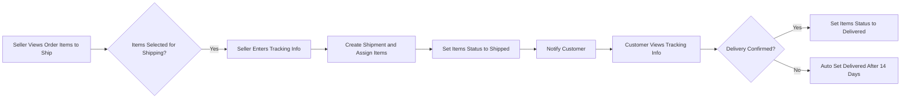

# E-Commerce Shopping Mall Platform

## Customer Account

- WHEN a user registers, THE system SHALL require email and password.
- WHEN a customer attempts to use any feature, THE system SHALL require the customer to be logged in (no guest access allowed).
- WHEN a customer logs in with email and password, THE system SHALL authenticate and start a session.
- WHEN a customer requests password change, THE system SHALL update the password after validating current credentials.
- WHEN a customer requests account deletion, THE system SHALL delete the customer's profile information but preserve their orders and order history for seller records and legal purposes.
- WHEN a customer deletes their account, THE system SHALL preserve customer reviews but display the reviews as authored by "deleted user".

## Customer Profile

- Each customer SHALL have a profile including display name and phone number.
- WHEN a customer edits their profile, THE system SHALL update the display name and phone number accordingly.

## Address Management

- Customers SHALL be able to add multiple shipping addresses.
- Each address SHALL include recipient name, phone number, street address, city, state/province, postal code, and country.
- WHEN a customer edits an address, THE system SHALL update the address fields.
- WHEN a customer deletes an address, THE system SHALL remove it.
- Customers SHALL be able to set one shipping address as default.

## Seller Account

- Sellers SHALL register with email and password.
- Seller accounts SHALL require administrator approval before being able to sell.
- Sellers SHALL be able to view their account approval status (pending, approved, rejected).
- IF seller registration is rejected, THEN THE seller SHALL be able to view the rejection reason and resubmit a new request.
- Sellers SHALL be able to change their password.
- Sellers SHALL be able to delete their account only if they have no pending orders or pending cancellation/refund requests.
- WHEN a seller deletes their account, THE system SHALL delete their products from listings but preserve order history and snapshots with shop names preserved.

## Seller Profile

- Each seller SHALL have a profile with shop name, description, and logo image.
- WHEN a seller edits their profile, THE system SHALL update shop name, description, and logo.
- EACH profile edit SHALL generate a snapshot capturing the previous state.
- Customers SHALL be able to view seller profiles.

## Categories

- Products SHALL be organized into categories with one level of subcategory nesting.
- Each category SHALL have a name and description.
- Only administrators SHALL create and manage categories.
- Customers SHALL be able to browse all categories and view products within categories.

## Snapshot Principle

- All editable data modifications SHALL create immutable snapshots recording timestamps, changes made, and before/after values.
- Snapshots SHALL apply to products, product variants, seller profiles, order items, reviews, cancellation and refund requests.
- Product snapshots SHALL include product fields and all variant fields for complete state preservation.
- Snapshots SHALL be viewable by relevant owners and administrators.

## Products

- Sellers SHALL be able to create products with name, description, category, and base price.
- Products belong to the seller creating them.
- Sellers SHALL be able to edit their own products, with each edit generating a snapshot.
- Sellers SHALL be able to delete products only if no pending order items or cancellation/refund requests exist.
- Deleting a product SHALL delete all variants and inventory records.
- Deleted products SHALL not appear in search or category listings.
- Sellers and administrators SHALL be able to view product snapshots.

## Product Images

- Sellers SHALL upload multiple images per product.
- Images can be reordered, with the first image as the main thumbnail.
- Image changes SHALL be included in snapshots.
- Sellers can delete images.

## Product Variants (SKU)

- Products can have multiple variants representing combinations of options.
- Each variant SHALL have a unique SKU code, option values, price override (optional), and stock quantity.
- Sellers SHALL be able to add, edit, and delete variants subject to no pending order or refund conditions.
- A product MUST have at least one variant to be purchasable.
- Products without variants SHALL be visible but marked "unavailable".

## Inventory Management

- Stock quantities SHALL be managed through inventory history records with quantity changes, reasons, and timestamps.
- Current stock is the sum of inventory records.
- Stock adjustments are generated automatically on order placement and cancellations/refunds.
- Sellers SHALL be able to restock and adjust inventory with quantity and reason.
- Out of stock variants SHALL be marked "out of stock" and cannot be added to carts.

## Product Search

- Customers SHALL be able to search products by name with pagination.
- Filters SHALL include category, price range, and in-stock only.
- Sorting options SHALL include newest first, price low-to-high, and price high-to-low.

## Product Listing

- Product lists SHALL show main thumbnail, name, base price or price range, seller shop name, and average rating.

## Product Detail Page

- Customers SHALL view full product details including images, name, description, category, seller profile link, variants, average rating, and reviews.

## Wishlist

- Customers SHALL add products to their wishlist.
- Wishlist views SHALL be paginated.
- Wishlist SHALL show products, not variants.
- Deleted products SHALL be removed automatically from wishlists.

## Shopping Cart

- Customers SHALL add product variants with specified quantities to their cart.
- Quantities SHALL combine for duplicate variants.
- Cart SHALL display product name, variant options, price, quantity, and subtotal.
- Cart SHALL show total price.
- Stock availability SHALL be verified with warnings when quantity exceeds stock.
- Variants deleted or out of stock SHALL be marked unavailable.

## Checkout

- Customers SHALL be prevented from checking out unavailable items.
- Shipping address MUST be selected or defaulted.
- Order summary SHALL include items, shipping address, and total price.
- Shipping address SHALL be locked post-order.

## Payment

- Payment SHALL be handled via external gateway.
- Payment failures SHALL allow retry without creating orders.
- Payment success triggers order creation.

## Order Creation

- Orders SHALL be created upon successful payment.
- Stock quantities SHALL be decreased via negative inventory records.
- Purchased items SHALL be removed from carts.
- Order items SHALL each have status "paid".
- Snapshots of product and seller profiles SHALL be stored with order items.
- Order items from different sellers SHALL be grouped under one order.

## Order History

- Customers SHALL view paginated order lists sorted by newest.
- Order details SHALL show items, shipping address, shipment and tracking info.

## Order Status

- Item statuses: paid, shipped, delivered, cancelled, refunded.
- Overall order status derived as: 
  - Paid if all items paid
  - Shipped if any shipped and none delivered
  - Delivered if all delivered
  - Cancelled if all cancelled
  - Refunded if all refunded
  - Partially completed for mixed states

## Shipping and Tracking

- Shipments group order items per seller with tracking info shared.
- Customers confirm delivery per shipment.

## Order Cancellation

- Customers MAY request cancellation of individual paid items.
- Cancellations SHALL include reasons.
- Sellers SHALL approve or reject cancellation requests.
- Seller responses SHALL generate snapshots.
- Approved cancellations SHALL restore stock.
- Partial cancellations leave remaining items active.
- Fully cancelled orders become "cancelled" status.

## Refund Requests

- Customers MAY request refunds on delivered items within 7 days.
- Refund requests SHALL include reasons.
- Sellers SHALL approve or reject refund requests.
- Seller responses SHALL generate snapshots.
- Approved refund items SHALL restore stock.
- Fully refunded orders become "refunded" status.

## Reviews and Ratings

- Customers MAY write one review per product per order post-delivery.
- Reviews SHALL have 1-5 star ratings and optional text.
- Reviews SHALL be editable with each edit creating snapshots.
- Deleted reviews preserved as snapshots.
- Average product rating calculated excluding deleted reviews.

## Seller Dashboard

- Sellers SHALL view shop summary: total products, order items, pending cancellations and refunds.
- Sellers SHALL list and filter order items by status.

## Administrator System

- Users MAY request administrator roles with reasons.
- Super administrators SHALL approve or reject requests.
- Two admin grades: regular and super admin.
- Super admins CAN promote or demote other admins (except self-demotion).
- Admins CAN approve/reject seller registrations with reasons.
- Admins CAN suspend/unsuspend sellers, affecting product visibility and selling ability.
- Admins CAN create, edit, and delete categories.
- Admins CAN view and delete products, and view snapshots.
- Admins CAN view all orders and force-cancel or refund.
- Admins CAN ban/unban customers and sellers.

## Security and Compliance

- Authentication SHALL use email and password.
- All features SHALL enforce access control by actor roles.
- Banned users SHALL be prevented from login.
- Sensitive operations SHALL generate audit logs.

## Performance and Error Handling

- Response times SHALL meet usability standards (e.g., cart queries < 2 seconds).
- System SHALL handle payment failures gracefully with user notifications.
- Stock conflicts SHALL result in clear error messages preventing order placement.

---