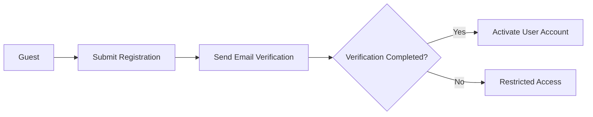
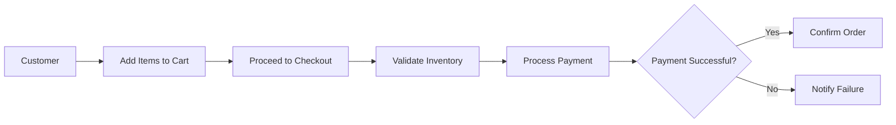
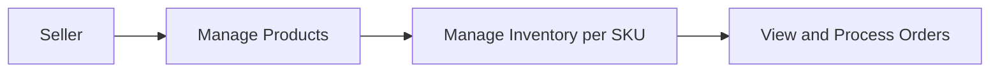

# Requirements Analysis Report for E-Commerce Shopping Mall Platform

## 1. Introduction

The e-commerce shopping mall platform aims to create a scalable, secure, and feature-rich multi-vendor marketplace connecting customers and sellers seamlessly. It enables users to browse products with detailed variants, manage accounts and orders, interact with sellers, and review purchased items. Sellers can manage product catalogs, inventory, and fulfill orders. Administrators oversee platform operations through a comprehensive dashboard.

The business goal is to provide a user-friendly platform that supports diverse products and sellers with robust backend processes that ensure data integrity, security, and scalability.

## 2. User Roles and Authentication

### 2.1 User Roles
- **Guest**: Can browse product catalogs and view details without registering.
- **Customer**: Registered user able to manage profile, multiple addresses, shopping cart, wishlist, place orders, track shipments, and write reviews.
- **Seller**: Vendor managing products, SKUs, inventory, and processing orders for their listings.
- **Admin**: Platform administrators with full permissions to manage users, products, orders, refunds, and platform settings.

### 2.2 Authentication Requirements
- Users register with a unique email and secure password.
- Email verification is mandatory before full account activation.
- Password reset using secure tokens sent via verified email.
- JWT-based authentication with access and refresh tokens supporting session maintenance.
- Role-based access control ensures data and feature permissions according to user roles.

## 3. Functional Requirements

### 3.1 User Registration and Login
- WHEN a guest submits a registration request with a valid email and password, THE system SHALL create a user account in a pending verification state.
- THE system SHALL send a verification email with a unique link.
- IF email verification is not completed within the specified time, THEN the user SHALL have restricted access.
- WHEN a user logs in with valid credentials and a verified email, THE system SHALL issue authentication tokens.
- IF login credentials are invalid, THEN THE system SHALL return a specific error message.

### 3.2 Address Management
- THE customer SHALL be able to add, update, delete, and list multiple shipping addresses.
- THE system SHALL enable one address to be marked as the primary shipping address.
- WHEN modifying addresses, ownership and data validity SHALL be enforced.

### 3.3 Product Catalog and Search
- THE system SHALL organize products into categories and subcategories with unlimited nesting.
- THE system SHALL support keyword search over product titles, descriptions, and SKU attributes.
- Filtering options SHALL include category, price range, brand, and ratings.
- Sort options SHALL enable ordering by price, popularity, newest arrivals, and customer ratings.

### 3.4 Product Variants (SKUs)
- Sellers SHALL be able to create multiple SKUs per product representing variations like color, size, and custom options.
- Each SKU SHALL have independent inventory counts and pricing.
- THE system SHALL ensure unique SKU identification platform-wide.

### 3.5 Shopping Cart and Wishlist
- THE customer SHALL be able to add and remove product SKUs to/from a persistent shopping cart.
- THE shopping cart SHALL persist across user sessions.
- THE customer SHALL manage a wishlist private to their account.
- Wishlist items SHALL not be shared publicly but remain accessible for future consideration.

### 3.6 Order Placement and Payment Processing
- WHEN a customer places an order, THE system SHALL validate cart contents, SKUs availability, total pricing including taxes and shipping.
- THE system SHALL process payments securely via integrated gateways such as Stripe or PayPal.
- IF payment fails, THEN THE system SHALL notify the customer immediately and abort the order.
- WHEN payment succeeds, THE system SHALL generate an order record and decrement SKU inventory atomically.

### 3.7 Order Tracking and Shipping Status Updates
- THE customer SHALL be able to view real-time order status: processing, shipped, delivered, or cancelled.
- THE system SHALL allow shipping status updates manually by sellers or automatically via shipping provider integrations.
- Notifications SHALL be sent to customers on significant status changes via email or in-app messages.

### 3.8 Product Reviews and Ratings
- Customers who have purchased products SHALL be allowed to submit ratings and written reviews.
- Reviews SHALL undergo moderation to filter inappropriate or spam content before public display.
- Sellers SHALL NOT be able to modify or delete user reviews.

### 3.9 Seller Accounts and Product Management
- Sellers SHALL register for seller accounts with verification steps.
- Sellers SHALL be able to create, update, and delete their own product listings and variants.
- Inventory management SHALL be handled at the SKU level with real-time updates.
- Sellers SHALL view and process orders containing their products.

### 3.10 Inventory Management per SKU
- THE system SHALL maintain up-to-date stock levels per SKU.
- WHEN orders are placed, THE system SHALL reserve and decrement stock atomically to prevent oversells.
- Low stock alerts SHALL be sent to sellers when thresholds are reached.

### 3.11 Order History, Cancellation, and Refund Requests
- Customers SHALL view their complete order histories.
- THE system SHALL allow cancellation requests before shipment status.
- Refund requests SHALL be submitted and routed for admin approval.
- THE system SHALL restrict cancellation or refund of shipped or delivered orders.

### 3.12 Admin Dashboard for Order and Product Management
- Admins SHALL have full CRUD access to users, products, orders, and refunds.
- THE dashboard SHALL provide graphical reports and operational insights.
- Admins SHALL be able to intervene in refunds, disputes, or policy enforcement.

## 4. Business Rules
- Orders SHALL not exceed available SKU inventory.
- Payment confirmation is required for order finalization.
- Reviews only allowed from verified customers with completed transactions.
- Cancellation allowed only before shipment.
- Admins have override privileges for dispute resolution and refunds.

## 5. Error Handling
- IF login fails, THEN THE system SHALL return an error within 2 seconds detailing the failure.
- IF inventory is insufficient during checkout, THEN THE system SHALL notify the customer and prohibit order placement.
- IF payment gateway errors occur, THEN THE system SHALL rollback order creation and notify the user.
- IF review content violates moderation guidelines, THEN THE system SHALL reject submission with explanation.

## 6. Performance Requirements
- Login and registration SHALL respond within 2 seconds.
- Product search results SHALL return within 1 second.
- The system SHALL support at least 1000 concurrent users without degradation.

## 7. User Flow Diagrams

### 7.1 User Registration and Verification Flow

### 7.2 Order Placement and Payment Flow

### 7.3 Seller Product and Order Management Flow

## 8. Conclusion

All requirements are business-focused and implementation-agnostic to ensure clarity and developer autonomy. Developers must implement backend systems meeting these business needs, complying with stated performance, security, and reliability criteria.

> This report contains business requirements only. Technical decisions on architecture, APIs, and database design are deferred to the development team.