# Performance and Security Requirements for Shopping Mall Platform

The Shopping Mall platform must provide robust, scalable, secure, and compliant backend services to support a high-quality e-commerce experience. This document outlines specific business requirements for performance, security, data privacy, and regulatory compliance to guide backend development.

## 1. Introduction

The system SHALL ensure reliable and secure operation to handle a growing number of users, transactions, and data with high availability and strong security protections.

## 2. Performance Requirements

### 2.1 Response Times
- WHEN a user attempts to log in, THE system SHALL respond with success or failure within 2 seconds.
- WHEN a customer searches the product catalog or browses products, THE system SHALL return results within 3 seconds.
- WHEN a customer adds items to the shopping cart or wishlist, THE system SHALL confirm the action within 2 seconds.
- WHEN a customer places an order including payment processing, THE system SHALL complete the entire process within 5 seconds.
- WHEN an admin or seller updates product or inventory information, THE system SHALL persist changes and confirm success within 3 seconds.
- WHEN a user requests order tracking or shipping status, THE system SHALL return current status within 2 seconds.

### 2.2 Throughput and Concurrency
- THE system SHALL support at least 500 concurrent active users maintaining specified response times.
- THE platform SHALL process a minimum of 50 orders per minute without performance degradation.

### 2.3 Scalability
- THE system SHALL enable horizontal scaling to handle increasing traffic and data volume.
- THE database SHALL support scaling to accommodate growing datasets for users, orders, and products.

### 2.4 Availability
- THE platform SHALL maintain at least 99.9% uptime monthly excluding scheduled maintenance.

### 2.5 Monitoring and Alerts
- THE system SHALL continuously monitor performance metrics including response times, error rates, and resource usage.
- WHEN metrics exceed predefined thresholds, THE system SHALL generate alerts to administrators promptly.

## 3. Security Requirements

### 3.1 Authentication and Authorization
- THE system SHALL enforce strong password policies including minimum length and complexity.
- THE system SHALL lock user accounts after 5 failed login attempts for a configurable duration to prevent brute force attacks.
- THE system SHALL implement JWT-based authentication with secure token storage and expiration.
- THE system SHALL apply strict role-based access control (RBAC) limiting user access strictly by their roles: guest, customer, seller, admin.

### 3.2 Data Protection
- THE system SHALL encrypt all sensitive user data including passwords and payment details both at rest and during transmission.
- PASSWORDS SHALL be hashed with state-of-the-art algorithms.
- Sensitive data SHALL be masked in logs and error messages to avoid information leaks.

### 3.3 Secure Payment Processing
- THE system SHALL integrate with PCI DSS compliant third-party payment gateways.
- PAYMENT information SHALL not be stored unencrypted or in sensitive logs.
- The system SHALL verify payment data correctness before completing payments.

### 3.4 Access Control
- API endpoints SHALL restrict access according to user roles.
- All failed authorization attempts SHALL be logged with relevant data.

### 3.5 Security Incident Management
- THE system SHALL detect and notify administrators immediately on any security breach or suspicious activity.
- Audit logs SHALL record all critical operations with timestamps, user IDs, and action details.

## 4. Data Privacy

### 4.1 User Data Handling
- THE system SHALL collect only essential personal data required for platform operations.
- Users SHALL have the ability to view, update, or request deletion of their personal information.

### 4.2 Data Retention and Deletion
- THE system SHALL retain user and order data for at least 5 years to comply with legal and operational requirements.
- WHEN a user requests account deletion, personal data SHALL be anonymized or deleted according to regulations.

### 4.3 Encryption and Transport Security
- Personal data SHALL be encrypted at rest and in transit using TLS 1.2 or higher.

## 5. Compliance and Regulations

### 5.1 GDPR Compliance
- THE system SHALL provide mechanisms for user consent management and privacy policy notifications.
- User rights including data access, correction, and deletion SHALL be supported per GDPR.

### 5.2 PCI DSS Compliance
- THE payment processing SHALL adhere to PCI DSS standards through secure integrations.

### 5.3 Audit and Logging
- THE system SHALL maintain tamper-proof logs for critical system operations.
- Logs SHALL be retained for at least 1 year to support audits.

## 6. Mermaid Diagram: Performance and Security Overview

```mermaid
graph LR
  subgraph "Performance"
    A["User Login (<= 2s)"] --> B["Product Search (<= 3s)"]
    B --> C["Add to Cart/Wishlist (<= 2s)"]
    C --> D["Order Placement (<= 5s)"]
    D --> E["Inventory Update (<= 3s)"]
    E --> F["Order Tracking (<= 2s)"]
  end

  subgraph "Security"
    G["Strong Password Policies"] --> H["Account Lockout After 5 Failed Attempts"]
    H --> I["JWT Authentication"]
    I --> J["Role-Based Access Control"]
    J --> K["Data Encryption At Rest & Transit"]
    K --> L["Secure Payment Gateway Integration"]
    L --> M["Audit Logging"]
  end

  subgraph "Compliance"
    N["GDPR Compliance"] --> O["PCI DSS Compliance"]
    O --> P["User Consent Management"]
    P --> Q["Privacy Policy Notifications"]
  end

  F --> G
  M --> N
```

---

All requirements are specified to ensure backend developers have precise guidance on performance and security expectations. All statements define what the system SHALL do with concrete metrics and policies. Technical implementation details are delegated to development teams who must ensure compliance and operational excellence.