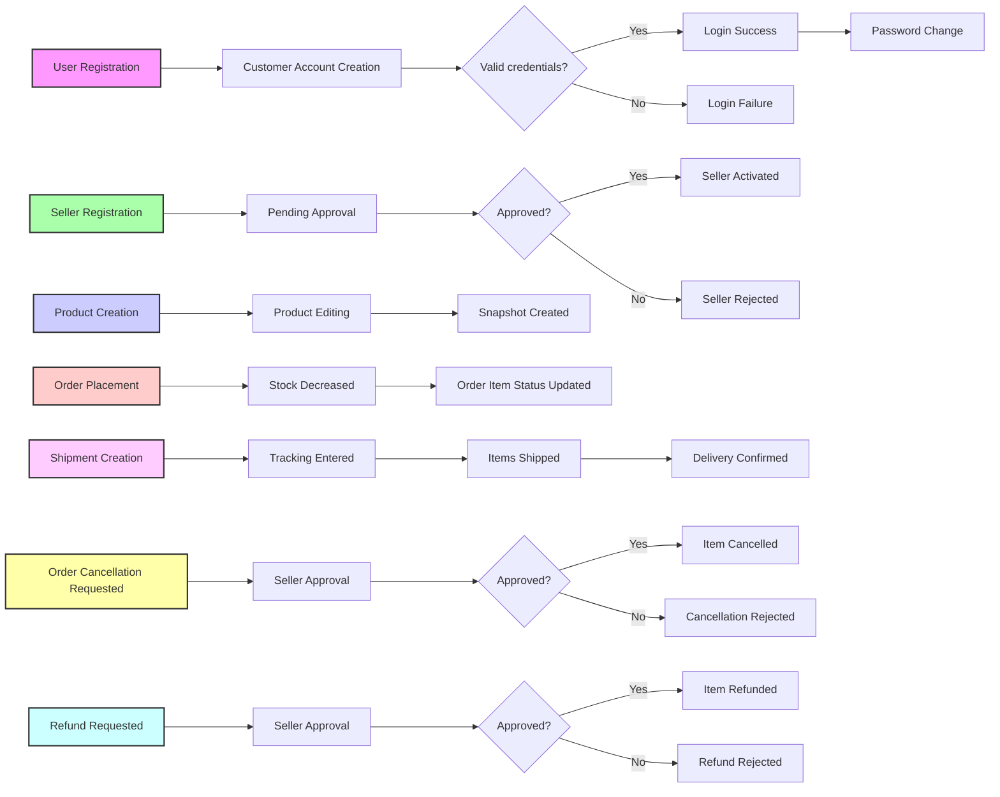

# E-Commerce Shopping Mall Platform Requirements Specification

## 1. Customer Account Management

### 1.1 Registration and Authentication
- WHEN a user wants to use the platform, THE system SHALL require customer registration using a unique email address and password.
- THE system SHALL NOT allow guest browsing; login is mandatory for all features.
- WHEN a customer submits a sign-up request with a valid email and password, THE system SHALL create a customer account.
- WHEN a customer logs in with valid credentials, THE system SHALL authenticate and allow access.
- WHEN a customer requests a password change, THE system SHALL validate their current password and allow updating to a new password.

### 1.2 Account Deletion and Data Preservation
- WHEN a customer requests account deletion, THE system SHALL delete their profile information immediately.
- THE system SHALL preserve all orders and order history associated with the deleted customer account for legal and seller record purposes.
- THE system SHALL preserve all reviews written by the customer, but display them as authored by "deleted user".
- WHEN a customer deletes their account, THE system SHALL disable future login attempts for that account.

## 2. Customer Profile Management

- WHEN a customer views their profile, THE system SHALL display their display name and phone number.
- WHEN a customer updates their display name or phone number, THE system SHALL validate and save the changes.

## 3. Address Management

- WHEN a customer adds a new shipping address, THE system SHALL require recipient name, phone number, street address, city, state/province, postal code, and country.
- THE system SHALL allow customers to manage multiple shipping addresses including create, update, and delete operations.
- WHEN a customer deletes an address, THE system SHALL remove it from their address list.
- THE system SHALL allow setting one address as the default shipping address.
- WHEN a default shipping address is deleted, THE system SHALL enforce the customer to select/set another default address or leave empty if none.

## 4. Seller Account Management

### 4.1 Seller Registration and Approval
- WHEN a user submits seller sign-up with email and password, THE system SHALL create a seller account in pending approval status.
- THE system SHALL require administrator approval before activating seller accounts.
- WHEN a seller logs in, THE system SHALL display their approval status (pending, approved, rejected).
- WHEN a seller registration is rejected, THE system SHALL provide a rejection reason visible to the seller.
- WHEN a rejected seller submits a new registration request, THE system SHALL create a new pending approval entry.

### 4.2 Seller Account Deletion
- A seller SHALL be allowed to delete their account only if they have no pending orders (status paid or shipped) and no pending cancellation or refund requests.
- WHEN a seller deletes their account, THE system SHALL delete all their listed products.
- THE system SHALL preserve the order history and snapshots related to the deleted seller.
- THE system SHALL preserve the shop name in past orders for accurate historical reference.

## 5. Seller Profile Management

- EACH seller shall have a profile containing shop name, shop description, and logo image.
- Sellers can update their profile information.
- EVERY profile edit SHALL create an immutable snapshot recording previous state, change timestamp, and values before and after.
- Customers SHALL be able to view seller profiles with the current shop information.

## 6. Category Management

- Products SHALL be organized into categories, with support for one-level subcategory nesting.
- EACH category SHALL have a name and description.
- ONLY administrators shall create, edit, or delete categories.
- WHEN a category is deleted, THE products assigned to it shall become uncategorized.
- Customers SHALL be able to browse categories and view products within them.

## 7. Snapshot Principle and Implementation

- ANY modification to editable data SHALL create a snapshot recording change time, fields changed, and before/after values.
- Snapshots shall be immutable and preserved for dispute resolution.
- Snapshots SHALL apply to products, product variants, seller profiles, order items, reviews, cancellation requests, and refund requests.
- Product snapshots SHALL include full product fields and nested variant snapshots.

## 8. Product and Inventory Management

### 8.1 Product Management
- Sellers SHALL create products with mandatory fields: name, description, category, and base price.
- EACH product belongs to its creator seller.
- Sellers SHALL be able to edit their products, with every edit creating a product snapshot.
- Sellers can delete products only if no order items with paid/shipped status or pending cancellation/refund requests exist.
- Deleting a product SHALL delete all variants and inventory records.
- Deleted products SHALL not appear in search or category listings.
- Sellers and administrators SHALL be able to view product snapshots.

### 8.2 Product Images
- Sellers can upload multiple images for each product.
- Images SHALL support ordering; the first image is the main thumbnail.
- Sellers can delete images, with changes recorded in snapshots.

### 8.3 Product Variants
- A product can have multiple variants representing option combinations.
- EACH variant has a unique SKU code, option values, optional price override, and stock quantity.
- Sellers can add, edit (SKU, options, price), and delete variants with restrictions.
- Deletion requires no pending orders or requests for that variant.
- Products must have at least one variant to be purchasable; otherwise shown as unavailable.

### 8.4 Inventory Management
- Stock quantities are tracked per variant via inventory history records.
- EACH inventory record contains quantity change, reason, and timestamp.
- Stock is calculated by summing inventory records.
- Sellers can restock or adjust inventory with reasons.
- Order placement and cancellation/refund automatically update inventory.
- When stock is zero, variant marked as out of stock and unavailable for cart addition.

## 9. Product Search and Listing

- Customers can search products by name with pagination.
- Filters include category, price range, and in-stock only.
- Sort options: newest first, price low to high, price high to low.
- Product listings display main image, name, price or price range, seller shop name, and average rating.

## 10. Product Detail Page

- Shows full product details including images, name, description, category, seller profile link, variants with prices and stock status.
- Displays average rating and reviews sorted newest first.

## 11. Wishlist

- Customers can add/remove products from their wishlist.
- Wishlist is paginated and shows products only (not variants).
- Deleted products auto-remove from all wishlists.

## 12. Shopping Cart

- Customers add specific product variants with quantities.
- Quantities combine for identical variants.
- Cart displays product name, variant options, price, quantity, subtotal, and a total price.
- Warnings if stock is insufficient.
- Deleted or out-of-stock variants marked unavailable.

## 13. Checkout and Payment

- Customers select shipping address and review order before placing.
- Unavailable items cannot be checked out.
- Payment is processed externally.
- Failed payments prevent order creation; success triggers order creation and inventory update.

## 14. Order Management

### 14.1 Order Creation
- Orders contain one or more order items per variant with quantity.
- Each order item status "paid" upon successful payment.
- Snapshots preserve product, variant, and seller profile states at purchase.
- Cart items are removed upon order creation; stock reduced.

### 14.2 Order Status
- Item statuses: Paid, Shipped, Delivered, Cancelled, Refunded.
- Overall order status is a derived state from items:
  - All paid: "paid"
  - Any shipped, none delivered: "shipped"
  - All delivered: "delivered"
  - All cancelled: "cancelled"
  - All refunded: "refunded"
  - Mixed states: "partially completed"

### 14.3 Shipping and Tracking
- Sellers manage shipments per order items with tracking info.
- Items from different sellers ship separately.
- Delivery confirmation by customers updates item statuses to delivered.
- Auto-confirm delivery after 14 days if no manual confirmation.

### 14.4 Order Cancellation
- Customers request cancellation per item (status: paid).
- Sellers approve or reject; snapshot records each decision.
- Approved cancellations update item status, restore stock.
- Partial cancellations handled at item level.

### 14.5 Refund Requests
- Refunds requested per item (status: delivered), within 7 days of delivery.
- Sellers approve or reject; snapshot records decisions.
- Approved refunds update item status, restore stock.

## 15. Reviews and Ratings

- Customers write one review per product per order after delivery.
- Reviews have rating (1-5 stars) and optional text.
- Reviews editable and deletable by customers; edits create snapshots.
- Deleted reviews preserved in snapshot but not visible.
- Product average rating computed from active reviews.

## 16. Seller Dashboard

- Sellers view data summaries: product count, order items, pending cancellations and refunds.
- Order items listed with filtering by status, pagination, and sorting.
- Dashboard access restricted to approved, non-suspended sellers.

## 17. Administrator System

### 17.1 Administrator Roles and Requests
- Any user can request admin role with reason.
- Super administrators review and approve or reject requests.
- Admin levels: regular and super administrator with promotion/demotion rules.
- Super administrators cannot demote themselves.

### 17.2 Seller Management
- Admins approve/reject/suspend/unsuspend sellers.
- Suspended sellers' products hidden, no new product creation, but can process existing orders.

### 17.3 Category Management
- Admins manage categories and subcategories.
- Product category assignment updates accordingly.

### 17.4 Product and Order Oversight
- Admins view and manage all products, including deletion.
- Admins view all orders, force-cancel or force-refund items/orders.

### 17.5 User Management
- Admins view and ban/unban customers and sellers with login restrictions.

---

