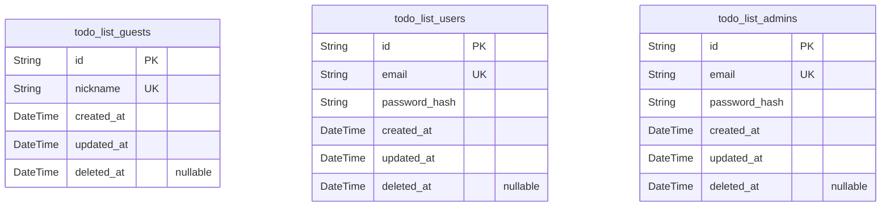
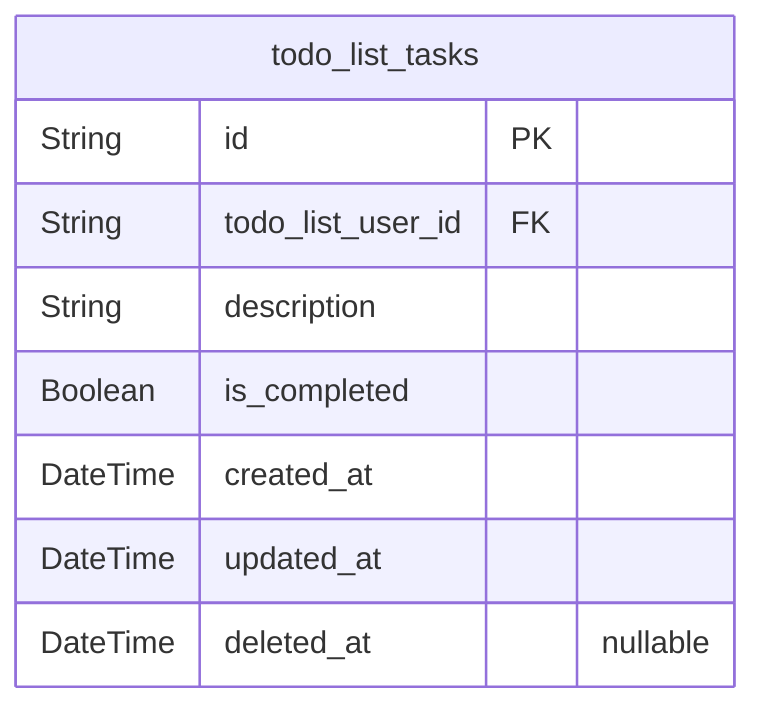

# Prisma Markdown

> Generated by [`prisma-markdown`](https://github.com/samchon/prisma-markdown)

- [Actors](#actors)
- [Tasks](#tasks)

## Actors

### `todo_list_guests`

Guest role information for unauthenticated users with limited read-only
access. Represents basic guest identity records for access control and
session tracking. Does not require a password or email, but includes
timestamps and soft delete support.

Properties as follows:

- `id`: Primary Key.
- `nickname`: Guest user's display nickname or pseudonym.
- `created_at`: Timestamp when the guest record was created.
- `updated_at`: Timestamp when the guest record was last updated.
- `deleted_at`: Timestamp when the guest record was soft deleted (nullable).

### `todo_list_users`

Authenticated users of the Todo list application. Stores user credentials
including unique email and hashed password for login. Maintains
timestamps and soft delete timestamp for account lifecycle management.

Properties as follows:

- `id`: Primary Key.
- `email`: Unique email address used for user login and communication.
- `password_hash`: Password hash for secure authentication.
- `created_at`: Timestamp when the user record was created.
- `updated_at`: Timestamp when the user record was last updated.
- `deleted_at`: Timestamp when the user record was soft deleted (nullable).

### `todo_list_admins`

System administrators with full permissions to manage users and system
settings. Includes unique email and password hashing for secure access.
Timestamps record lifecycle events and soft delete for account
deactivation.

Properties as follows:

- `id`: Primary Key.
- `email`: Unique email address for admin login.
- `password_hash`: Password hash for secure authentication of administrators.
- `created_at`: Timestamp when the admin record was created.
- `updated_at`: Timestamp when the admin record was last updated.
- `deleted_at`: Timestamp when the admin record was soft deleted (nullable).

## Tasks

### `todo_list_tasks`

Represents individual todo tasks created and managed by authenticated
users. Each task is linked to a user (todo_list_users) by foreign key
todo_list_user_id. Tasks have a description text, a boolean completion
status, and temporal fields for created, updated, and optional deleted
(soft delete). The model supports a primary stance for independent user
task management requiring CRUD operations.

Properties as follows:

- `id`: Primary Key.
- `todo_list_user_id`: Belonged user's [todo_list_users.id](#todo_list_users).
- `description`: Task description text, must be non-empty and trimmed.
- `is_completed`: Indicates whether the task is completed (true) or pending (false).
- `created_at`: Timestamp when the task was created.
- `updated_at`: Timestamp when the task was last updated.
- `deleted_at`: Soft delete timestamp, null if not deleted.
