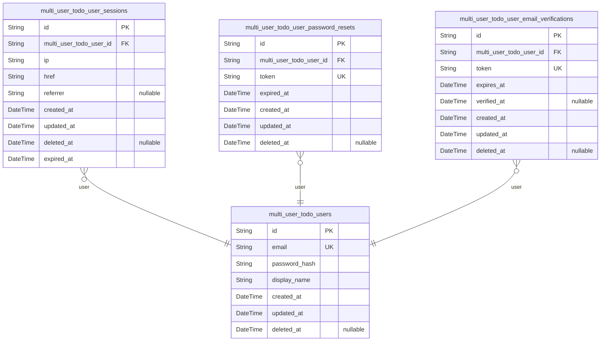
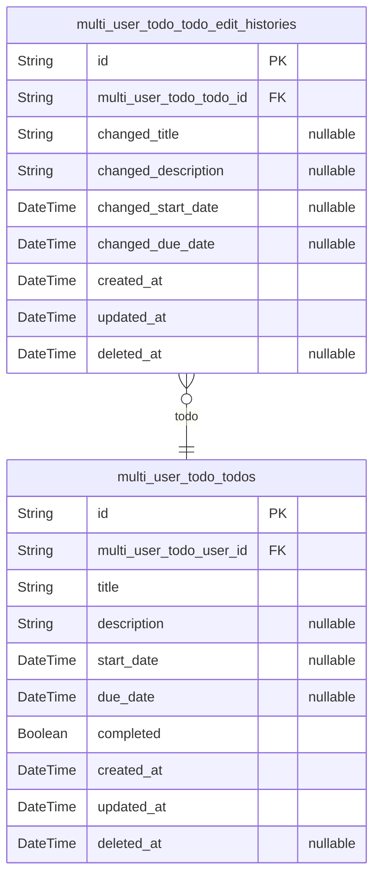

# Prisma Markdown

> Generated by [`prisma-markdown`](https://github.com/samchon/prisma-markdown)

- [Actors](#actors)
- [Todos](#todos)

## Actors

```mermaid
erDiagram
"multi_user_todo_users" {
  String id PK
  String email UK
  String password_hash
  String display_name
  DateTime created_at
  DateTime updated_at
  DateTime deleted_at "nullable"
}
"multi_user_todo_user_sessions" {
  String id PK
  String multi_user_todo_user_id FK
  String ip
  String href
  String referrer "nullable"
  DateTime created_at
  DateTime updated_at
  DateTime deleted_at "nullable"
  DateTime expired_at
}
"multi_user_todo_user_password_resets" {
  String id PK
  String multi_user_todo_user_id FK
  String token UK
  DateTime expired_at
  DateTime created_at
  DateTime updated_at
  DateTime deleted_at "nullable"
}
"multi_user_todo_user_email_verifications" {
  String id PK
  String multi_user_todo_user_id FK
  String token UK
  DateTime expires_at
  DateTime verified_at "nullable"
  DateTime created_at
  DateTime updated_at
  DateTime deleted_at "nullable"
}
"multi_user_todo_user_sessions" }o--|| "multi_user_todo_users" : user
"multi_user_todo_user_password_resets" }o--|| "multi_user_todo_users" : user
"multi_user_todo_user_email_verifications" }o--|| "multi_user_todo_users" : user
```

### `multi_user_todo_users`

Registered user accounts with email and password credentials, including
profile display name. This table handles authentication information and
user identity for the multi-user todo application. Supports soft deletion
via deleted_at field, allowing account deletion. Acts as the root actor
entity for user-related operations and relationships.

Properties as follows:

- `id`: Primary Key.
- `email`: Unique email address used for user authentication and communication.
- `password_hash`: Hashed password for secure user authentication.
- `display_name`: Display name for the user's profile.
- `created_at`: Timestamp when the user account was created.
- `updated_at`: Timestamp when the user account was last updated.
- `deleted_at`
  > Nullable timestamp indicating when the account was soft deleted (null if
  > active).

### `multi_user_todo_user_sessions`

JWT session tokens for user authentication with access and refresh
tokens. Tracks session metadata including IP address, client URL, and
referrer. Supports auditing and session lifecycle management by linking
sessions to registered users.

Properties as follows:

- `id`: Primary Key.
- `multi_user_todo_user_id`: Belonged user's [multi_user_todo_users.id](#multi_user_todo_users).
- `ip`: IP address of the client initiating the session.
- `href`: URL of the client at the time of session start.
- `referrer`: Referrer URL of the client, null if not available.
- `created_at`: Session creation timestamp.
- `updated_at`: Session last update timestamp.
- `deleted_at`: Soft delete timestamp. Null if not deleted.
- `expired_at`: Timestamp when the session expires.

### `multi_user_todo_user_password_resets`

Password reset tokens to enable users to securely recover access to their
accounts. Each token has an expiry date. Linked to a user account
referenced by multi_user_todo_users.

Properties as follows:

- `id`: Primary Key.
- `multi_user_todo_user_id`: Belonged user's [multi_user_todo_users.id](#multi_user_todo_users).
- `token`: Secure token string used for password reset authentication.
- `expired_at`: Date and time when the password reset token expires.
- `created_at`: Timestamp when the password reset record was created.
- `updated_at`: Timestamp when the password reset record was last updated.
- `deleted_at`: Timestamp when the password reset record was soft deleted.

### `multi_user_todo_user_email_verifications`

Email verification tokens to confirm user email ownership after
registration. Linked to registered users, stores token details,
expiration, and verification timestamps. Supports soft deletion for audit
and compliance.

Properties as follows:

- `id`: Primary Key.
- `multi_user_todo_user_id`: Belonged user's [multi_user_todo_users.id](#multi_user_todo_users).
- `token`: Unique email verification token for confirming user email.
- `expires_at`: Expiration datetime of the email verification token.
- `verified_at`: Timestamp when the email was verified. Null if not yet verified.
- `created_at`: Record creation timestamp.
- `updated_at`: Record last update timestamp.
- `deleted_at`: Soft delete timestamp, null if record is active.

## Todos

```mermaid
erDiagram
"multi_user_todo_todos" {
  String id PK
  String multi_user_todo_user_id FK
  String title
  String description "nullable"
  DateTime start_date "nullable"
  DateTime due_date "nullable"
  Boolean completed
  DateTime created_at
  DateTime updated_at
  DateTime deleted_at "nullable"
}
"multi_user_todo_todo_edit_histories" {
  String id PK
  String multi_user_todo_todo_id FK
  String changed_title "nullable"
  String changed_description "nullable"
  DateTime changed_start_date "nullable"
  DateTime changed_due_date "nullable"
  DateTime created_at
  DateTime updated_at
  DateTime deleted_at "nullable"
}
"multi_user_todo_todo_edit_histories" }o--|| "multi_user_todo_todos" : todo
```

### `multi_user_todo_todos`

Todos created by users with titles, optional descriptions, start and due
dates, completion status, soft deletion status, and timestamps. Each todo
belongs to exactly one user represented by multi_user_todo_users. Soft
deletion allows trash management. Completion status is a simple boolean
toggle.

Properties as follows:

- `id`: Primary Key.
- `multi_user_todo_user_id`: Owner user's [multi_user_todo_users.id](#multi_user_todo_users).
- `title`: Title of the todo item, required field.
- `description`: Optional detailed description of the todo item.
- `start_date`: Optional start date for the todo.
- `due_date`: Optional due date for the todo.
- `completed`: Completion status of the todo, true means done, false means not done.
- `created_at`: Timestamp when the todo was created.
- `updated_at`: Timestamp of the last update to the todo.
- `deleted_at`: Timestamp when the todo was deleted; null means not deleted (soft delete).

### `multi_user_todo_todo_edit_histories`

Edit history entries for todos, capturing timestamped changes to title,
description, start date, and due date. Each entry references the parent
todo and supports soft deletion for audit trail management.

Properties as follows:

- `id`: Primary Key.
- `multi_user_todo_todo_id`: Referenced todo's [multi_user_todo_todos.id](#multi_user_todo_todos).
- `changed_title`: Changed title if updated, null if not changed.
- `changed_description`: Changed description if updated, null if not changed.
- `changed_start_date`: Changed start date if updated, null if not changed.
- `changed_due_date`: Changed due date if updated, null if not changed.
- `created_at`: Timestamp when this edit history entry was created.
- `updated_at`: Timestamp when this edit history entry was last updated.
- `deleted_at`: Soft delete timestamp for this history entry.
