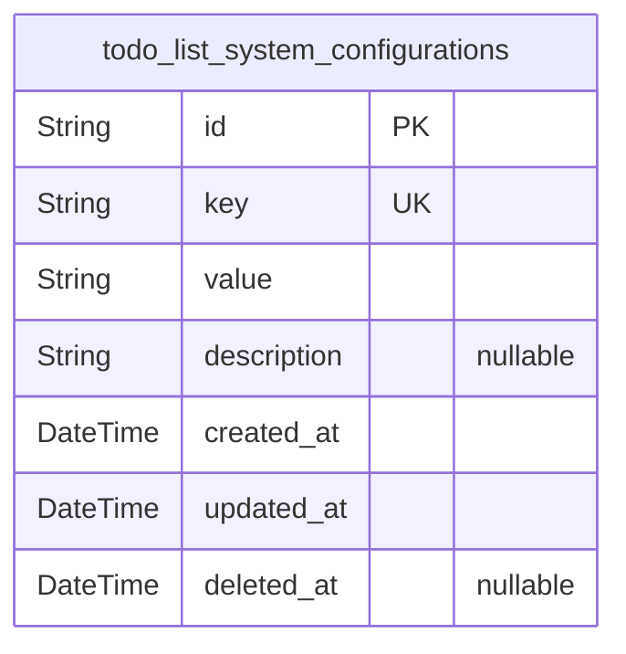
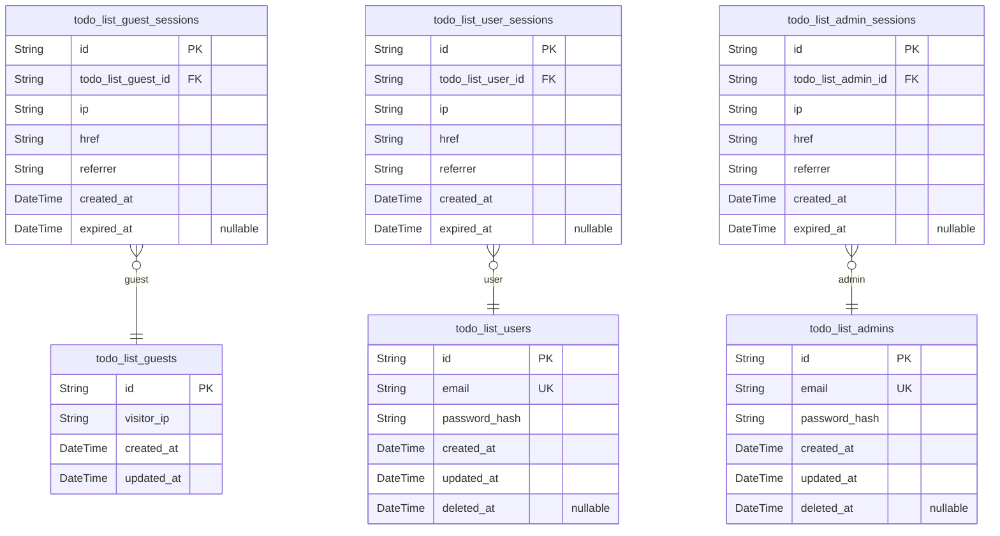
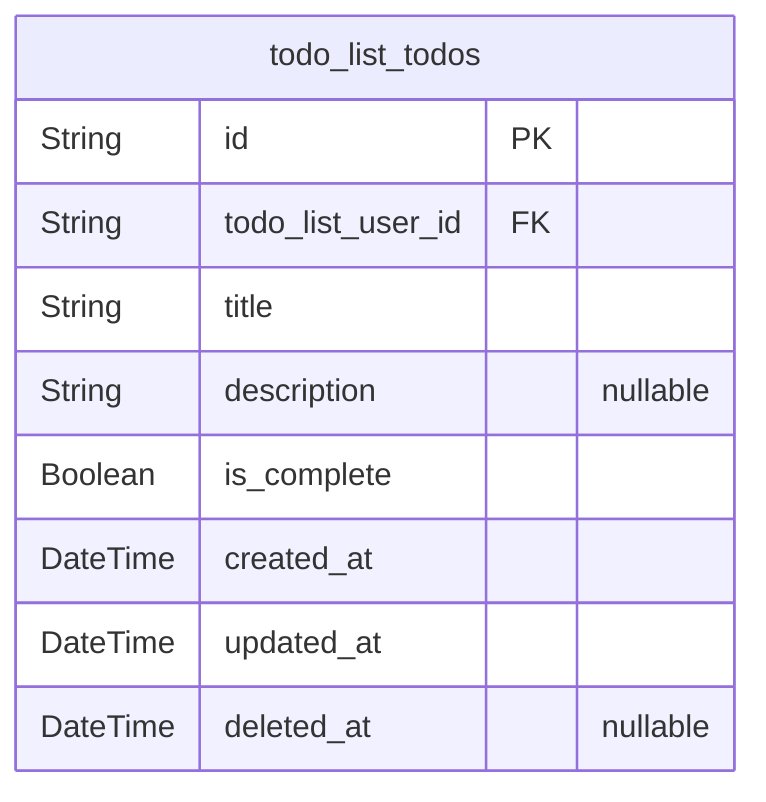

# Prisma Markdown

> Generated by [`prisma-markdown`](https://github.com/samchon/prisma-markdown)

- [Systematic](#systematic)
- [Actors](#actors)
- [Todos](#todos)

## Systematic

```mermaid
erDiagram
"todo_list_system_configurations" {
  String id PK
  String key UK
  String value
  String description "nullable"
  DateTime created_at
  DateTime updated_at
  DateTime deleted_at "nullable"
}
```

### `todo_list_system_configurations`

System configuration key-value storage for the Todo List application.

Stores system-wide parameters and settings that control application
behavior and feature toggles. Each configuration entry contains a unique
key name, associated string value, human-readable description, and
lifecycle timestamps. This facilitates dynamic configuration without
requiring code changes or system redeployment.

Configurations are managed independently and may be updated by
administrators or system processes. The table supports soft deletion to
preserve audit trails and enable recovery if necessary.

Properties as follows:

- `id`: Primary Key.
- `key`: Unique configuration key identifier used for lookup and management.
- `value`
  > Configuration value stored as string, typically representing a setting or
  > parameter value.
- `description`: Human-readable explanation of the configuration entry and its purpose.
- `created_at`: Timestamp when the configuration entry was created.
- `updated_at`: Timestamp when the configuration entry was last modified.
- `deleted_at`
  > Soft delete timestamp indicating when the entry was marked deleted, if
  > applicable.

## Actors

```mermaid
erDiagram
"todo_list_guests" {
  String id PK
  String visitor_ip
  DateTime created_at
  DateTime updated_at
}
"todo_list_guest_sessions" {
  String id PK
  String todo_list_guest_id FK
  String ip
  String href
  String referrer
  DateTime created_at
  DateTime expired_at "nullable"
}
"todo_list_users" {
  String id PK
  String email UK
  String password_hash
  DateTime created_at
  DateTime updated_at
  DateTime deleted_at "nullable"
}
"todo_list_user_sessions" {
  String id PK
  String todo_list_user_id FK
  String ip
  String href
  String referrer
  DateTime created_at
  DateTime expired_at "nullable"
}
"todo_list_admins" {
  String id PK
  String email UK
  String password_hash
  DateTime created_at
  DateTime updated_at
  DateTime deleted_at "nullable"
}
"todo_list_admin_sessions" {
  String id PK
  String todo_list_admin_id FK
  String ip
  String href
  String referrer
  DateTime created_at
  DateTime expired_at "nullable"
}
"todo_list_guest_sessions" }o--|| "todo_list_guests" : guest
"todo_list_user_sessions" }o--|| "todo_list_users" : user
"todo_list_admin_sessions" }o--|| "todo_list_admins" : admin
```

### `todo_list_guests`

Guests who visit the Todo List application without registration.

This table stores basic guest visitor information for tracking anonymous
sessions and limited interaction capabilities.
Guests represent unregistered users visiting the platform with no
authentication requirements.

Each guest has a unique UUID primary key and temporal fields for creation
and updates.

Properties as follows:

- `id`: Primary Key.
- `visitor_ip`: IP address of the guest visitor for tracking purposes.
- `created_at`: Timestamp when the guest record was created.
- `updated_at`: Timestamp when the guest record was last updated.

### `todo_list_guest_sessions`

Session records for guest visitors of the Todo List application.

Tracks anonymous sessions for guests, including connection context and
session lifecycle details.

Each session belongs to exactly one guest, enabling session-based
interaction tracking without authentication.

Properties as follows:

- `id`: Primary Key.
- `todo_list_guest_id`: Reference to the guest who owns this session. [todo_list_guests.id](#todo_list_guests).
- `ip`: IP address of the session connection.
- `href`: Connection URL for the session.
- `referrer`: Referrer URL for the session.
- `created_at`: Session creation time.
- `expired_at`: Session expiration time, null if session is currently active.

### `todo_list_users`

Registered users who can create, read, update, and delete their own todo
items.

This table stores user authentication credentials, including secure
password hashes and contact emails.

Each user record contains a unique UUID primary key along with timestamps
for auditing purposes.

Properties as follows:

- `id`: Primary Key.
- `email`: User email address used for authentication and communication.
- `password_hash`: Hashed password for secure user authentication.
- `created_at`: Timestamp when the user was created.
- `updated_at`: Timestamp when the user was last updated.
- `deleted_at`: Timestamp when the user was soft deleted, if applicable.

### `todo_list_user_sessions`

Session records for registered users of the Todo List application.

Tracks authenticated user sessions with security and connection details.

Each session belongs to exactly one user and records creation and
expiration times for session lifecycle management.

Properties as follows:

- `id`: Primary Key.
- `todo_list_user_id`: Reference to the user who owns this session. [todo_list_users.id](#todo_list_users).
- `ip`: IP address of the session connection.
- `href`: Connection URL for the session.
- `referrer`: Referrer URL for the session.
- `created_at`: Session creation time.
- `expired_at`: Session expiration time, null if session is currently active.

### `todo_list_admins`

Administrators of the Todo List application with full system privileges.

This table stores admin authentication data including email and hashed
password.

Admins have a unique UUID primary key and timestamps for auditing their
account lifecycle.

Properties as follows:

- `id`: Primary Key.
- `email`: Admin email address for authentication and communication.
- `password_hash`: Hashed password for secure admin authentication.
- `created_at`: Timestamp when the admin account was created.
- `updated_at`: Timestamp when the admin account was last updated.
- `deleted_at`: Timestamp when the admin account was soft deleted, if applicable.

### `todo_list_admin_sessions`

Session records for administrators of the Todo List application.

Tracks admin user sessions including connection information and session
lifetimes.

Each session links to one admin and records creation and expiration times
for session management.

Properties as follows:

- `id`: Primary Key.
- `todo_list_admin_id`: Reference to the admin who owns this session. [todo_list_admins.id](#todo_list_admins).
- `ip`: IP address of the session connection.
- `href`: Connection URL for the session.
- `referrer`: Referrer URL for the session.
- `created_at`: Session creation time.
- `expired_at`: Session expiration time, null if session is currently active.

## Todos

```mermaid
erDiagram
"todo_list_todos" {
  String id PK
  String todo_list_user_id FK
  String title
  String description "nullable"
  Boolean is_complete
  DateTime created_at
  DateTime updated_at
  DateTime deleted_at "nullable"
}
```

### `todo_list_todos`

Todo list items representing individual tasks managed by registered users.

Each todo item is uniquely identified and owned by a user. The model
supports task metadata including title, optional description, completion
status, and standard timestamps for creation, updates, and soft deletion.

Ownership is enforced via a foreign key to the todo_list_users table
ensuring that users can only manage their own todo items.

Soft deletion is implemented to allow reversible deletion while
preserving historical audit trails.

Properties as follows:

- `id`: Primary Key.
- `todo_list_user_id`: Owner user of the todo item. [todo_list_users.id](#todo_list_users).
- `title`
  > Title of the todo item, required and limited to a reasonable length for
  > usability.
- `description`
  > Optional detailed description of the todo item providing additional
  > context and information.
- `is_complete`: Flag indicating whether the todo item is marked as completed.
- `created_at`: Timestamp when the todo item was created.
- `updated_at`: Timestamp when the todo item was last updated.
- `deleted_at`: Timestamp indicating soft deletion status; null if not deleted.
