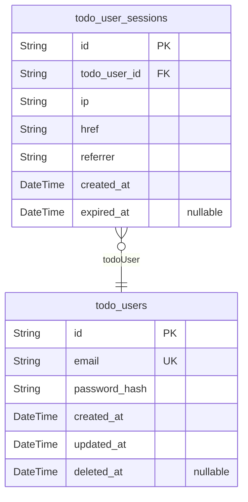
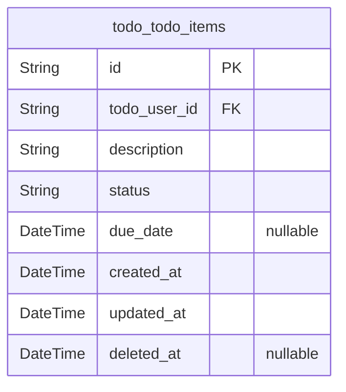

# Prisma Markdown

> Generated by [`prisma-markdown`](https://github.com/samchon/prisma-markdown)

- [Actors](#actors)
- [Todos](#todos)

## Actors

```mermaid
erDiagram
"todo_users" {
  String id PK
  String email UK
  String password_hash
  DateTime created_at
  DateTime updated_at
  DateTime deleted_at "nullable"
}
"todo_user_sessions" {
  String id PK
  String todo_user_id FK
  String ip
  String href
  String referrer
  DateTime created_at
  DateTime expired_at "nullable"
}
"todo_user_sessions" }o--|| "todo_users" : todoUser
```

### `todo_users`

Authenticated user accounts who can login and manage their personal todo
items. Includes credentials and audit information. Uniquely identified by
UUID. Soft deletable for account deactivation.

Properties as follows:

- `id`: Primary Key.
- `email`: User's unique email address for authentication and contact.
- `password_hash`: Hashed password for secure authentication.
- `created_at`: Timestamp when the user account was created.
- `updated_at`: Timestamp when the user account was last updated.
- `deleted_at`: Soft delete timestamp to mark user deactivation.

### `todo_user_sessions`

Sessions for authenticated users maintaining JWTs for access control and
expiration. Each session references an existing user and records
connection context like IP and referrer.

Properties as follows:

- `id`: Primary Key.
- `todo_user_id`: Referenced user's [todo_users.id](#todo_users).
- `ip`: IP address of the session client.
- `href`: URL from which the session was established.
- `referrer`: Referrer URL of the session request.
- `created_at`: Timestamp when the session was created.
- `expired_at`: Timestamp when the session expires or ends.

## Todos

```mermaid
erDiagram
"todo_todo_items" {
  String id PK
  String todo_user_id FK
  String description
  String status
  DateTime due_date "nullable"
  DateTime created_at
  DateTime updated_at
  DateTime deleted_at "nullable"
}
```

### `todo_todo_items`

Todo items entity storing user tasks with ownership and task details
including description, status, due date, and timestamps for creation,
update, and soft deletion. Each todo is owned by a unique user identified
by todo_users.id. This table supports independent CRUD operations for
todo items managed by authenticated users.

Properties as follows:

- `id`: Primary Key.
- `todo_user_id`: Owner user identifier referencing todo_users.id
- `description`: Text description of the todo item, mandatory, max 255 characters.
- `status`: Status of the todo item, either 'pending' or 'completed'.
- `due_date`
  > Optional due date for task completion; if provided must not be in the
  > past.
- `created_at`: Timestamp when the todo item was created.
- `updated_at`: Timestamp when the todo item was last updated.
- `deleted_at`: Timestamp when the todo item was soft deleted; null means active.
