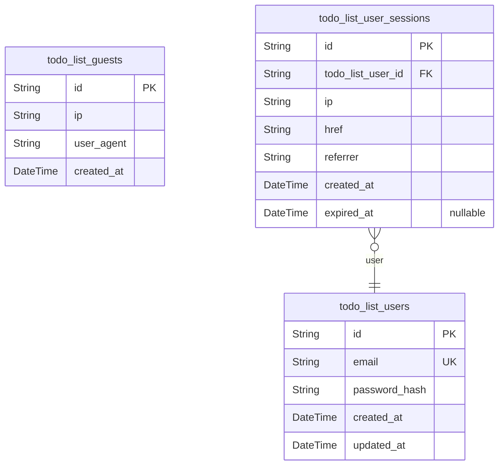
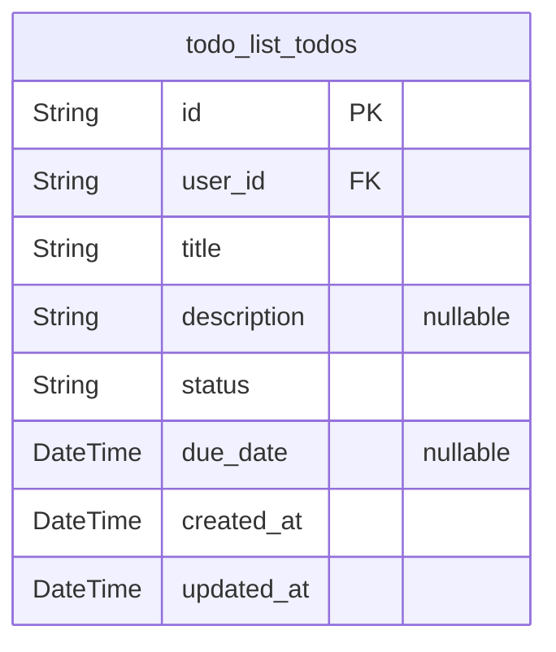

# Prisma Markdown

> Generated by [`prisma-markdown`](https://github.com/samchon/prisma-markdown)

- [Actors](#actors)
- [TodoManagement](#todomanagement)

## Actors

```mermaid
erDiagram
"todo_list_guests" {
  String id PK
  String ip
  String user_agent
  DateTime created_at
}
"todo_list_users" {
  String id PK
  String email UK
  String password_hash
  DateTime created_at
  DateTime updated_at
}
"todo_list_user_sessions" {
  String id PK
  String todo_list_user_id FK
  String ip
  String href
  String referrer
  DateTime created_at
  DateTime expired_at "nullable"
}
"todo_list_user_sessions" }o--|| "todo_list_users" : user
```

### `todo_list_guests`

Guest users who access the system without authentication.

Stores minimal identifying information for tracking purposes.
Guests do not have sessions since they are unauthenticated.

Used for analytics, monitoring, and optionally restricting access based
on IP or device.

Properties as follows:

- `id`: Primary Key.
- `ip`: IP address of the guest user for tracking and access control.
- `user_agent`: User agent string of the guest browser or client device.
- `created_at`: Time when the guest record was created.

### `todo_list_users`

Authenticated users of the Todo List application.

Users must register with a unique email and password hash.

Manages user identity, authentication credentials, and account metadata.

Supports authentication workflows and user-specific todo data access
controls.

Properties as follows:

- `id`: Primary Key.
- `email`: Unique email address for user login and communication.
- `password_hash`
  > Hashed password string for user authentication. Never store plain text
  > passwords.
- `created_at`: User account creation timestamp.
- `updated_at`: Timestamp of last account update.

### `todo_list_user_sessions`

Sessions for authenticated users of the Todo List application.

Tracks active and historical login sessions for users.

Records connection context such as IP, referrer, and access URL.

Supports session expiration and audit logging.

Each session links to its owning user.

This table has a composite index on user_id and created_at to optimize
session queries.

Properties as follows:

- `id`: Primary Key.
- `todo_list_user_id`: Reference to the owning user. [todo_list_users.id](#todo_list_users).
- `ip`: IP address from which the session was established.
- `href`: URL accessed during the session.
- `referrer`: Referrer URL for the session.
- `created_at`: Timestamp when the session was created.
- `expired_at`: Timestamp when the session expired or was terminated.

## TodoManagement

```mermaid
erDiagram
"todo_list_todos" {
  String id PK
  String user_id FK
  String title
  String description "nullable"
  String status
  DateTime due_date "nullable"
  DateTime created_at
  DateTime updated_at
}
```

### `todo_list_todos`

User personal todo items managed independently.

Each todo item belongs to one authenticated user and contains essential
task information including title, optional description, status, and
optional due date. The status field tracks task progression with values
for pending, completed, and deleted states.

Timestamps created_at and updated_at support auditability and record
changes over time. Permanent deletion is enforced without soft delete
fields.

The user_id foreign key ensures ownership linkage to the users in the
Actors component.

This table is the primary entity for the todo management domain,
supporting all CRUD operations for personal todo items.

Properties as follows:

- `id`: Primary key identifier for each todo item.
- `user_id`: Reference to the owning user. [todo_list_users.id](#todo_list_users).
- `title`: Short description or title of the todo item limited to 255 characters.
- `description`: Optional detailed description of the todo item limited to 1000 characters.
- `status`
  > Task status indicating progress phase: 'pending', 'completed', or
  > 'deleted'.
- `due_date`: Optional due date and time for the task, must be in the future when set.
- `created_at`: Timestamp when the todo item was created.
- `updated_at`: Timestamp when the todo item was last updated.
