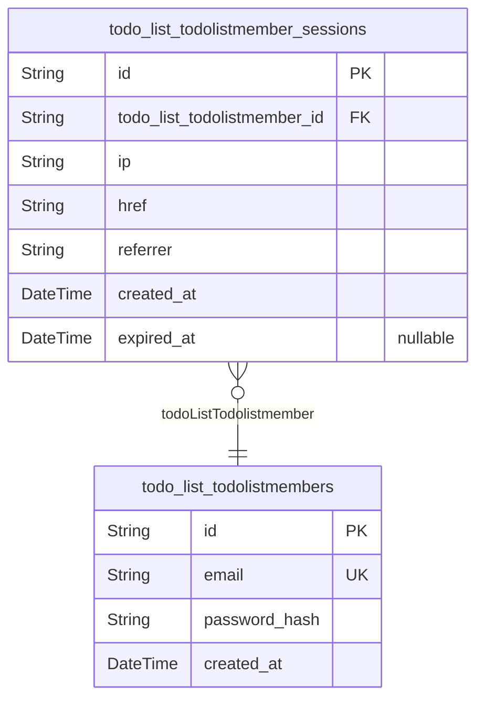
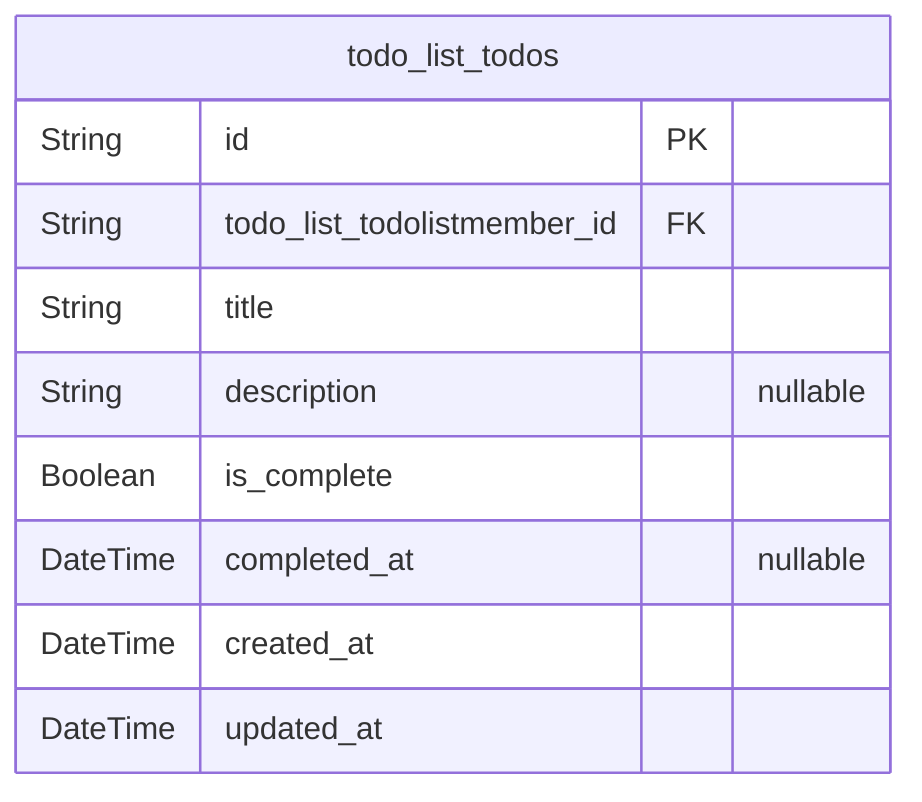

# Prisma Markdown

> Generated by [`prisma-markdown`](https://github.com/samchon/prisma-markdown)

- [Actors](#actors)
- [Todos](#todos)

## Actors

```mermaid
erDiagram
"todo_list_todolistmembers" {
  String id PK
  String email UK
  String password_hash
  DateTime created_at
}
"todo_list_todolistmember_sessions" {
  String id PK
  String todo_list_todolistmember_id FK
  String ip
  String href
  String referrer
  DateTime created_at
  DateTime expired_at "nullable"
}
"todo_list_todolistmember_sessions" }o--|| "todo_list_todolistmembers" : todoListTodolistmember
```

### `todo_list_todolistmembers`

Authenticated user account for the Todo List system.

Represents a natural person who registers, logs in, and manages their own
private todo items. Each account is uniquely identified by email, which
is required for login and password recovery. All authentication and data
ownership are strictly scoped to this actor – there is no account sharing
or joint access.

Password information is stored as a cryptographically secure hash—never
in plain text. Sessions are managed in a separate table, providing audit
trails and session control. User accounts support full account deletion
with immediate and permanent removal of all data. There are no
administrative roles or collaborative features in this minimal model.

Properties as follows:

- `id`: Primary Key.
- `email`
  > Unique user email address for authentication and communication. Must
  > follow proper email format and is used for login and password reset.
- `password_hash`
  > Cryptographically secure hash of the user's password. Never stored in
  > plain text and required for authentication.
- `created_at`: Timestamp of account creation. Used for audit and compliance purposes.

### `todo_list_todolistmember_sessions`

Authentication sessions for a todoListMember.

This table records session activity including IP, href, referrer, and
session timeline. Each session is linked to one todoListMember and
represents a unique browser or device login instance. Used for securing
API access and providing audit records. Sessions may expire or be
invalidated by the system or user action. No sensitive auth credentials
are stored here; only association and activity context.

Properties as follows:

- `id`: Primary Key.
- `todo_list_todolistmember_id`
  > References the todoListTodolistmember who owns this session. {@link
  > todo_list_todolistmembers.id}.
- `ip`
  > IP address from which the session was created or last accessed. Used for
  > audit and security.
- `href`
  > Connection URL or origin used when session was initialized. Provides
  > context on session creation.
- `referrer`
  > Referrer value (if present) at time of login; commonly HTTP referer
  > header.
- `created_at`: Timestamp when the session was initially created.
- `expired_at`
  > Timestamp marking when the session was invalidated, closed by user, or
  > expired. Null if session is still active.

## Todos

```mermaid
erDiagram
"todo_list_todos" {
  String id PK
  String todo_list_todolistmember_id FK
  String title
  String description "nullable"
  Boolean is_complete
  DateTime completed_at "nullable"
  DateTime created_at
  DateTime updated_at
}
```

### `todo_list_todos`

Todo items managed by each authenticated user in the Todo List application.

This table stores all actionable tasks owned by a single user
(todolistmember). Each todo is a distinct record with a unique identifier
and is strictly associated with its creator, preventing access by other
users. Todos are private and enforce per-user title uniqueness as
required by business rules.

The model provides minimal yet complete fields to represent task text, an
optional longer description, a completion status, timestamps for audit
support, and referential integrity to an existing user. No collaboration,
sharing, or advanced metadata is present for MVP; only essential CRUD
operations are supported. All deletions are irreversible as specified.

Each todo can be created, viewed, updated, and deleted by the owner only;
no user or admin may access other users' data at any time.

Properties as follows:

- `id`: Primary Key. Unique identifier for each todo item.
- `todo_list_todolistmember_id`
  > Reference to the owning user account. Enforces strict per-user data
  > isolation. [todo_list_todolistmembers.id](#todo_list_todolistmembers).
- `title`
  > Todo title provided by the owner. Must be unique for each user, between 1
  > and 100 characters, and non-blank.
- `description`
  > Optional longer details or notes for the todo. Allows up to 1000
  > characters. Can be null or empty as needed.
- `is_complete`
  > Completion status. True if the todo is marked complete, false if still
  > pending or in progress.
- `completed_at`
  > If set, indicates when the todo was marked complete. Null if not
  > completed.
- `created_at`: Timestamp for when the todo was created.
- `updated_at`
  > Timestamp for the most recent update to the todo, including status or
  > field edits.
