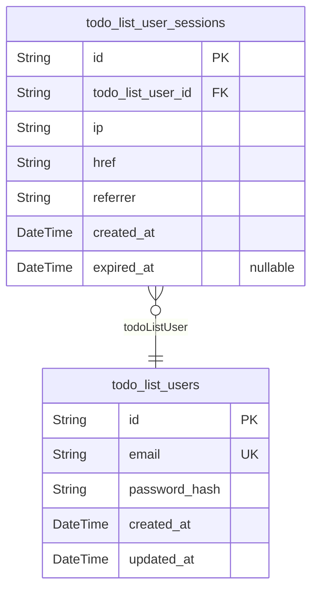
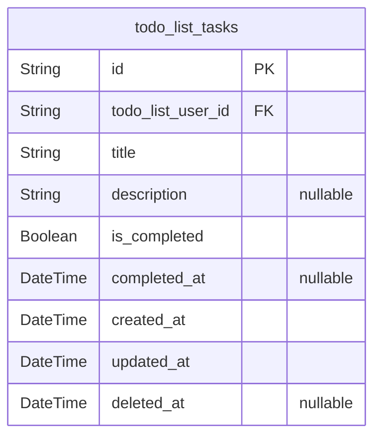

# Prisma Markdown

> Generated by [`prisma-markdown`](https://github.com/samchon/prisma-markdown)

- [Actors](#actors)
- [Todos](#todos)

## Actors

```mermaid
erDiagram
"todo_list_users" {
  String id PK
  String email UK
  String password_hash
  DateTime created_at
  DateTime updated_at
}
"todo_list_user_sessions" {
  String id PK
  String todo_list_user_id FK
  String ip
  String href
  String referrer
  DateTime created_at
  DateTime expired_at "nullable"
}
"todo_list_user_sessions" }o--|| "todo_list_users" : todoListUser
```

### `todo_list_users`

Registered users of the Todo list application who can authenticate and
manage their personal tasks.

Each user has a unique email address used for login purposes and a hashed
password for secure authentication.
The user entity serves as the authentication principal and owner of tasks
and sessions.

Users cannot be deleted outright; soft deletion is not implemented here.
User lifecycle primarily includes creation, authentication, and potential
deactivation handled outside this schema.

Properties as follows:

- `id`: Primary Key.
- `email`: Unique email address used for user authentication and communication.
- `password_hash`
  > Hashed password for secure authentication. Plain passwords are never
  > stored.
- `created_at`: Timestamp when the user account was created.
- `updated_at`: Timestamp when the user account was last updated.

### `todo_list_user_sessions`

Active sessions of the registered users representing authenticated login
sessions.

This table stores session information including IP address, originating
URL, and referrer URL to support auditing and session management.
Sessions have creation and optional expiration timestamps.

Each session is linked to a user, allowing multiple concurrent sessions
per user.

This is a subsidiary table managed indirectly through user authentication
and session handling flows.

Properties as follows:

- `id`: Primary Key.
- `todo_list_user_id`: Reference to the owning user. [todo_list_users.id](#todo_list_users)
- `ip`: IP address from which the session originated.
- `href`: URL accessed at session initiation.
- `referrer`: Referrer URL prior to accessing the session start URL.
- `created_at`: Timestamp when the session was created.
- `expired_at`: Optional timestamp when the session expired.

## Todos

```mermaid
erDiagram
"todo_list_tasks" {
  String id PK
  String todo_list_user_id FK
  String title
  String description "nullable"
  Boolean is_completed
  DateTime completed_at "nullable"
  DateTime created_at
  DateTime updated_at
  DateTime deleted_at "nullable"
}
```

### `todo_list_tasks`

Individual todo tasks managed privately by authenticated users.

This table stores all todo tasks created by users with strong ownership
linkage via user ID. Each task has a unique identifier, title, optional
description, timestamps for creation, update, completion, and soft
deletion status. Tasks are always associated with exactly one user,
ensuring data integrity and avoiding shared or public tasks.

The completion status is tracked as a boolean flag, and an optional
completion timestamp records when the task was marked completed. Soft
delete is enabled via nullable deleted_at field for task lifecycle
management and audit.

User sessions and authentication details are handled exclusively in
separate components to ensure modular design and single responsibility.

Properties as follows:

- `id`: Primary Key.
- `todo_list_user_id`: Reference to the owning user. [todo_list_users.id](#todo_list_users).
- `title`
  > Task title. Must be a non-empty string with a maximum length of 255
  > characters.
- `description`: Optional detailed description of the task. Limited to 1000 characters.
- `is_completed`
  > Flag indicating whether the task has been completed (true) or is still
  > pending (false).
- `completed_at`: Timestamp when the task was marked completed. Null if task is incomplete.
- `created_at`: Task creation timestamp.
- `updated_at`: Timestamp of the last task update.
- `deleted_at`: Soft deletion timestamp. Null indicates the task is active.
