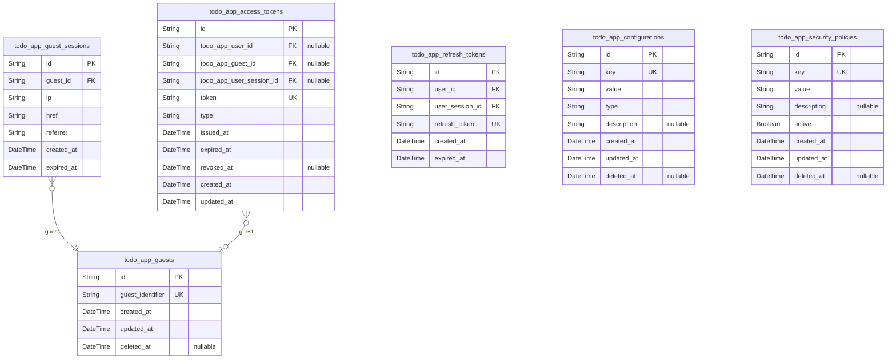
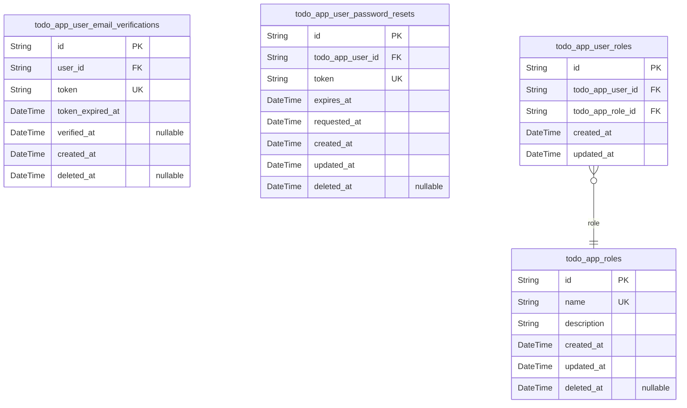
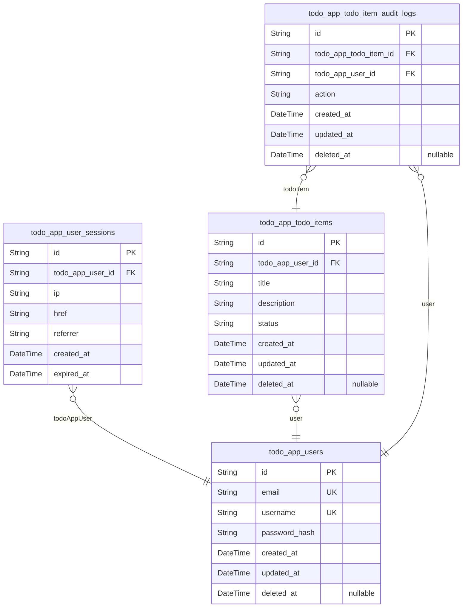

# Prisma Markdown

> Generated by [`prisma-markdown`](https://github.com/samchon/prisma-markdown)

- [Systematic](#systematic)
- [Actors](#actors)
- [Todo](#todo)

## Systematic

```mermaid
erDiagram
"todo_app_guests" {
  String id PK
  String guest_identifier UK
  DateTime created_at
  DateTime updated_at
  DateTime deleted_at "nullable"
}
"todo_app_guest_sessions" {
  String id PK
  String guest_id FK
  String ip
  String href
  String referrer
  DateTime created_at
  DateTime expired_at
}
"todo_app_access_tokens" {
  String id PK
  String todo_app_user_id FK "nullable"
  String todo_app_guest_id FK "nullable"
  String todo_app_user_session_id FK "nullable"
  String token UK
  String type
  DateTime issued_at
  DateTime expired_at
  DateTime revoked_at "nullable"
  DateTime created_at
  DateTime updated_at
}
"todo_app_refresh_tokens" {
  String id PK
  String user_id FK
  String user_session_id FK
  String refresh_token UK
  DateTime created_at
  DateTime expired_at
}
"todo_app_configurations" {
  String id PK
  String key UK
  String value
  String type
  String description "nullable"
  DateTime created_at
  DateTime updated_at
  DateTime deleted_at "nullable"
}
"todo_app_security_policies" {
  String id PK
  String key UK
  String value
  String description "nullable"
  Boolean active
  DateTime created_at
  DateTime updated_at
  DateTime deleted_at "nullable"
}
"todo_app_guest_sessions" }o--|| "todo_app_guests" : guest
"todo_app_access_tokens" }o--o| "todo_app_guests" : guest
```

### `todo_app_guests`

Guest user identity and profile information for the todoApp system.

Stores unauthenticated user records who may access limited system
features before full registration or authentication. Each guest is
represented by a unique identifier string that can be used to track their
interactions or sessions during their transient usage period.

Guests have creation and update timestamps for auditing, and soft
deletion support to allow removal without permanent data loss. Guest
records serve as a foundation for managing temporary or transient users
separately from registered authenticated users.

This table has a primary key UUID "id" and includes a unique guest
identifier string. It is functionally independent from user-related
tables handled in other components but may relate indirectly through
session tables already defined separately.

Properties as follows:

- `id`: Primary Key.
- `guest_identifier`
  > Unique string identifier for the guest user, used to track transient
  > users prior to registration.
- `created_at`: Timestamp when the guest record was created.
- `updated_at`: Timestamp when the guest record was last updated.
- `deleted_at`
  > Soft delete timestamp indicating when the guest record was deleted, if
  > applicable.

### `todo_app_guest_sessions`

Guest user authentication sessions tracking login states and connection
metadata.

Each session belongs to a single guest user and records information about
the connection such as IP address, URL accessed (href), and referrer URL.
Sessions are append-only with timestamps marking creation and expiration
for lifecycle management.

This table supports auditing of guest login activity and helps maintain
system security and session validity. It references {@link
todo_app_guests.id} to link the session to the guest identity.

The model is architected as an actor session entity with standalone
lifecycle, appropriate for managing ephemeral guest session data.

Properties as follows:

- `id`: Primary Key.
- `guest_id`: Reference to the guest user. [todo_app_guests.id](#todo_app_guests).
- `ip`: IP address of the guest session connection.
- `href`: URL accessed during the session.
- `referrer`: Referrer URL from which the session originated.
- `created_at`: Session creation timestamp.
- `expired_at`: Session expiration timestamp. Sessions must have expiration for security.

### `todo_app_access_tokens`

JWT access tokens issued to users or guests for authentication and
authorization.

This table stores the active and historical access tokens, including
token string, type, and timestamps indicating issuance, expiry, and
revocation.

Foreign keys link tokens to either registered users or guest users,
supporting multiple token types for flexible authentication mechanisms.

Used in security workflows to validate user sessions and authorize API
requests. Tokens can be revoked and tracked for security audits.

Properties as follows:

- `id`: Primary key.
- `todo_app_user_id`
  > Reference to the registered user who owns this token. {@link
  > todo_app_users.id}.
- `todo_app_guest_id`
  > Reference to the guest user who owns this token. {@link
  > todo_app_guests.id}.
- `todo_app_user_session_id`
  > Reference to the user session during which this token was issued. {@link
  > todo_app_user_sessions.id}.
- `token`: JWT access token string used for authenticating requests.
- `type`: Type of the token, e.g., 'access', 'api', or 'refresh'.
- `issued_at`: Timestamp when the token was issued.
- `expired_at`: Timestamp when the token expires.
- `revoked_at`: Timestamp when the token was revoked, if applicable.
- `created_at`: Record creation timestamp.
- `updated_at`: Record last update timestamp.

### `todo_app_refresh_tokens`

Refresh tokens issued to authenticated users for secure session renewal
and longevity.

This table manages JWT refresh tokens linked to specific users and their
authenticated sessions. It stores the token string, creation timestamp,
and expiration timestamp to enforce valid session duration policies.

Each refresh token directly references a user and the session it
originated from, enabling secure token revocation and audit capabilities.
This design supports efficient lookup and management of active and
expired tokens in the authentication subsystem.

Properties as follows:

- `id`: Primary key identifying the refresh token record uniquely.
- `user_id`: The user associated with this refresh token. [todo_app_users.id](#todo_app_users).
- `user_session_id`
  > The user session that this refresh token is linked to. {@link
  > todo_app_user_sessions.id}.
- `refresh_token`: JWT refresh token string used to obtain new access tokens.
- `created_at`: Timestamp when the refresh token was created.
- `expired_at`
  > Timestamp when the refresh token expires, enforcing session validity
  > duration.

### `todo_app_configurations`

Global application configuration settings accessible system-wide.

This table stores key-value pairs representing various configuration
parameters used throughout the todoApp system. Each configuration entry
includes a unique key, a value stored as a string, and the data type of
the value for proper interpretation.

Configuration entries can be independently created, updated, and deleted
by authorized system components or administrators.
Soft deletion is supported via the deleted_at timestamp to maintain
historical context and enable recovery.

Timestamps created_at and updated_at provide audit trails for changes in
configuration settings.

Properties as follows:

- `id`: Primary key UUID for configuration entry.
- `key`: Unique configuration key identifying the setting.
- `value`
  > Configuration value stored as a string; interpretation depends on the
  > type field.
- `type`
  > Data type of the configuration value (e.g., string, int, boolean) for
  > parsing and validation.
- `description`
  > Optional human-readable description explaining the purpose of this
  > configuration.
- `created_at`: Timestamp when the configuration entry was created.
- `updated_at`: Timestamp when the configuration entry was last updated.
- `deleted_at`: Timestamp for soft deletion; null means the configuration is active.

### `todo_app_security_policies`

System security policies and feature flags controlling application behavior.

Stores key-value pairs representing various security and feature toggles
used to configure system behavior dynamically. Each policy has a
descriptive text explaining its purpose.

Supports soft deletion for safe policy deactivation without permanent
data loss. Active flag indicates whether the policy is currently
enforced.

This table serves as a central configuration point for security settings
enforceable across the entire todo app system.

Properties as follows:

- `id`: Primary Key.
- `key`: Unique identifier for the security policy or feature flag.
- `value`
  > Value of the security policy, representing its configuration state or
  > setting.
- `description`: Optional detailed explanation of the policy's purpose and usage.
- `active`: Indicates whether the policy is currently active and enforced.
- `created_at`: Timestamp indicating when the policy was created.
- `updated_at`: Timestamp indicating when the policy was last updated.
- `deleted_at`
  > Soft delete timestamp to mark the policy as logically deleted without
  > removing it from the database.

## Actors

```mermaid
erDiagram
"todo_app_user_email_verifications" {
  String id PK
  String user_id FK
  String token UK
  DateTime token_expired_at
  DateTime verified_at "nullable"
  DateTime created_at
  DateTime deleted_at "nullable"
}
"todo_app_user_password_resets" {
  String id PK
  String todo_app_user_id FK
  String token UK
  DateTime expires_at
  DateTime requested_at
  DateTime created_at
  DateTime updated_at
  DateTime deleted_at "nullable"
}
"todo_app_roles" {
  String id PK
  String name UK
  String description
  DateTime created_at
  DateTime updated_at
  DateTime deleted_at "nullable"
}
"todo_app_user_roles" {
  String id PK
  String todo_app_user_id FK
  String todo_app_role_id FK
  DateTime created_at
  DateTime updated_at
}
"todo_app_user_roles" }o--|| "todo_app_roles" : role
```

### `todo_app_user_email_verifications`

Records verifying tokens and verification status for user emails.

This table stores email verification tokens generated for users during
registration or email change processes. It tracks the token string and
its expiration time, as well as when the verification was completed. The
table is associated with the authenticated user through a foreign key
relationship with the users table.

Temporal fields include created_at for token creation and deleted_at for
soft deletion support. The token field is unique to ensure no token
duplication.

This model supports secure email verification workflows critical to user
authentication and account integrity.

Properties as follows:

- `id`: Primary Key.
- `user_id`
  > Reference to the user this verification belongs to. {@link
  > todo_app_users.id}.
- `token`: Unique verification token sent to the user email.
- `token_expired_at`: Expiration datetime of the verification token.
- `verified_at`
  > Datetime when the email verification was completed. Null if not verified
  > yet.
- `created_at`: Timestamp when the verification record was created.
- `deleted_at`: Timestamp when the record was soft deleted.

### `todo_app_user_password_resets`

Password reset requests made by users to regain access to their accounts.

This table stores the reset tokens, expiration times, and request
timestamps associated with each password reset attempt. It references the
user who initiated the reset request ensuring audit trails and secure
management of password recovery flows.

Soft deletion is supported to allow historical record keeping while
enabling administrative cleanup or invalidation of password reset
requests.

Properties as follows:

- `id`: Primary Key.
- `todo_app_user_id`: The user who requested the password reset. [todo_app_users.id](#todo_app_users).
- `token`
  > Unique token generated for the password reset process. Used to
  > authenticate the reset attempt.
- `expires_at`
  > Expiration date and time of the password reset token. After this, the
  > token becomes invalid.
- `requested_at`: Timestamp when the password reset request was initiated.
- `created_at`: Record creation timestamp.
- `updated_at`: Record last update timestamp.
- `deleted_at`
  > Soft deletion timestamp to mark the password reset request as deleted
  > without removing data.

### `todo_app_roles`

Application roles defining permissions and access levels within the system.

Each role represents a set of permissions that can be assigned to users
to control access to various application features and resources.

Roles are managed independently and support standard lifecycle operations
including creation, update, and soft deletion.

This table serves as the foundation for role-based access control within
the todoApp application.

Properties as follows:

- `id`: Primary Key.
- `name`: Unique name of the role used for identification and assignment.
- `description`: Detailed explanation of the role's purpose and the permissions it grants.
- `created_at`: Timestamp when the role was created.
- `updated_at`: Timestamp when the role was last updated.
- `deleted_at`: Timestamp when the role was soft deleted, if applicable.

### `todo_app_user_roles`

Mapping table linking users to roles, supporting a many-to-many
relationship between the two entities.

This table enables assigning multiple roles to a single user and allows
each role to be assigned to multiple users independently.

Each record associates one user with one role, ensuring unique
assignments via a composite unique constraint on user and role IDs.

As a subsidiary entity, this table is managed through its parent
entities, mainly users and roles, and supports authorization and access
control in the system.

Properties as follows:

- `id`: Primary Key.
- `todo_app_user_id`: Reference to the user. [todo_app_users.id](#todo_app_users).
- `todo_app_role_id`: Reference to the role assigned to the user. [todo_app_roles.id](#todo_app_roles).
- `created_at`: Record creation timestamp.
- `updated_at`: Record last update timestamp.

## Todo

```mermaid
erDiagram
"todo_app_users" {
  String id PK
  String email UK
  String username UK
  String password_hash
  DateTime created_at
  DateTime updated_at
  DateTime deleted_at "nullable"
}
"todo_app_user_sessions" {
  String id PK
  String todo_app_user_id FK
  String ip
  String href
  String referrer
  DateTime created_at
  DateTime expired_at
}
"todo_app_todo_items" {
  String id PK
  String todo_app_user_id FK
  String title
  String description
  String status
  DateTime created_at
  DateTime updated_at
  DateTime deleted_at "nullable"
}
"todo_app_todo_item_audit_logs" {
  String id PK
  String todo_app_todo_item_id FK
  String todo_app_user_id FK
  String action
  DateTime created_at
  DateTime updated_at
  DateTime deleted_at "nullable"
}
"todo_app_user_sessions" }o--|| "todo_app_users" : todoAppUser
"todo_app_todo_items" }o--|| "todo_app_users" : user
"todo_app_todo_item_audit_logs" }o--|| "todo_app_todo_items" : todoItem
"todo_app_todo_item_audit_logs" }o--|| "todo_app_users" : user
```

### `todo_app_users`

Registered users with authentication credentials and profile data.

This table stores all essential information about users who can log into
the system. It includes unique identifiers, authentication credentials
such as email and password hash, and operational timestamps for auditing
and lifecycle management.

Users have unique email addresses and usernames to ensure distinct
identity across the platform. Passwords are stored as hashes to maintain
security.

Soft deletion is supported to allow account deactivation without data
loss. The table serves as the basis for user authentication and
authorization, and has relational connections to session and roles
tables.

Properties as follows:

- `id`: Primary Key.
- `email`: User's unique email address used for login and communication.
- `username`: Unique username chosen by the user for identification within the app.
- `password_hash`
  > Hashed password used for user authentication. Plain passwords are never
  > stored.
- `created_at`: Timestamp when the user account was created.
- `updated_at`: Timestamp when the user account was last updated.
- `deleted_at`: Timestamp marking soft deletion of the user account, if applicable.

### `todo_app_user_sessions`

Authentication sessions for registered users tracking login state and
session details.

This table stores a record of each login session initiated by a user in
the system. Sessions include connection context information such as IP
address, access URL (href), and referrer URL to help with security
auditing and anomaly detection.

Each session is tied to exactly one user via the foreign key relationship
to todo_app_users.id. Sessions have a definitive expiration time to
enforce security policies and session lifecycle management.

This table uses a session stance as it exists solely to maintain login
session lifecycle data and is managed through authentication flows rather
than standard CRUD operations.

Properties as follows:

- `id`: Primary Key.
- `todo_app_user_id`
  > References the user who owns this authentication session. {@link
  > todo_app_users.id}.
- `ip`: IP address from which the session was initiated.
- `href`: URL of the page or resource accessed during the session.
- `referrer`: Referrer URL indicating the previous page leading to this session.
- `created_at`: Timestamp when the session was created.
- `expired_at`: Timestamp when the session expires and is no longer valid.

### `todo_app_todo_items`

Todo items owned exclusively by individual users.

Each todo item belongs to a registered user represented by the
todo_app_users table. Users manage their todo items independently with
full CRUD operations. The table tracks title, description, and status to
represent the task's content and lifecycle state.

Soft deletion is enabled to support audit trails and recovery of deleted
tasks. Temporal fields created_at and updated_at maintain the creation
and modification history. This model has a foreign key relationship to
the owner user ensuring data integrity.

This table has a primary stance as users directly create, search, filter,
and manage todo items independently within the system.

Properties as follows:

- `id`: Primary key identifying the todo item.
- `todo_app_user_id`: The registered user who owns this todo item. [todo_app_users.id](#todo_app_users).
- `title`: Title of the todo item representing the task summary.
- `description`: Detailed description providing additional information about the todo item.
- `status`
  > Current lifecycle status of the todo item (e.g., pending, completed,
  > in_progress).
- `created_at`: Timestamp when the todo item was created.
- `updated_at`: Timestamp when the todo item was last updated.
- `deleted_at`: Timestamp when the todo item was soft deleted; null if not deleted.

### `todo_app_todo_item_audit_logs`

Audit logs recording all create, update, and delete actions performed on
todo items for security and compliance.

Each log entry captures the specific todo item affected, the user who
performed the action, the nature of the action, and timestamps for
creation and modification.

This table supports auditing requirements by providing a detailed and
immutable trail of all user activities on todo items. It includes soft
delete to allow logical deletion while preserving historical data.

Properties as follows:

- `id`: Primary Key.
- `todo_app_todo_item_id`: Reference to the todo item being audited. [todo_app_todo_items.id](#todo_app_todo_items).
- `todo_app_user_id`: Reference to the user who performed the action. [todo_app_users.id](#todo_app_users).
- `action`: Type of action performed on the todo item (e.g., create, update, delete).
- `created_at`: Timestamp when the audit log entry was created.
- `updated_at`: Timestamp when the audit log entry was last updated.
- `deleted_at`
  > Soft delete timestamp allowing logical deletion of audit logs while
  > preserving history.
