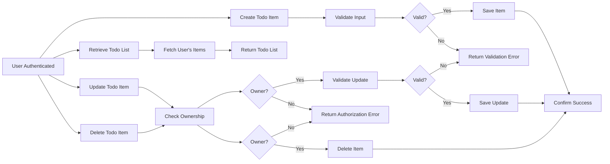

# Requirements Analysis Report for Todo List Application

## Document Scope and Intent

This report defines comprehensive business requirements for the minimal viable Todo List Application backend service, focusing solely on the features necessary to create, read, update, and delete personal todo items by authenticated users. It excludes all technical implementation details such as database design, APIs, or frontend UI specifics. The document is intended for backend developers to unambiguously understand what the system must do.

## User Actors and Authentication

### User Actor Definition

An authenticated individual who can register, log in, and manage their personal todo items. This user has the following capabilities:
- Create new todo items
- Retrieve their own todo items
- Update their own todo items
- Delete their own todo items
- Cannot access other users' todo items

### Authentication Flow

- WHEN a prospective user submits registration data, THE system SHALL validate the input and create a new user account.
- WHEN a registered user submits login credentials, THE system SHALL authenticate and establish a secure session.
- WHEN a logged-in user requests logout, THE system SHALL terminate the session and invalidate tokens.
- THE system SHALL securely store passwords using strong hashing algorithms with random salts.
- THE system SHALL expire inactive sessions after 30 minutes of inactivity.
- THE system SHALL support token-based authentication, issuing JSON Web Tokens (JWT) for access and refresh tokens.
- THE access token SHALL expire 15 minutes after issuance.
- THE refresh token SHALL expire 30 days after issuance or upon logout.
- THE JWT payload SHALL include user identification and a permissions array.

### Permission Matrix

| Action                        | User |
|------------------------------|------|
| Register                     | ✅   |
| Login/Logout                 | ✅   |
| Create Todo Items            | ✅   |
| Read Own Todo Items          | ✅   |
| Update Own Todo Items        | ✅   |
| Delete Own Todo Items        | ✅   |
| Access Others' Todo Items    | ❌   |

## Functional Requirements

### Todo Item CRUD Operations
- WHEN an authenticated user creates a todo item, THE system SHALL save the item with an associated unique user identifier.
- WHEN a user requests retrieval of todo items, THE system SHALL return only those belonging to the authenticated user.
- WHEN a user updates a todo item, THE system SHALL validate ownership and apply modifications.
- WHEN a user deletes a todo item, THE system SHALL remove it only if it belongs to the requester.

### Todo Item Data Attributes
- THE todo item SHALL include a mandatory textual description field containing between 1 and 255 characters.
- THE todo item SHALL include an optional completion status, which defaults to "pending" if unspecified.
- THE todo item MAY include an optional creation timestamp in ISO 8601 format.
- THE todo item MAY include an optional due date, which, if supplied, SHALL not be a date in the past.

### Input Validation
- WHEN creating or updating a todo item, THE system SHALL validate that the description is non-empty and does not exceed 255 characters.
- IF the description is invalid, THEN THE system SHALL reject the request with an error message "Invalid description length".
- WHEN a due date is provided, THE system SHALL validate it is a valid ISO 8601 date not earlier than the current date.
- IF the due date is invalid, THEN THE system SHALL reject the request with an error message "Invalid due date".

### Authorization
- THE system SHALL enforce strict ownership checks to prevent users from accessing or modifying todo items they do not own.
- IF a user attempts unauthorized access, THEN THE system SHALL return an authorization error.

## Business Rules

- Each todo item SHALL be uniquely identifiable by a user.
- Description text is mandatory; other fields are optional.
- Completion status SHALL only accept the values "pending" or "completed".
- Deleted items are permanently removed and cannot be recovered.
- User authentication is mandatory before any CRUD operation.

## Error Handling

- IF invalid input is detected, THEN THE system SHALL return meaningful error messages indicating the issue.
- IF unauthorized access is attempted, THEN THE system SHALL return a clear authorization error.
- IF system errors occur, THEN THE system SHALL return a generic error message and ensure errors are logged for audit.

## Performance Requirements

- THE system SHALL respond to all CRUD operations within 2 seconds under normal load conditions.
- THE system SHALL support concurrent use by a minimum of 100 active users.
- THE system SHALL ensure data consistency under concurrent access.

## User Interaction Workflow

## Summary

The requirements defined herein establish a secure, minimal, and functional Todo list application backend service. It mandates authenticated users managing their own todo items with strict validation, authorization, and error handling according to the EARS model. Performance and concurrency expectations ensure robust user experience.

All implementation details, including database design and APIs, are at the discretion of the development team, with this document serving to define WHAT the system shall do, without prescribing HOW it shall be done.

---