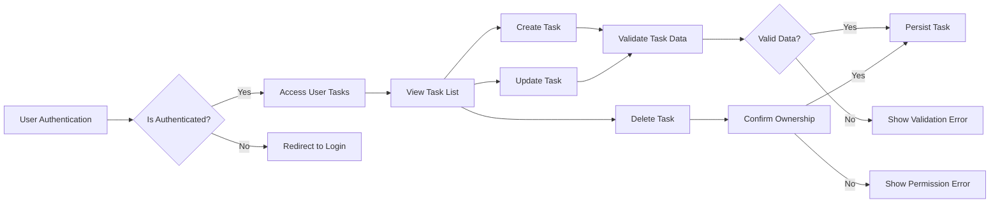

# Todo List Application Requirements Analysis Report

## 1. Introduction

This document provides the complete business requirements analysis for the Todo list application backend service. The application facilitates the creation, management, and completion of personal todo tasks with minimal feature set to ensure rapid development and ease of use. It is intended to guide backend developers with clear, unambiguous, and testable requirements, focusing exclusively on business needs.

The scope excludes frontend UI specifications, database schema definitions, technical architecture, and API design.

## 2. Business Model

### Why This Service Exists

The Todo list application addresses a common need for individuals to organize their daily tasks efficiently. Existing solutions may be complex or bloated; this application fills the niche for a simple, lightweight, and reliable task management system.

### Revenue Strategy

Currently, the service is planned as a free tool to attract users and can grow into monetization via premium features or ads in future versions.

### Growth Plan

Growth will depend on providing a stable minimal viable product (MVP) and potentially integrating with third-party services later.

### Success Metrics

- User adoption measured by the number of registered users
- Task creation and completion rates
- System reliability and uptime

## 3. User Actors

### Defined Actors

| Actor Name | Description |
|------------|-------------|
| guest | Unauthenticated users who can view the landing page and public information but cannot create or modify tasks |
| user | Authenticated users who can create, read, update, and delete their own tasks |

### Authentication and Permissions

- Guests have read-only access limited to the landing page or public info.
- Users must authenticate to access personal task management features.

## 4. Functional Requirements

### Task Management

- WHEN a user creates a new todo task, THE system SHALL save the task associated with that user.
- WHEN a user requests to view their tasks, THE system SHALL retrieve and display only the tasks belonging to that user.
- WHEN a user updates an existing task, THE system SHALL update the task only if it belongs to that user.
- WHEN a user deletes a task, THE system SHALL delete the task only if it belongs to that user.

### Task Attributes

- THE system SHALL store for each task: a unique identifier, title, optional description, creation timestamp, completion status (incomplete or complete), and last updated timestamp.
- WHEN a user marks a task as completed, THE system SHALL update the task's status accordingly.

### User Authentication

- THE system SHALL require users to register with email and password.
- WHEN a user logs in, THE system SHALL authenticate credentials and establish a session.

## 5. Business Rules

- THE system SHALL ensure that users can only access and modify their own tasks.
- THE system SHALL validate that task titles are non-empty strings.
- THE system SHALL limit task descriptions to a maximum length of 1000 characters.
- THE system SHALL reject operations on tasks that do not exist.
- THE system SHALL automatically generate unique task IDs.

## 6. Error Handling

- IF a user attempts to create a task with an empty title, THEN THE system SHALL reject the request and return a validation error.
- IF a user tries to access a task not owned by them, THEN THE system SHALL deny access and return a permission error.
- IF the system encounters an unexpected failure during task operations, THEN THE system SHALL return an internal server error with a generic error message.

## 7. Performance Requirements

- WHEN a user submits a task creation or update, THE system SHALL respond within 2 seconds.
- WHEN a user fetches their task list, THE system SHALL return the data within 3 seconds.

## 8. Diagrams

## 9. Summary

This document defines all minimum functional and non-functional business requirements for a Todo list backend application that supports user authentication, personal task management, and error handling. The requirements are precise and actionable to allow backend developers to implement the service efficiently and correctly.

This document provides business requirements only. All technical implementation decisions, such as architecture, API design, and database schema, are fully at the discretion of the development team. The document specifies what the system should do, not how it should be built.