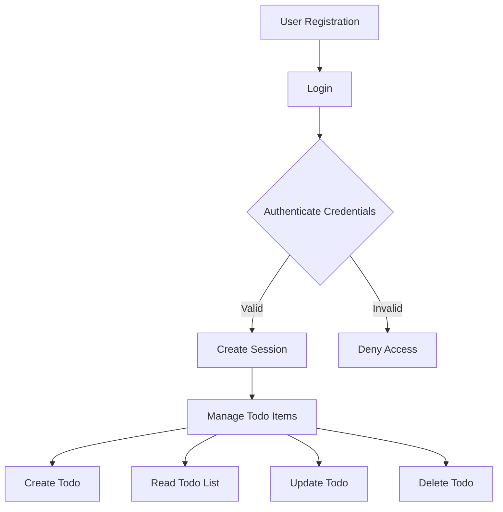

# Todo List Application Requirement Analysis Report

## 1. Introduction

The Todo List application provides users with a simple and efficient way to manage their personal tasks. The system supports creating, reading, updating, and deleting individual todo items, ensuring secure authentication and role-based access control.

## 2. Business Model

The application aims to offer a minimalistic task management solution to individual users, emphasizing usability and performance. It targets users seeking simple task tracking without overwhelming features.

## 3. User Actors

### 3.1 Guest
Unauthenticated visitors who can register to become users. Guests cannot create or manage todo items.

### 3.2 User
Registered individuals who can create, read, update, and delete their own todo items securely.

### 3.3 Admin
Administrators with full access rights to manage all users and all todo items.

## 4. Functional Requirements

### 4.1 Todo Item Creation
WHEN a registered user submits a new todo item, THE system SHALL create the item with a unique identifier, title, optional description, creation timestamp, and default status as incomplete.

### 4.2 Todo Item Retrieval
WHEN a registered user requests their todo list, THE system SHALL return all todo items belonging to that user with optional filtering by completion status.

### 4.3 Todo Item Update
WHEN a registered user updates a todo item, THE system SHALL verify ownership and allow updates to title, description, and completion status.

### 4.4 Todo Item Deletion
WHEN a registered user deletes a todo item, THE system SHALL verify ownership and remove the item from persistent storage.

### 4.5 Admin Access
THE admin SHALL be able to perform CRUD operations on any todo item and retrieve lists of todo items for any user.

### 4.6 Authentication
WHEN a guest registers, THE system SHALL validate registration details and create a user account.

WHEN a user logs in, THE system SHALL authenticate credentials and create a secure session.

### 4.7 Session Management
THE system SHALL maintain authenticated user sessions securely until explicit logout or session expiry.

## 5. Business Rules

### 5.1 Ownership
THE system SHALL ensure users access only their own todo items.

### 5.2 Data Validation
WHEN creating or updating todo items, THE system SHALL enforce that the title is non-empty and less than 255 characters, and the description if provided is less than 1000 characters.

### 5.3 Identifiers
THE system SHALL assign unique identifiers to all todo items.

## 6. Error Handling

### 6.1 Authentication Failure
IF login credentials are invalid, THEN THE system SHALL deny access with a clear error message.

### 6.2 Authorization Failure
IF a user attempts unauthorized access, THEN THE system SHALL deny the request and log the event.

### 6.3 Validation Errors
IF data validation fails, THEN THE system SHALL reject the operation and respond with detailed error information.

### 6.4 System Errors
IF unexpected errors occur, THEN THE system SHALL respond with a generic error and log details for diagnosis.

## 7. Performance Requirements

THE system SHALL respond to all CRUD operations within 2 seconds 95% of the time and scale gracefully under concurrent load.

## 8. Security and Compliance

THE system SHALL store passwords securely using industry-standard hashing, sanitize inputs to prevent injections, and protect session data with secure tokens.

## 9. Glossary

- **Todo Item**: A task record with a title, optional description, status, and timestamps.
- **CRUD**: Create, Read, Update, Delete operations.
- **Session**: Authenticated state of a user.

## 10. Appendices

Future plans include notification features, recurring task support, and integrations with external productivity tools.

---

# Mermaid Diagram

