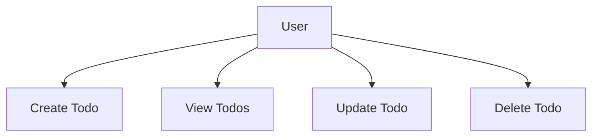

# Requirement Analysis – Todo List Application (Minimal)

## Introduction and Purpose

The Todo List application is designed to provide users with a highly accessible, reliable way to record, review, and manage their daily tasks. The primary purpose is to support individual task organization and completion by offering only the core functionality of a classic todo application. Business goals focus strictly on enabling users to create, read, update, and delete (CRUD) todo items without distraction. All requirements are written to support a backend implementation suitable for both web and mobile clients.

## User Types and Roles

- **User** – The single actor in this minimal version. Each user manages only their own todos, does not interact with other users, and cannot see or modify data belonging to other accounts. 

## Functional Requirements (Minimal)

All functional requirements are structured using EARS (Easy Approach to Requirements Syntax):

### Todo Creation
- WHEN a user submits valid text for a todo,
  THE system SHALL create a new todo item associated exclusively with that user's account, defaulting to an incomplete status.
- WHEN a todo creation request includes only the required description,
  THE system SHALL use the current timestamp as the creation date.
- WHEN a user attempts to create an empty or whitespace-only todo,
  THE system SHALL reject the request and return a clear, actionable error message within 2 seconds.

### Viewing Todos
- WHEN a user requests to view their todo list,
  THE system SHALL return all current todos for that user, ordered by creation timestamp descending.
- WHEN a user requests to view todos and none exist,
  THE system SHALL return an empty list with a success status.
- WHEN a user requests to view todos,
  THE system SHALL ensure that no todos belonging to other users are included in the result.

### Updating Todos
- WHEN a user provides a valid todo ID and update data (description and/or completion status),
  THE system SHALL update the matching todo if it belongs to the user, returning the updated item on success.
- WHEN a user submits an update with an empty or whitespace-only description,
  THE system SHALL reject the request with a descriptive error message.
- WHEN a user tries to update a todo that does not exist or does not belong to them,
  THE system SHALL reject the update and provide a permission denied or not found error within 2 seconds.

### Deleting Todos
- WHEN a user provides a valid todo ID for deletion,
  THE system SHALL remove the associated todo belonging to that user.
- WHEN a user attempts to delete a todo that does not exist or does not belong to them,
  THE system SHALL reject the action and return a permission denied or not found error within 2 seconds.

## Non-Functional Requirements

- WHEN the service processes any request,
  THE system SHALL provide a response within 2 seconds under normal network and server conditions.
- WHEN a user interacts with the backend,
  THE system SHALL persist all todo data securely and not lose data due to system errors or restarts.
- WHEN processing multiple simultaneous requests from the same user,
  THE system SHALL execute operations in the order received (FIFO).
- WHEN a user session is established,
  THE system SHALL securely authenticate each request and allow actions only for the authenticated account.
- WHEN the user signs out or their session expires,
  THE system SHALL immediately prevent access until valid re-authentication occurs.

## Permission Requirements

- WHEN any API endpoint for todos is accessed,
  THE system SHALL require valid authentication by means of session or JWT token.
- WHEN a user is authenticated,
  THE system SHALL ensure every operation (create, read, update, delete) is strictly limited to that user’s own data.
- WHEN invalid or expired credentials are provided,
  THE system SHALL reject all requests and provide a secure, generic error response without leaking account information.

## Edge Cases and Error Handling

- WHEN a user submits a request with missing, malformed, or oversized data (e.g., extremely long text),
  THE system SHALL reject the request with a specific error message stating the problem.
- WHEN a user attempts to perform multiple conflicting operations simultaneously (e.g., deleting and updating the same todo),
  THE system SHALL serialize and execute requests in a predictable order to prevent data corruption.
- WHEN server resources are temporarily unavailable,
  THE system SHALL return a retryable error response within 2 seconds and log the incident for future investigation.

## Business Rules and Constraints

- EACH todo SHALL contain at minimum: description text, creation timestamp, status (complete/incomplete).
- NO two todos with identical descriptions SHALL be forbidden, but EACH todo SHALL be uniquely identified by an immutable ID.
- Todo descriptions SHALL NOT exceed 255 characters and SHALL NOT be empty or whitespace only.
- ALL deletion operations SHALL be irreversible.
- Todos SHALL be listed in reverse order of creation (most recent first).

## Success Criteria and Explicit Non-Goals

- Backend is considered successful WHEN every EARS-formulated requirement is met, persistent across tests, and passes all automated acceptance scenarios for single-user flows.
- NOT included: user registration, user-to-user sharing, notifications, recurring/repeating tasks, attachments, categories, or labels. These features are out of scope for this minimal version.

## Minimal Use Case Diagram

## References
- See [Project Documentation Table of Contents](./00-toc.md)
- All requirements described above are implementation-ready for backend engineering.