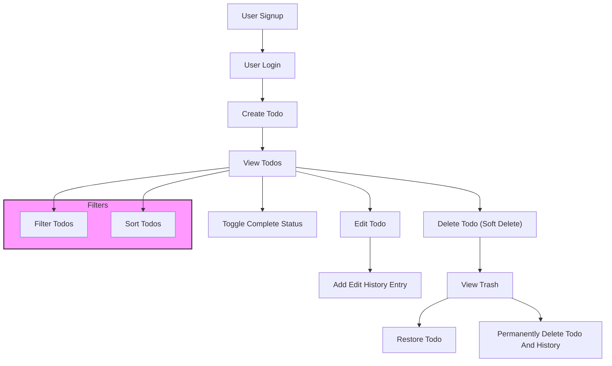

# Multi-User Todo Application Requirements Specification

## 1. User Account Management

The system SHALL allow users to manage their accounts with the following features:

- WHEN a new user signs up, THE system SHALL allow the user to register using a unique email address and a password.
- WHEN a registered user attempts to log in, THE system SHALL authenticate the user using their email and password.
- WHEN a logged-in user requests a password change, THE system SHALL allow the user to update their password after verifying the current password.
- WHEN a logged-in user requests account deletion, THE system SHALL permanently delete the user account and all associated data including todos and their edit histories.
- WHEN account deletion is performed, THE system SHALL remove all of the user's todos, including those in the trash, permanently from the database.

Authentication Requirements:
- User sessions SHALL be managed securely using JWT tokens.
- Passwords SHALL be stored securely using strong hashing algorithms.
- Email addresses SHALL be unique across the system.
- The system SHALL enforce password complexity rules, such as minimum length and character variety.

## 2. User Profile Management

- WHEN a user is registered, THE system SHALL create a user profile associated with the account.
- EACH user profile SHALL contain a display name.
- WHEN a logged-in user requests to edit their profile, THE system SHALL allow the user to update their display name.
- Users SHALL NOT have access to other users' profiles or profile information.
- The system SHALL enforce privacy so that all profile data is accessible only to the owning user.

## 3. Todo Management

### 3.1 Creating Todos

- WHEN a logged-in user creates a new todo, THE system SHALL allow specifying the following fields:
  - Title (required)
  - Description (optional, can be empty)
  - Start date (optional, can be empty)
  - Due date (optional, can be empty)
- Newly created todos SHALL have their completion status set to incomplete by default.

### 3.2 Viewing Todos

- WHEN a logged-in user views their todo list, THE system SHALL return a paginated list of their own todos.
- EACH todo in the list SHALL include the following information:
  - Title
  - Completion status
  - Start date (if set)
  - Due date (if set)
  - Creation date
- WHEN a logged-in user views a specific todo, THE system SHALL provide full details including the full description.
- The system SHALL ensure that users can view only their own todos.

### 3.3 Completing Todos

- WHEN a logged-in user toggles a todo completion status, THE system SHALL allow marking the todo as complete or incomplete.
- The completion status SHALL be a simple binary toggle.

### 3.4 Editing Todos

- WHEN a user edits a todo, THE system SHALL allow updates to the todo's title, description, start date, and due date.
- EACH edit SHALL create an entry in the todo's edit history capturing the changes.

### 3.5 Edit History

- EACH todo SHALL maintain an edit history.
- WHEN a todo is edited, THE system SHALL create a history entry recording:
  - Timestamp of the edit
  - Changed title if updated
  - Changed description if updated
  - Changed start date if updated
  - Changed due date if updated
- WHEN a logged-in user requests the edit history of a todo, THE system SHALL return the full history sorted from most recent to oldest.

### 3.6 Deleting Todos

- WHEN a user deletes a todo, THE system SHALL perform a soft delete, marking the todo as deleted but not removing it from the database.
- Deleted todos SHALL NOT appear in the user's normal todo list.

## 4. Trash Management

- WHEN a user views their trash, THE system SHALL provide a paginated list of todos that have been soft deleted.
- Users SHALL be able to restore a deleted todo from the trash, returning it to the normal todo list.
- Users SHALL be able to permanently delete a todo from the trash.
- WHEN a todo is permanently deleted from the trash, THE system SHALL also permanently delete all associated edit history entries.

## 5. Filtering and Sorting Todos

- Users SHALL be able to filter their todo list by completion status with the following options:
  - All todos
  - Only completed todos
  - Only incomplete todos
- Users SHALL be able to sort their todo list by:
  - Creation date (ascending or descending)
  - Start date (earliest first or latest first)
  - Due date (earliest first or latest first)
- Todos with no start date SHALL appear at the end when sorting by start date.
- Todos with no due date SHALL appear at the end when sorting by due date.

## 6. Security and Privacy

- EACH user's todos and profile information SHALL be private and accessible only to the owning user.
- The system SHALL enforce authorization rules restricting access to resources based on the user.
- User data SHALL be stored securely, and sensitive information such as passwords SHALL be encrypted or hashed.
- THE system SHALL prevent any unauthorized access, viewing, or modification of other users' data.
- All actions SHALL be audited and logged for security purposes.

---

# Mermaid Diagram: Todo Application Workflow

