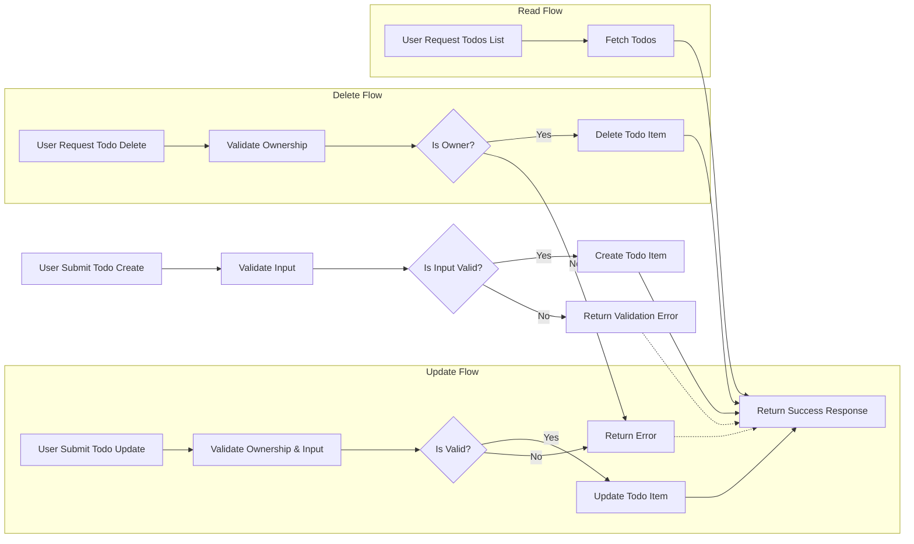

# Requirements Analysis Report for Todo List Application

## 1. Service Overview

### 1.1 Business Model

The Todo List application exists to provide users with a simple and efficient tool to organize personal tasks and reminders in a minimalistic manner. It addresses the need for lightweight task management without overwhelming features, enabling users to track what they need to do daily. This service targets individuals seeking a straightforward, distraction-free productivity aid.

The business model is based on offering a free utility service with potential future monetization strategies such as premium features, integrations, or subscription plans, though the current focus is purely functional minimalism.

### 1.2 Core Value Proposition

- Simple task creation and management
- User-specific todo lists with ability to create, update, delete, and list tasks
- Secure authentication to separate user data
- Fast and responsive backend to ensure seamless user experience

## 2. User Actors and Authentication

### 2.1 User Actors

| Actor | Description |
|-------|-------------|
| Guest | Unauthenticated users who can browse public information but cannot create or modify todos. |
| User  | Authenticated users who can create, read, update, and delete their own todo items. |

### 2.2 Permissions (Business Terms)

- **Guest**
  - Can only read public information (currently none exist explicitly)
  - Cannot create, modify, or delete todos

- **User**
  - Can create new todo items
  - Can read only their own todo items
  - Can update only their own todo items
  - Can delete only their own todo items

### 2.3 Authentication System (Summary)

- Users register with email and password
- Users log in with credentials
- User sessions are securely maintained

## 3. Functional Requirements

### 3.1 Todo Item Lifecycle

- Users manage personal todo lists
- A todo item includes at minimum a text description, a completed flag, creation timestamp, and optional due date

### 3.2 Create, Read, Update, Delete (CRUD) Operations

- WHEN a user submits a new todo item with valid content, THE system SHALL create the todo assigned to that user.
- WHEN a user requests their todo list, THE system SHALL return all incomplete and completed todo items associated with that user.
- WHEN a user updates a todo item they own, THE system SHALL apply the changes to the item.
- WHEN a user deletes a todo item they own, THE system SHALL remove the item permanently.
- IF a user attempts any modification on todo items they do not own, THEN THE system SHALL deny the action and return an appropriate error.

### 3.3 Input Validation

- WHEN a user submits a new or updated todo item, THE system SHALL validate that the text description is a non-empty string of maximum length 255 characters.
- WHERE a due date is provided, THE system SHALL validate that it is a valid ISO 8601 date-time string not in the past.

### 3.4 Access Control

- THE system SHALL enforce that users can only manipulate their own todo items.
- GUEST users SHALL NOT have write access to any todo data.

## 4. Business Rules

- Todo items must be uniquely identifiable.
- Completed status is a boolean field defaulting to false.
- A todo item cannot have an empty text.
- Only authenticated users can have todo items.
- Deleted todo items are removed permanently with no archive.

## 5. Error Handling

- IF a user submits invalid todo content, THEN THE system SHALL respond with a validation error specifying the exact failure.
- IF an unauthenticated request attempts modification, THEN THE system SHALL respond with permission denied error.
- IF a user requests or modifies a todo not belonging to them, THEN THE system SHALL respond with a not found or access denied error.

## 6. Performance Requirements

- THE system SHALL respond to user requests within 2 seconds under normal loads.
- THE system SHALL return a user's todo list with a maximum of 100 items per request.

## 7. Visual Mermaid Diagrams

### 7.1 Todo Item CRUD Workflow

