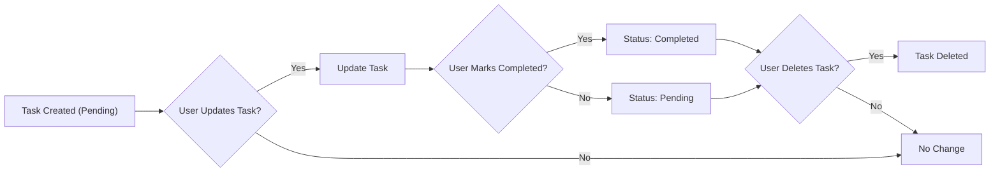

# Functional Requirements Analysis for Todo List Application

## 1. Introduction
This document specifies detailed business and functional requirements for a minimum viable Todo list application backend. The system enables authenticated users to create, manage, complete, and delete personal tasks. It excludes advanced features like deadlines, reminders, or collaboration. The focus is on personal task management.

## 2. Business Model
The Todo list application addresses the widespread need for simple personal task management, targeting users who seek a lightweight, easy-to-use tool. Growth is planned through simplicity, reliability, and user retention.

## 3. User Roles and Permissions

| Role  | Description                                                                                                     | Permissions                                             |
|-------|-----------------------------------------------------------------------------------------------------------------|---------------------------------------------------------|
| Guest | Unauthenticated users with view-only access to public information, no ability to modify tasks.                  | View public task information only                        |
| User  | Authenticated users with permissions to create, update, complete, and delete their own tasks.                  | Full CRUD on own tasks                                   |
| Admin | System administrators with permissions to manage all users and system-wide settings as well as all user tasks. | Full management rights over all data and settings       |

### 3.1 Role-Based Permissions
- WHEN a guest accesses the system, THEN THE system SHALL restrict the user to read-only operations.
- WHEN a user is authenticated, THEN THE system SHALL allow creation, update, completion, and deletion only of tasks owned by that user.
- WHEN an admin is authenticated, THEN THE system SHALL grant full control over all user tasks and system settings.

## 4. Task Management

### 4.1 Task Creation
- WHEN a user submits a new task description, THEN THE system SHALL create a new task linked to that user.
- THE task SHALL have a unique identifier and a "pending" status assigned by default.

### 4.2 Task Update
- WHEN a user updates the description of an existing task, THEN THE system SHALL validate ownership and update the description.
- THE system SHALL reject updates to tasks not owned by the user with a proper authorization error.

### 4.3 Task Completion
- WHEN a user marks a task as completed, THEN THE system SHALL update the task status to "completed".
- WHEN a user reverts a completed task to pending, THEN THE system SHALL update the status back to "pending".

### 4.4 Task Deletion
- WHEN a user requests deletion of a task, THEN THE system SHALL confirm ownership and delete the task.
- THE system SHALL reject deletion requests for tasks not owned by the requesting user with an authorization error.

### 4.5 Task Listing
- WHEN a user requests their task list, THEN THE system SHALL return all tasks associated with their user ID.
- THE returned task information SHALL include task description, status, and unique identifier.

## 5. Task Life Cycle

The task life cycle includes these states and transitions:
- Created (pending)
- Updated (description or status changed)
- Completed
- Deleted

## 6. Validation Rules
- WHEN a user submits a new or updated task description, THEN THE system SHALL validate that the description is a non-empty string.
- IF the description is empty or contains only whitespace, THEN THE system SHALL reject the request with an error message "Task description cannot be empty".
- THE system SHALL reject any CRUD operation on tasks by unauthenticated users with an authentication error.

## 7. Authentication Requirements

### 7.1 Registration
- WHEN a user submits registration data with a valid email and password, THEN THE system SHALL create a new user account.
- THE system SHALL send an email verification link within 60 seconds.
- IF a duplicate email is submitted, THEN THE system SHALL reject registration with an error "Email already in use".

### 7.2 Login
- WHEN a user submits valid login credentials, THEN THE system SHALL authenticate and provide access within 2 seconds.
- IF credentials are invalid, THEN THE system SHALL reject access with an error "Invalid username or password".

### 7.3 Session Management
- WHILE a session is active, THEN THE system SHALL maintain session integrity and validity.
- IF a session expires or is invalidated, THEN THE system SHALL require re-authentication.

### 7.4 Email Verification
- WHEN a user clicks a verification link, THEN THE system SHALL mark the email as verified.
- IF the link is expired or invalid, THEN THE system SHALL provide means to request a new verification link.

### 7.5 Password Reset
- WHEN a user requests a password reset, THEN THE system SHALL send a reset link to verified email within 60 seconds.
- WHEN a user submits a new password via the reset link, THEN THE system SHALL update the password and revoke all active sessions.

### 7.6 Password Change
- WHEN an authenticated user requests a password change, THEN THE system SHALL verify the current password before updating.

### 7.7 Access Revocation
- WHEN a user requests to revoke all sessions, THEN THE system SHALL invalidate all active tokens immediately.

## 8. Error Handling
- IF unauthorized access to task data is attempted, THEN THE system SHALL return an authorization error message within 2 seconds.
- IF an invalid or empty task description is submitted, THEN THE system SHALL respond with a validation error describing the issue.
- IF an unauthenticated user attempts restricted operations, THEN THE system SHALL return an authentication error.
- IF system errors occur, THEN THE system SHALL provide a generic error message with a timestamp for investigation.

## 9. Performance Requirements
- WHEN a user requests the task list, THEN THE system SHALL respond within 2 seconds under normal load.
- WHEN a user performs any task CRUD operation, THEN THE system SHALL process and persist the change within 2 seconds.
- THE system SHALL support concurrent requests from multiple users ensuring data integrity.

## 10. Summary of Functional Flows
- Users SHALL register, verify their email, log in, and manage their todo tasks.
- Tasks SHALL be created, updated, completed, deleted, and listed per user.
- The system SHALL enforce strict authentication and authorization checks.
- The system SHALL provide clear error feedback and maintain performance standards.

---

This document contains comprehensive business and functional requirements for the Todo list application backend. It uses EARS format for clarity and testability and focuses on minimum viable product features to enable individual task management securely and efficiently.