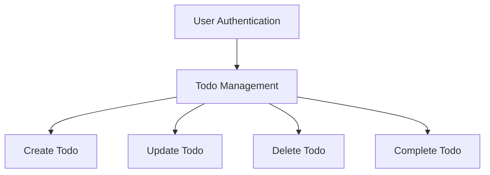

# Todo List Application Requirements Analysis

## 1. Introduction
The Todo List application is designed to provide minimal yet sufficient functionality for managing personal task items efficiently. The system enables registered users to create, view, update, and delete their todo tasks, ensuring an intuitive and reliable user experience.

## 2. User Actors
- **Guest (Unauthenticated User):** Can register for an account but cannot access or manage todos.
- **User (Registered User):** Can perform full CRUD (Create, Read, Update, Delete) operations on their own todo items.
- **Admin (System Administrator):** Has full control over all user accounts and todos, including management and system maintenance.

## 3. Functional Requirements
### 3.1 Todo Creation
- WHEN a registered user accesses the create todo interface, THE system SHALL allow the user to enter a todo title and optional description.
- WHEN the user submits a new todo, THE system SHALL save it associated with the user's account.

### 3.2 Todo Retrieval
- WHEN a registered user requests their todo list, THE system SHALL return all todos created by that user.
- WHEN a user requests a specific todo by ID, THE system SHALL return the detailed information if the todo belongs to the user.

### 3.3 Todo Update
- WHEN a user modifies the title or description of an existing todo, THE system SHALL update the todo item.

### 3.4 Todo Completion
- WHEN a user marks a todo as completed, THE system SHALL update the status accordingly.
- WHEN a todo is marked completed, THE user SHALL be able to view its completed status.

### 3.5 Todo Deletion
- WHEN a user deletes a todo, THE system SHALL permanently remove the todo item from the database.

## 4. Business Rules
- Ownership is enforced. Users SHALL only be able to manage their own todo items.
- Admins SHALL be able to access and manage todos for all users.
- Access to todos is restricted by authentication and authorization.

## 5. Authentication and Authorization
- WHEN a guest user registers, THE system SHALL create a new user account after validating the registration data.
- WHEN a user attempts to log in, THE system SHALL verify credentials and establish a secure session.
- THE system SHALL invalidate sessions upon logout or expiration.
- THE system SHALL enforce password complexity and secure storage.

## 6. Error Handling
- WHEN invalid data is submitted during todo creation or update, THE system SHALL reject the operation with an appropriate error message.
- WHEN unauthorized access is attempted, THE system SHALL return a permission denied response.
- THE system SHALL log all errors and exceptional events for later review.

## 7. Security and Compliance
- The system SHALL protect user data confidentiality and integrity.
- All API endpoints SHALL be secured with authentication mechanisms.
- THE system SHALL comply with applicable data protection regulations.

## 8. Performance Requirements
- THE system SHALL respond to all standard CRUD operations within 1 second under normal load.
- THE system SHALL support scalability to handle up to 10,000 simultaneous users.

## 9. Appendices
- Glossary includes terms like "todo", "user", "admin", "status".

## Mermaid Diagram

```mermaid
graph TD
A["User Authentication"] --> B["Todo Management"]
B --> C["Create Todo"]
B --> D["Update Todo"]
B --> E["Delete Todo"]
B --> F["Complete Todo"]
```