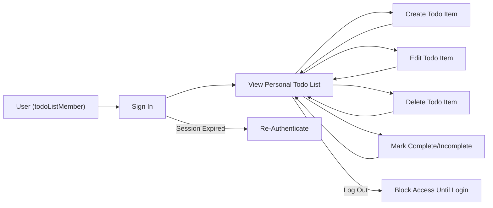

# Todo List Application: Requirements

## Functional Requirements (EARS Format)

- THE service SHALL enable each authenticated user (todoListMember) to create a new todo item with a title and optional details.
- THE service SHALL allow users to view a list of all their own todo items, showing whether each is complete or incomplete.
- THE service SHALL allow users to edit the title, details, or completion status of their own todo items at any time.
- THE service SHALL allow users to delete any of their own todo items when they are no longer needed.
- THE service SHALL ensure that todo items are persistently stored and are not lost between user sessions or due to unexpected logouts.
- WHEN a user logs in, THE service SHALL present only that user's todo items immediately and with no delay.
- IF an unauthenticated request to view, add, edit, or delete todos is made, THEN THE service SHALL prompt the user to log in first and deny the operation until authentication is confirmed.
- IF a user attempts to access a todo not owned by them, THEN THE service SHALL deny access and return a clear error message indicating lack of permissions.
- WHEN a user marks a todo as complete, THE service SHALL update its state to complete and record the last updated time.
- WHEN a user marks a todo as incomplete, THE service SHALL update its state to incomplete and record the last updated time.
- THE service SHALL restrict every user to accessing or modifying only their own todo data at all times; there is no access to other users' todos.
- WHEN network connectivity is interrupted during use, THE service SHALL provide an appropriate error message and attempt to resynchronize as soon as connectivity is restored.
- WHEN a session expires, THE service SHALL require the user to log in again before allowing access to any todo features.
- IF required fields are missing when creating or updating a todo, THEN THE service SHALL reject the request and clearly indicate which fields must be provided.

## User Authentication and Authorization

- THE service SHALL require a user to authenticate with a valid account (email or supported provider) before accessing or modifying any todos.
- THE service SHALL persist user sessions using secure mechanisms and ensure users remain logged in until they explicitly log out or the session expires due to inactivity.
- WHEN a user logs out, THE service SHALL ensure no further access to todo data is possible until a new authentication occurs.
- THE service SHALL securely identify the current user for every operation by verifying session credentials.

## System Actors

**todoListMember** — an authenticated user who owns, creates, views, updates, and deletes only their own todo items. No other roles (admin, manager, guest, etc.) exist in the minimal application.

## Permission Matrix

| Actor            | View Own Todos | Create Todo | Update Own Todo | Delete Own Todo | View/Edit Others' Todos |
|------------------|:-------------:|:-----------:|:---------------:|:---------------:|:----------------------:|
| todoListMember   |      Yes      |     Yes     |      Yes        |      Yes        |          No            |

## Error and Exception Scenarios

- IF any operation fails due to server error, THEN THE service SHALL notify the user with a descriptive message and suggest to retry.
- IF a user attempts a forbidden operation (such as editing another user's todo), THEN THE service SHALL log the attempt and show a friendly error notification without revealing any information about other users or their data.
- IF a user's session has expired or is invalid, THEN THE service SHALL require immediate re-authentication.

## Key User Workflows

1. **Sign In**: User opens the application, signs in, and is shown only their personal todo list.
2. **Create Todo**: User adds a new todo, filling required fields, which is immediately shown in their list.
3. **Edit Todo**: User edits the content or completion status of an existing todo they own.
4. **Delete Todo**: User deletes a todo they no longer need, removing it from their list instantly.
5. **Logout**: User logs out; further todo operations are blocked until a new login.

## Business Rule Constraints

- Each user's todo data is strictly private and cannot be viewed or modified by others under any circumstances.
- There are no collaborative todo features—every operation is single-user and personal.
- Todo items must have a non-empty title; details/notes are optional.
- The application is minimal: there are no tags, deadlines, categories, reminders, or sharing functionalities.
- Data consistency and reliability are mandatory; every operation SHALL ensure user data is never lost due to application or server failure to the extent possible.

## Non-Functional and Success Criteria

- THE application SHALL be usable on both desktop and mobile devices.
- THE application SHALL provide feedback on all user actions (e.g., confirmations, error messages).
- THE application SHALL retain todo data securely, ensuring privacy in storage and transfer.
- THE application SHALL respond to user actions within 2 seconds under normal operating conditions.
- THE system SHALL maintain high availability (target: 99.9% uptime) and zero data loss.

## Minimal User Flow – Mermaid Diagram

```mermaid
graph LR
  U["User (todoListMember)"] --> S["Sign In"]
  S --> L["View Personal Todo List"]
  L --> C["Create Todo Item"]
  L --> E["Edit Todo Item"]
  L --> D["Delete Todo Item"]
  L --> M["Mark Complete/Incomplete"]
  C --> L
  E --> L
  D --> L
  M --> L
  S -- "Session Expired" --> X["Re-Authenticate"]
  L -- "Log Out" --> O["Block Access Until Login"]
```

## Summary and Acceptance Criteria

- All user interactions are session-based and private
- Only minimal CRUD (Create, Read, Update, Delete) for personal todos is supported
- No collaborative, admin, or multi-user views or edits are possible
- Only the authenticated user can operate on their own data
- All requirements and business rules above are strict and complete
- Application success is measured by privacy, usability, reliability, and clarity—not by feature volume
- Any proposed feature beyond this specification is intentionally and categorically excluded
