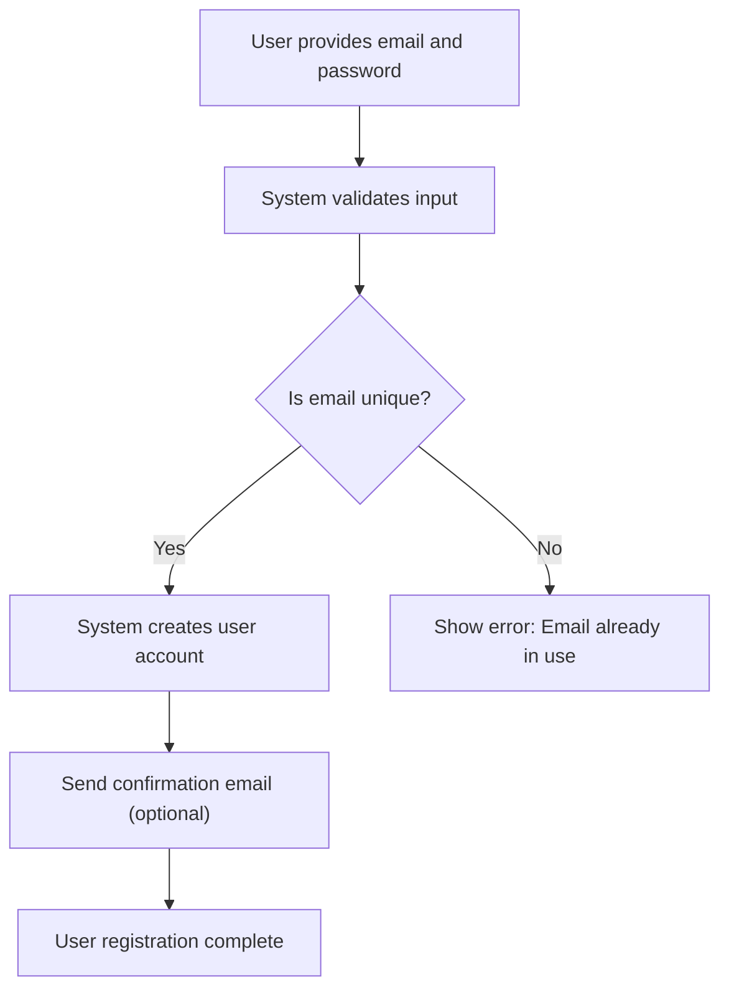
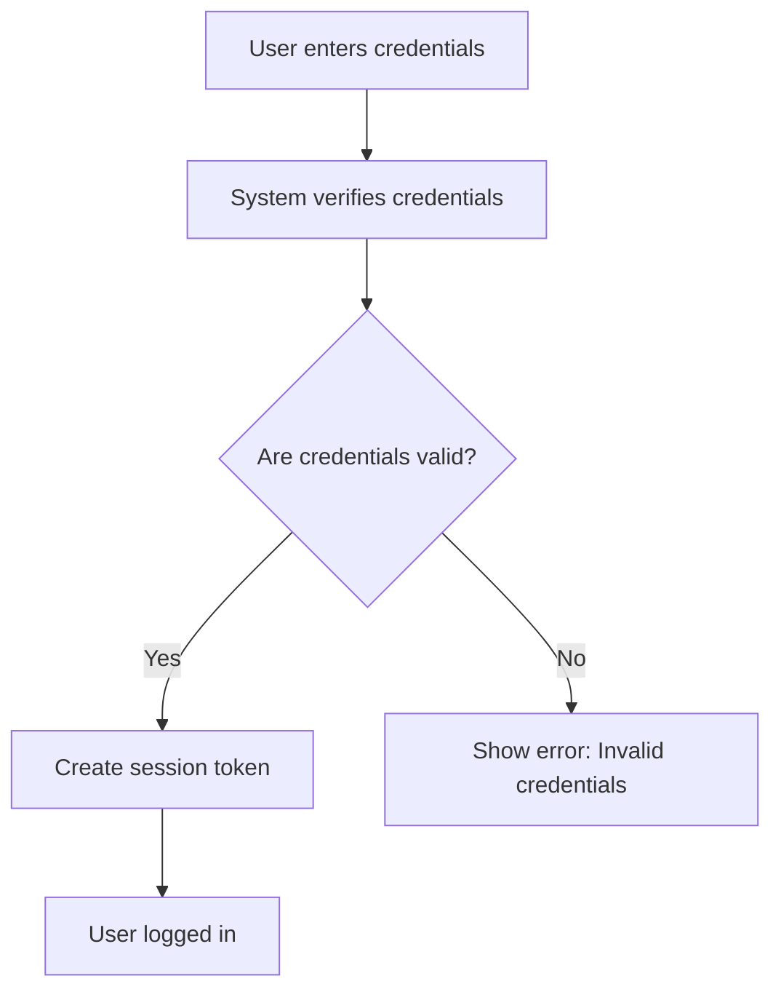
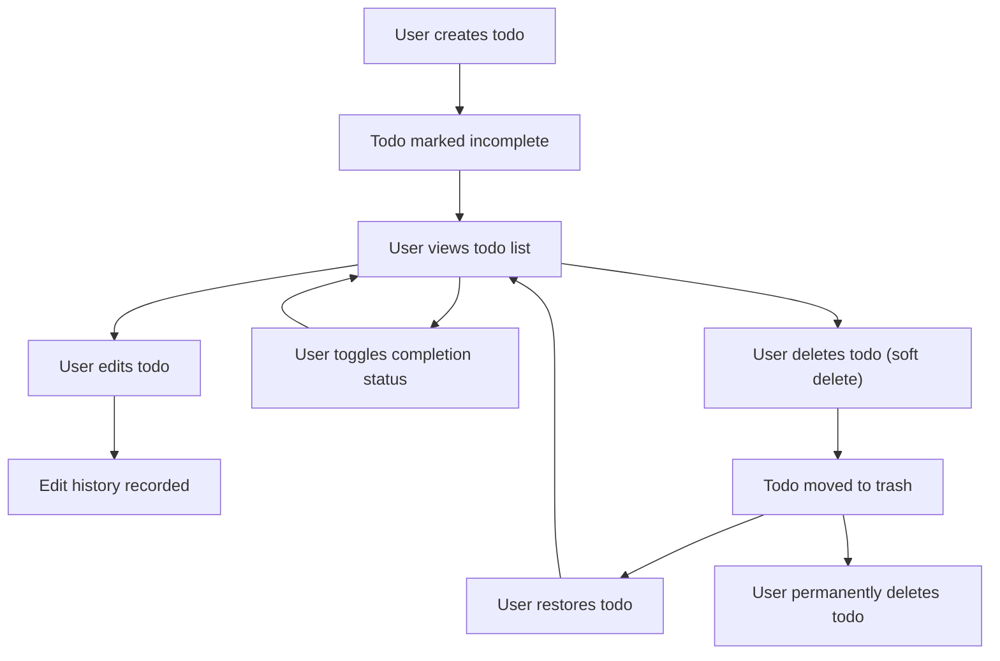

# Multi-User Todo Application Requirements Specification

## 1. User Account Management

### 1.1 Registration
- WHEN a visitor provides a valid email and password, THE system SHALL create a new user account.
- WHEN a user registers, THE system SHALL send a confirmation email (implementation optional).
- WHEN a user attempts to register with an already used email, THE system SHALL reject the registration with a clear error message.

### 1.2 Login
- WHEN a user provides valid email and password, THE system SHALL authenticate the user and create a session token.
- WHEN a user provides invalid credentials, THE system SHALL deny access and provide an error message.

### 1.3 Password Change
- WHEN a user requests a password change with the correct current password and a valid new password, THE system SHALL update the user's password.
- WHEN password change is successful, THE system SHALL notify the user.

### 1.4 Account Deletion
- WHEN a user requests account deletion, THE system SHALL permanently delete the user's account along with all todos, including those in trash and their edit histories.
- WHEN account deletion is complete, THE system SHALL log out the user and invalidate their session.

## 2. User Profile

### 2.1 Profile Data
- EACH user SHALL have a profile with a display name.
- WHEN a user updates their display name, THE system SHALL save the changes.
- Users SHALL NOT have access to other users' profiles.

## 3. Todo Management

### 3.1 Todo Creation
- WHEN a user submits a todo with a title, THE system SHALL create a new todo item associated with that user.
- The todo's title SHALL be a non-empty string.
- The description is optional and may be empty.
- The start date and due date are optional. If provided, they SHALL be valid dates in ISO 8601 format.
- Newly created todos SHALL have completion status set to incomplete by default.

### 3.2 Viewing Todos
- WHEN a user requests the list of their todos, THE system SHALL provide a paginated list.
- The default page size SHOULD be configurable, recommended to be 10 or 20 items.
- EACH todo in the list SHALL display title, completion status, start date (if set), due date (if set), and creation date.
- WHEN a user requests a single todo item, THE system SHALL provide full details, including full description.

### 3.3 Completing Todos
- Users SHALL be able to toggle completion status between complete and incomplete.
- WHEN a user marks a todo as complete or incomplete, THE system SHALL update the status accordingly.

### 3.4 Editing Todos
- Users SHALL be able to edit title, description, start date, and due date.
- WHEN a user edits a todo, THE system SHALL create a history record capturing:
  - The timestamp of the edit.
  - Previous and new values of changed fields (title, description, start date, due date).

### 3.5 Edit History
- EACH todo SHALL maintain a chronological edit history sorted from most recent to oldest.
- WHEN a user requests edit history for a todo, THE system SHALL provide the history entries.

### 3.6 Deleting Todos
- WHEN a user deletes a todo, THE system SHALL perform a soft delete.
- Deleted todos SHALL NOT appear in the user's normal todo list.

## 4. Trash Management

### 4.1 Viewing Trash
- WHEN a user views their trash, THE system SHALL provide a paginated list of their deleted todos.

### 4.2 Restoring Todos
- WHEN a user restores a todo from trash, THE system SHALL mark the todo as active and visible in the normal list.

### 4.3 Permanent Deletion
- WHEN a user permanently deletes a todo from trash, THE system SHALL delete the todo and all associated edit history.

## 5. Filtering and Sorting

### 5.1 Filtering
- Users SHALL be able to filter their todos by completion status:
  - All todos
  - Only complete todos
  - Only incomplete todos

### 5.2 Sorting
- Users SHALL be able to sort their todos by:
  - Creation date (newest first or oldest first)
  - Start date (earliest first or latest first), with todos lacking start date appearing at the end
  - Due date (earliest first or latest first), with todos lacking due date appearing at the end

## 6. Privacy and Security

- EACH user's todos and profile data SHALL be private.
- Users SHALL NOT have access to any other users' data.
- Authentication SHALL be required for all modifying actions.

## 7. Performance Requirements

- System SHALL respond to user actions (login, todo creation, updates) within 2 seconds under normal load.
- Pagination sizes SHALL be optimized for user experience and system performance.

## 8. Error Handling

- WHEN errors occur (e.g., invalid input, authentication failure), THE system SHALL provide clear, actionable error messages.

## 9. Business Processes and Workflows

### 9.1 User Registration Workflow

```mermaid
graph TD
  A["User provides email and password"] --> B["System validates input"]
  B --> C{"Is email unique?"}
  C -- Yes --> D["System creates user account"]
  C -- No --> E["Show error: Email already in use"]
  D --> F["Send confirmation email (optional)"]
  F --> G["User registration complete"]
```

### 9.2 User Login Workflow

```mermaid
graph TD
  A["User enters credentials"] --> B["System verifies credentials"]
  B --> C{"Are credentials valid?"}
  C -- Yes --> D["Create session token"]
  C -- No --> E["Show error: Invalid credentials"]
  D --> F["User logged in"]
```

### 9.3 Todo Lifecycle

```mermaid
graph TD
  A["User creates todo"] --> B["Todo marked incomplete"]
  B --> C["User views todo list"]
  C --> D["User edits todo"]
  D --> E["Edit history recorded"]
  C --> F["User toggles completion status"]
  F --> C
  C --> G["User deletes todo (soft delete)"]
  G --> H["Todo moved to trash"]
  H --> I["User restores todo"]
  I --> C
  H --> J["User permanently deletes todo"]
```

## 10. Glossary

- **Todo:** A task item with a title, optional description, start date, due date, and completion status.
- **Soft Delete:** Marking an item as deleted without permanent removal.
- **Trash:** Area holding soft-deleted todos waiting for permanent deletion or restoration.
- **Edit History:** Log of changes made to a todo's fields with timestamps.

## 11. References
- All data persistence and API design details are implementation concerns for backend developers.
- Business requirements focus on WHAT needs to be done, not HOW.
