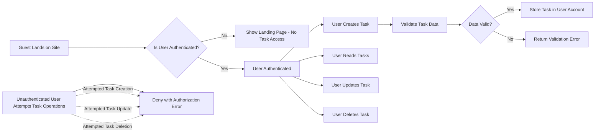

# Todo List Application Requirements Analysis Report

## 1. Service Description

The Todo list application is a minimalistic task management service designed to allow authenticated users to manage personal tasks efficiently. The system supports basic task operations such as creation, retrieval, updating, and deletion. It serves users who need a simple, no-frills tool to track and organize their to-dos.

## 2. Business Model

### Purpose
The Todo list application exists to provide users with a lightweight, easy-to-use tool for managing daily tasks without complicated features. It is aimed at individuals seeking a reliable and straightforward task organizer.

### Revenue Strategy
The application is intended to be free initially, encouraging widespread adoption. Monetization possibilities such as premium features or advertising may be explored in future versions but are out of the current scope.

### Growth Goals
Organic growth via user recommendations is anticipated due to usability and simplicity. Stability and ease of use form the foundation for user retention.

### Success Metrics
- Active user count
- Task creation and completion rates
- System uptime and responsiveness

## 3. User Needs

### User Actors
- Guest: Unauthenticated visitors with access only to the landing page; cannot manage tasks.
- User: Authenticated individuals who can create, read, update, and delete their own tasks exclusively.

### Functional Needs
- Users SHALL register and authenticate securely before task management.
- Users SHALL perform CRUD operations on their personal tasks.
- Task details include title, description, and status (pending or completed).

### Business Rules
- Tasks are owned solely by their creators; tasks are not shared or visible across accounts.
- Unauthorized access attempts to tasks must be denied.

### Error Handling
- WHEN an unauthenticated user attempts to create, update, or delete tasks, THE system SHALL deny the action and respond with an authorization error.
- WHEN users submit invalid or incomplete task data, THE system SHALL respond with clear validation error messages.

### Performance Expectations
- WHEN a user submits task creation or update requests, THE system SHALL respond within 2 seconds.
- WHEN retrieving task lists, THE system SHALL return paginated results of 20 tasks sorted by creation date in descending order within 3 seconds.

## 4. Success Criteria

- Secure user registration and authentication enabling task management.
- Accurate enforcement of task ownership and authorization.
- Reliable task CRUD operations with appropriate error handling.
- Meeting defined performance standards for user interactions.

## 5. User Interaction Flow

```mermaid
graph LR
  A["Guest Lands on Site"] --> B{"Is User Authenticated?"}
  B -->|"No"| C["Show Landing Page - No Task Access"]
  B -->|"Yes"| D["User Authenticated"]
  D --> E["User Creates Task"]
  E --> F["Validate Task Data"]
  F --> G{"Data Valid?"}
  G -->|"Yes"| H["Store Task in User Account"]
  G -->|"No"| I["Return Validation Error"]
  D --> J["User Reads Tasks"]
  D --> K["User Updates Task"]
  D --> L["User Deletes Task"]
  M["Unauthenticated User Attempts Task Operations"] --> N["Deny with Authorization Error"]

  click A href "https://example.com/landing" "Landing Page"
  click D href "https://example.com/user-dashboard" "User Dashboard"

  M -.->|"Attempted Task Creation"| N
  M -.->|"Attempted Task Update"| N
  M -.->|"Attempted Task Deletion"| N
```

