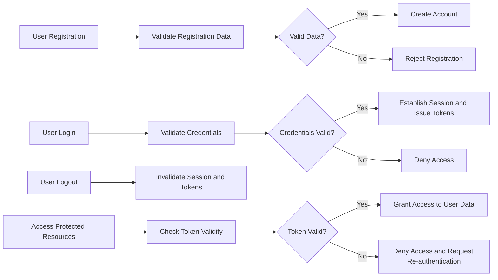

# Todo List Application - User Actors and Authentication Requirements

## 1. Introduction
The Todo list application supports a single actor type: the authenticated User, who is the only entity permitted to own and manage todo items. This document details the actors, authentication process, permissions, session management, and token policies necessary to secure the system.

## 2. User Actor Definitions

### 2.1 User Actor
- Description: An individual authenticated user who has registered and can perform all CRUD operations on their own todo list.
- Permissions: Users shall be authorized exclusively to their own todo items and prohibited from accessing other users’ data.

### 2.2 Actor Capabilities
| Action                         | User  |
|-------------------------------|-------|
| Register an account            | SHALL |
| Log in/out                    | SHALL |
| Create Todo item              | SHALL |
| Read own Todo items           | SHALL |
| Update own Todo items         | SHALL |
| Delete own Todo items         | SHALL |
| Access other users' Todo lists| SHALL NOT |
| Manage other users' data      | SHALL NOT |

## 3. Authentication Flow

### 3.1 Registration
- WHEN an individual submits registration data with valid email and password formats, THE system SHALL create their account.
- IF registration data is invalid, THEN THE system SHALL reject the registration with appropriate error messages.

### 3.2 Login
- WHEN a registered user submits correct credentials, THE system SHALL authenticate and establish a session.
- IF credentials are invalid, THEN THE system SHALL deny access with an authentication failure message within 2 seconds.

### 3.3 Session Management
- THE system SHALL secure user sessions to prevent unauthorized access or token reuse.
- Sessions SHALL expire after 30 minutes of inactivity.
- THE system SHALL support session invalidation upon user logout.

## 4. Permission Matrix

| Action                        | User  |
|------------------------------|-------|
| Create Todo items             | SHALL |
| Read own Todo items           | SHALL |
| Update own Todo items         | SHALL |
| Delete own Todo items         | SHALL |
| Access others’ data           | SHALL NOT |

## 5. Token Management

### 5.1 Token Types
- THE system SHALL use JSON Web Tokens (JWT) for authenticating and authorizing.

### 5.2 Token Expiration
- Access tokens SHALL expire 15 minutes after issuance.
- Refresh tokens SHALL expire 30 days after issuance.

### 5.3 Token Payload
- JWTs SHALL include the user's unique ID, role "user", and an array of permissions consistent with the user capabilities.

### 5.4 Token Storage
- Tokens SHALL be stored securely by the client via httpOnly cookies or other secure mechanisms.

### 5.5 Token Revocation
- WHEN a user logs out, THE system SHALL invalidate access and refresh tokens.

## 6. Conclusion
These requirements ensure that authentication and authorization are securely managed, guaranteeing users can only manage their own todo items. All requirements follow EARS format with measurable and testable conditions suitable for precise backend implementation.

---

# Mermaid Diagram

---

This document is strictly requirements focused, leaving implementation details to developers' discretion.